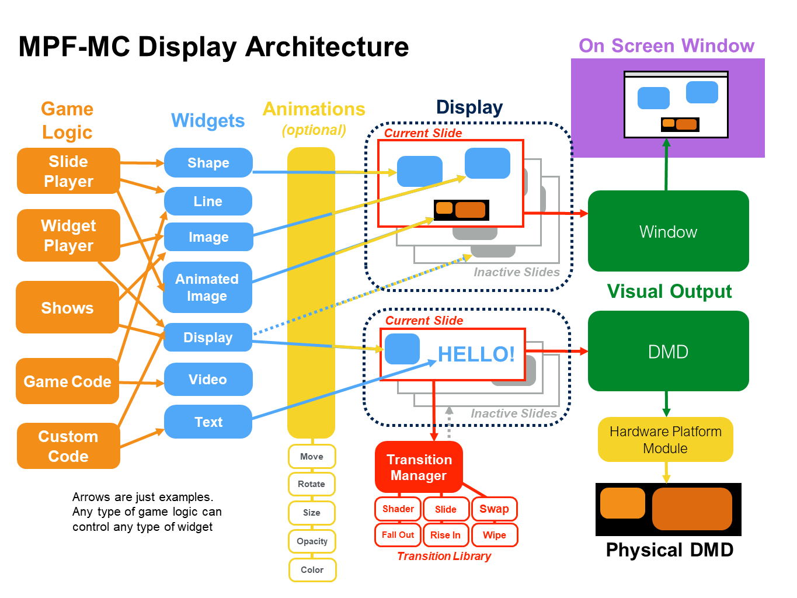

Display Concepts & Architecture
===============================

The MPF Media Controller uses the same core architecture to power all kinds of
displays, regardless of whether it's a DMD (physical or virtual, monochrome or
color), an LCD (on screen window displays), or a combination of both.

The MPF Media Controller's display system is based based on Kivy (a multimedia
programming library) and uses technologies like SDL2 and Gstreamer under the
hood.

Here's an architecture diagram which details how the MPF Media Controller's
display system works. It's kind of complex to look at, but we'll to step through
it piece-by-piece. The good news is that you don't have to understand all of it
to use MPF. (You can follow our step-by-step tutorial to get your display up and
running just with a few config file entries.) But as you start to create more
advanced display effects, it will be helpful to understand how everything fits
together.

The major components of the MPF Media Controller's display system are:

.. rubric:: Displays

Every "target" display is setup in MPF as a display. For example, if you have
a DMD, that is your display. If you have an LCD with a graphical window, then
that is your display. MPF can support multiple displays at the same time, so
you could have a DMD in the backbox and then a smaller LCD display on the
playfield.

You can even create sub-displays where one display has a small window which is
another display (kind of like picture-in-picture). For example, you could use
this to have a dot-effect window inside of a high def window on an LCD in the
backbox.

.. rubric:: Slides

Every display has a list of "slides", (which are the same height and width of
the display). One slide is "active" at a time, meaning it's the slide that's
showing. Think of these like slides in a slide projector. You'll probably end
up with hundreds of slides, but only one is showing at a time.

You can use transition effects to switch from one slide to another. (These are
things like sliding in, pushing, fading, flipping, etc.)

You'll probably end up with hundreds of slides.

.. rubric:: Widgets

Widgets are the "things" you actually put on slides. There are lots of
different types of widgets, including text, images, videos, shapes, etc.

Different widgets have different properties, like their x,y position on the
slide, their size, color, etc.

You can position widgets on slides with pixel-level accuracy, or you can use
relative positions like "10% down from the top edge", or "centered", or
"25% to the left of center", etc. Using relative positions means that your
display will be resolution independent.

You can also animate the properties of a widget. For example, a widget could
start out at the bottom of the display and then move to the center, or you can
animate the size, or the color, or the opacity, or pretty much anything else
you want. You can chain together multiple animations to run back-to-back, or you
can configure multiple animations to happen at the same time.

You can even configure the "curve" of the formula that's used to animate
widgets, so you can have them smoothly accelerate and decelerate, or slow down
as they're animating, or pop into place, etc.

.. rubric:: All these concepts come from PowerPoint. :)

The original creators of MPF have day jobs that require them to spend a lot of
time with PowerPoint! If you've ever used PowerPoint, you should notice that we
used PowerPoint (or Keynote or whatever presentation software you like) as the
conceptual model for MPF's display system. In PowerPoint, your content is a
series of "slides." Each slide contains one or more "elements (widgets)".
Those elements can be text, images, videos, drawing shapes, etc. Each element
has a "size" (length & width), a "position" on the slide (x,y coordinates), a
"layer" which controls how it overlaps with other elements, alpha
transparencies, and animation effects (blink, sparkle, move, etc).

And even though your entire PowerPoint presentation is made of of lots of slides,
only one slide is active on your "display" at a time. Then when you change to
another slide, you can have nice animated "transitions" from one slide to the
next.

So if the MPF display system seems kind of complex, just think of it like
a giant PowerPoint presentation and it should all hopefully make sense. Now
let's start digging into some of the details of each of the parts of the display
system.
