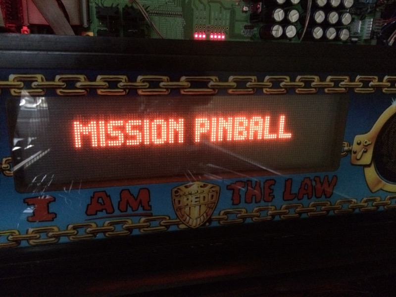
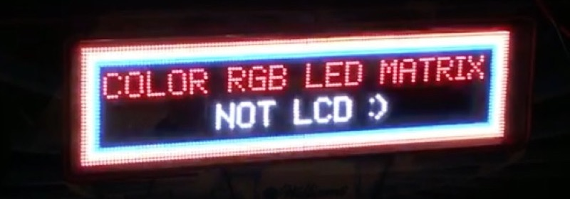

Displays & DMDs
===============

Pretty much every pinball machine has some type of display, whether it's
1980s-style 7-segment numeric displays, an early '90s- style alphanumeric
display, a mono or color dot matrix display (DMD), or a modern LCD (which itself
can either be a small LCD, like a "color DMD", or a huge one like what Jersey
Jack has in the backbox of The Wizard of Oz and The Hobbit).

The MPF media controller is designed so that it can support all types of these
displays, including multiple different types of displays at the same time. It
supports text, drawing shapes, images, and videos. You can position any
combination of these on the display at any time, and you can set layering and
transparencies. You can use standard TrueType fonts. You can also apply
animations, motions, and transitions to your displays and their widgets. And,
like just everything else in MPF, you can do most of your display configuration
via the machine configuration files.

Here are a few photos of the MPF Media Controller's display system in action.
These were all created with configuration files and without manual programming.

Here's a traditional DMD with a single text widget:

Here's an on-screen display window made up of an image widget (the background),
a virtual DMD widget, a rectangle widget (the thin white box around the DMD),
and a text widget (the "Judge Dredd" words in the lower right corner). The image
on the DMD is an image widget which has been targeted to DMD instead of the
window.

.. image:: images/display_window.jpg

Here's a "color" DMD on an LCD monitor. (It's a DMD widget surrounded by a blue
rectangle widget:

.. image:: images/display_color_dmd.jpg

Here's a full-color RGB DMD LED matrix. (So it's like a color DMD, but a matrix of
2.5mm RGB LEDs rather than an LCD):

Before we go into the details of all the various display components, let's start
with an overview of how the MPF display architecture works. (If you don't care
about the details and just want to start using your display, you can jump
directly into our :doc:`step-by-step tutorial </tutorial/index>` which covers
how to get your display running.)

The MPF Media Controller uses the same core architecture to power all kinds of
displays, regardless of whether it's a DMD (physical or virtual, monochrome or
color), an LCD (on screen window displays), or a combination of both.

The MPF Media Controller's display system is based based on Kivy (a multimedia
programming library) and uses technologies like SDL2 and Gstreamer under the
hood.

Here's an architecture diagram which details how the MPF Media Controller's
display system works. It's kind of complex to look at, but we'll to step through
it piece-by-piece. The good news is that you don't have to understand all of it
to use MPF. (You can follow our step-by-step tutorial to get your display up and
running just with a few config file entries.) But as you start to create more
advanced display effects, it will be helpful to understand how everything fits
together. The major components of the MPF Media Controller's display system are:

+ Your game logic which is responsible for generating the content that
  will be displayed. This could come from settings in your config files,
  entries in show files, or game code you write manually.
+ Every object you put on a display is called a *widget*.
  MPF supports several different types of widgets, each with
  their own settings and properties.

  + *Text widgets* let you display text.You can pick the font, the
    color, etc. The actual text strings in Text elements can be run
    through the Language module before they're sent to the display so you
    can do on-the-fly text replacements. This is used for multi-language
    translation and for installing alternate (i.e. "family friendly") text
    strings.
  + *Image widgets* let you show static images or animated sequences of images.
  + *Video widgets* let you play videos. You can start and stop them, specify
    whether they should repeat, specify the playback rate, etc.
  + *Shape widgets* let you draw simple shapes onto the display.
    Boxes, lines, circles, etc.

+ Every display widget lets you specify its position on the
  display, either via pixel-level accuracy, or with positional
  keywords like "top", "center", "left", etc. You can also specify the
  layer(z-order) of widgets to control which ones are drawn on top of
  each other if they overlap, and you can control alpha transparencies
  which affect how they blend with elements below them.
+ Next, you can apply *animations* to widgets which can be used to change any
  property of the widget over time. (Opacity, size, position, etc.) You can tie
  animations to specific events.
+ You arrange all of your widgets on a *Slide*. A slide is the
  same size of the display, so arranging various widgets on a
  slide is how you arrange them on the display. Every display has an
  "active" slide which is the slide that's currently being shown. It can
  also have one or more inactive slides that are waiting in the
  background to be shown later.
+ A *Transition Manager* lets you use cool effects to transition
  from one slide to another. MPF ships with several different types of
  transitions (push, fade, move_in, etc.), and it's really easy to
  write your own transitions if you'd like to make custom ones.

All these concepts come from PowerPoint. :)
-------------------------------------------

The original creators of MPF have day jobs that require them to spend a lot of
time with PowerPoint! If you've ever used PowerPoint, you should notice that we
used PowerPoint (or Keynote or whatever presentation software you like) as the
conceptual model for MPF's display system. In PowerPoint, your content is a
series of "slides." Each slide contains one or more " elements (widgets) ."
Those elements can be text, images, videos, drawing shapes , etc.  Each element
has a "size" (length & width), a "position" on the slide (x, y coordinates), a
"layer" which controls how it overlaps with other elements, alpha
transparencies, and animation effects (blink, sparkle, move, etc).

And even though your entire PowerPoint presentation is made of of lots of slides,
only one slide is active on your "display" at a time. Then when you change to
another slide, you can have nice animated "transitions" from one slide to the
next. So if the MPF display system seems kind of complex, just think of it like
a giant PowerPoint presentation and it should all hopefully make sense. Now
let's start digging into some of the details of each of the parts of the display
system.

.. toctree::

   Widgets </displays/widgets/index>
   Creating reusable "named" widgets <reusable_widgets>
   Animating widgets <animate_widgets>
   Positioning widgets <widget_positioning>
