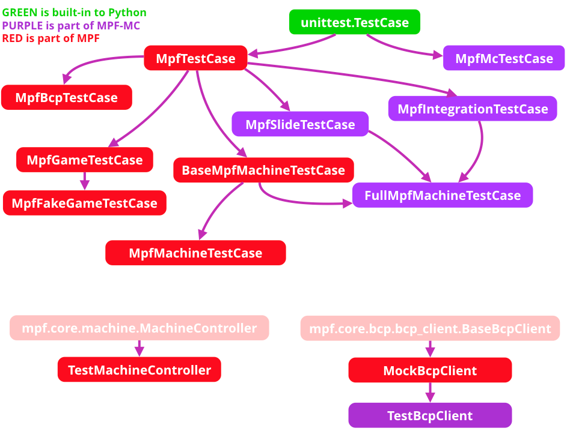

# Testing Class API

MPF includes several unit test classes which you can use to write tests which test MPF or to write tests for your own game.

These tests include several MPF-specific assertion methods for things like modes, players, balls, device states, etc., as well as logic which advances the time and mocks the BCP and hardware connections.

You can add commands in your tests to “advance” the time which the MPF tests can test quickly, so you can test a complete 3-minute game play session in a few hundred milliseconds of real world time.

It might be helpful to look at the real internal tests that MPF uses (which all use these test classes) to get a feel for how tests are written in MPF. They’re available in the mpf/tests folder in the MPF repository. (They’re installed locally when you install MPF.)

Here’s a diagram which shows how all the MPF and MPF-MC test case classes relate to each other:

And the API reference for each:

* [MpfFakeGameTestCase](testing_class_api/MpfFakeGameTestCase.md)
* [MpfGameTestCase](testing_class_api/MpfGameTestCase.md)
* [MpfMachineTestCase](testing_class_api/MpfMachineTestCase.md)
* [MpfTestCase](testing_class_api/MpfTestCase.md)
* [TestDataManager](testing_class_api/TestDataManager.md)
* [TestMachineController](testing_class_api/TestMachineController.md)
