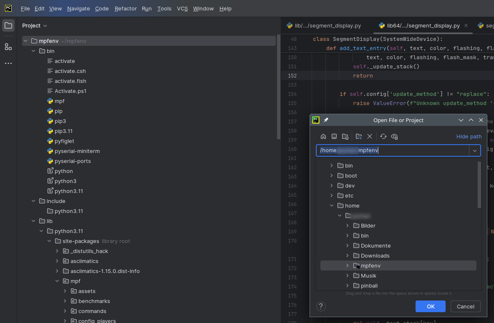
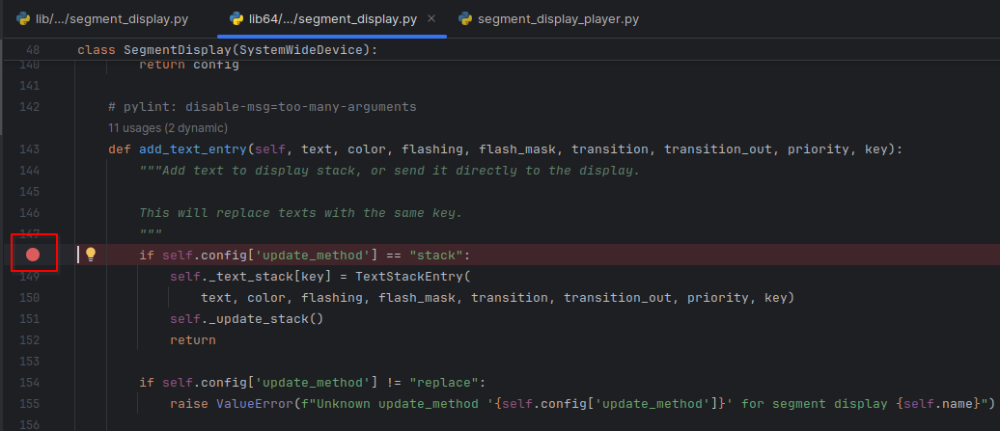
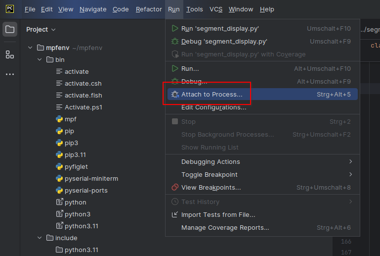
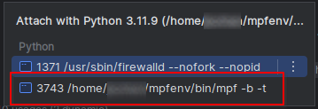
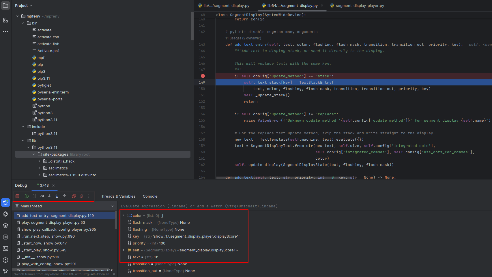
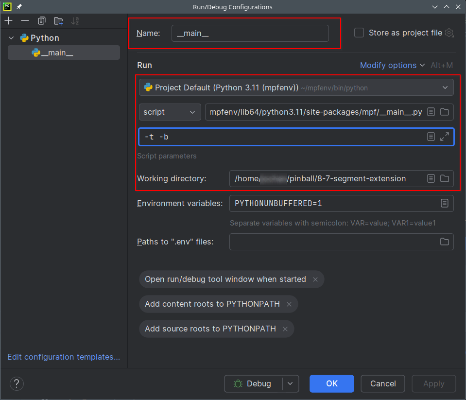

# Debugging

At some point in time you might have to debug either your own code or you want to debug the orginal MPF code. For this of course a Python debugger is needed. You can use your preferred tool and are not bound to a specific tool. In this chapter the debugging is explained using the [PyCharm Community Edition](https://www.jetbrains.com/pycharm/download/other.html). Regardless if you want to debug your own code or the MPF code itself, the process is the same and you can follow these instructions.

## Basic Setup
First of all you need to install MPF using a virtual environment and not using a precompile package, follow the [install chapter](../../install/index.md) for this. Then of course you need to install PyCharm, there is not much to do to install PyCharm after the download just run the installer.

## Open Project in PyCharm
Open the folder structure in PyCharm where you source file is located you would like to debug, that might be your machine folder with your own code extension or it might be the mpf sources which are located inside your virtual environment. From the `File` menu select `open`, if you don't see the `File` menu you have to click the three horizontal lines (Hamburger button) to make the menu visible.

A pop-up window will open, now either navigate and select your machine folder or your virtual environment folder:

## Set breakpoint

On the left side you will find the file structure, here you need to navigate to the source file you want to debug. Open that file in the code editor.

By clicking on the line number you can set a breakpoint:

## Run in debug mode
You basically have two options to run mpf in debug mode. You can either start mpf normally and then attach the debugger to the running process. The other option is that you start mpf in debug mode from PyCharm directly. The latter has the advantage that you can as well catch code that executes while mpf initializes and not only during the game flow. Both options are being explained below.

### Attach to process

Now it is time to start mpf like you normally do. Keep in mind, that before you start mpf with e.g. `mpf -t -b`, that you need to [activate](../../install/virtual-environments.md) your Python virtual environment.

From the `Run` menu select `Attach to Process`

Afterwards a new pop-up window will open up

from where you need to select your mpf process, depeding what other (Python) process you have running the list might be shorter or longer. Run your game and wait until your game flow hits the debugger. Now you have the normal debugging options like stepping in or looking into variables.

### Start mpf in debug mode

In this case you need to execute mpf not as an executable like you normally do, but as a python script. So you don't run it with `mpf -t -b` but with something like `python <path>/<script>.py`. First of all you need to know your python command, it could be simply `python` or it could include a version number like `python3.11`. Just try in a terminal what python command works for you if you don't know. Secondly you need to know the path and the script name which you want to execute. For mpf the script is named `__main__.py` the path depends on your virtual environment, look into your folder `<virtual_env>/lib64/python3.11/site-packages/mpf`, there you should be able to see the script `__main__.py`.

In PyCharm in the `run` menu open the debug configuration and configure it as following:

The name in the first field is set automatically if you leave it empty, you can choose your own name as well. In the script enter the full path to your python script like explained above. In the script parameters field enter the parameters you would pass usually to mpf, e.g. `-b -t`. Last but not least make sure to set the field working directory to your machine folder. Now you can start mpf using the `run` menu select there `debug <name>`, where name is the name you have specified in the debug configuration screen above.
