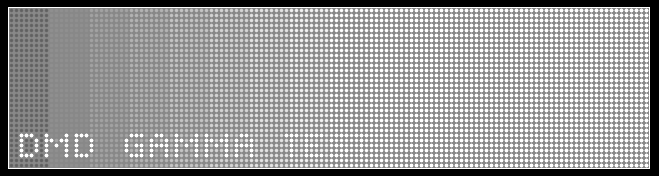

# Gamma correction in MPF


MPF includes functionality to allow you to adjust the gamma of the color
information that is sent to physical DMDs (RGB and mono) and to RGB
LEDs. (You don't need to set the gamma of an LCD display since that's
handled by your OS.)

You can read full details in the [Gamma
correction](https://en.wikipedia.org/wiki/Gamma_correction#Power_law_for_video_display)
article on Wikipedia, but the quick explanation is that the human eye
doesn't not perceive a change in brightness at the same ratio that an
LED sets its brightness.

When you're setting colors in MPF, you expect that 100% brightness
looks fully bright, and that 50% looks like 50%, etc. Here is a
screenshot of a slide which has 16 bars which fade from off to fully
white, in a more-or-less even fashion:


However if you show this slide on your physical DMD with no gamma
correction, it looks something like this:



Even though the individual pixels are showing their "correct"
brightness, the human eye can't really tell a different between 50% and
100%, and pretty much everything on the right half of the DMD looks
fully white.

So you can adjust this by setting the gamma value. By default, MPF uses
a gamma value of 2.5 for RGB LEDs, and 2.2 for RGB DMDs. (It also uses a
value of 1.0 for mono DMDs since some of the hardware controllers do
their own internal gamma correction, though others don't, so you might
have to change them.

We recommend you read the documentation for the
[dmds:](../dmds.md),
[rgb_dmds:](../rgb_dmds.md), and
[light_settings:](../light_settings.md) (for LEDs) to set
the proper gamma.

## Tuning your DMD gamma

MPF includes a built-in gamma test slide (the one used in the images
above) which you can use to dial-in your gamma setting.

The easiest way to show this slide on your physical DMD is to make a
temporary addition to your machine config to add a slide player, like
this:

``` mpf-mc-config
slide_player:
  mode_attract_started:
    dmd_gamma_test:
      priority: 10000000
##! test
#! start_game
#! assert_slide_on_top dmd_gamma_test
```

This will just show the gamma test slide at a crazy high priority so it
shows on top of everything else. (Remember if your DMD is not your
default display, you'll also have to add `target: dmd` or whatever you
use to target slides to your DMD.)

Now you can play with different gamma settings for your DMD in either
your `dmds:` or `rgb_dmds:` section. (Note you'll have to restart MPF
after each change you make.)

Note that you might also have to adjust `brightness:` along with
`gamma:`. For example, some people had to set the brightness of their
RGB DMDs to a super low value, like `0.1` or `0.2` before MPF had gamma
control, but with proper gamma settings, you can probably take your
brightness up to somewhere around `0.5`.

We like to use the gamma test slide and set the brightness first based
on the right-most brightest block, and then once that's set, we start
messing with the gamma. It will probably be some trial-and-error, but
once it's dialed in it's a "set it and forget it" type of thing.
