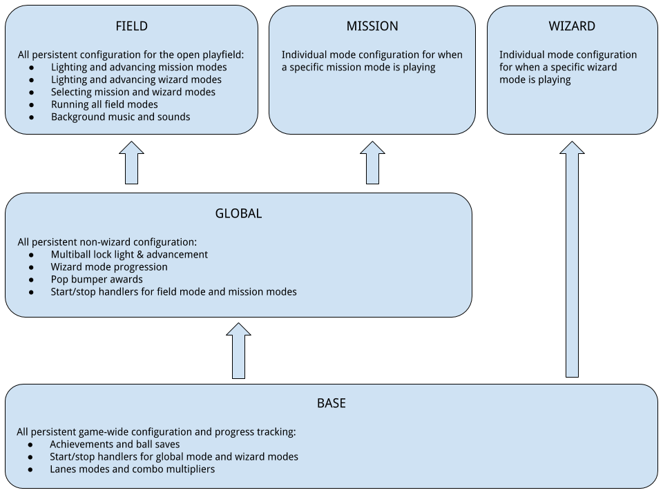

# Layering Modes Example


One of the major difficulties in designing a new game is managing the
interrelationship between different game modes. When considering how to
structure your game, it can be helpful to categorize your modes based on
how much they "take over" the playfield. When your modes are
categorized, you can create helper modes to manage the starting and
stopping of game modes.

For the purposes of demonstration and to help you start thinking about
how you might layer your own game, let's look at a breakdown of one
approach to mode layering.

## Gameplay Modes

While every pinball game has unique characteristics, many games can be
analysed based on three categories of game modes:

* **Field Modes** are nonintrusive modes that run when no wizard or
    mission modes are active and are typically used for accruals,
    multipliers, and shots to qualify for other modes. All field modes
    are run together.
* **Mission Modes** are "partial takeover" modes that ask for the
    player's attention but allow other gameplay mechanics to continue.
    Typically, a mission mode will disable qualification/starting of
    other mission modes but won't impact multiball locks, pop bumper
    awards, and other progressions. Examples include:
    * Attack Wave, Shoot the Martians *(Revenge from Mars)*
    * Trolls *(Medieval Madness)*
    * Catch the Robbers *(Dirty Harry)*
    * House Challenges *(Game of Thrones)*
* **Wizard Modes** are "complete takeover" modes that stop nearly
    all gameplay mechanics and force the player to focus on that mode
    exclusively. Examples include:
    * Multiball modes and video modes *(all games)*
    * Rooftop Chase *(Whodunit)*
    * Khan Battlefield *(the Shadow)*
    * G-R-E-Y Attack *(Congo)*
    * Hand of the King, Iron Throne, Winter Has Come *(Game of
        Thrones)*

*Note: a partial takeover mode is commonly referred to as a "game
mode", but here we will call it a "mission mode" because* **"game"
is a very specific mode in MPF** *and game.yaml is a file that we don't
want to interfere with.*

## Helper Modes

To facilitate the transition between Field, Mission, and Wizard modes,
three helper modes can run underneath the current gameplay:

* **Field Mode** *(field.yaml)* consolidates all of the field modes so
    that starting/stopping them can be managed by a single event
    handler. For clarity, it helps to consider the helper mode and all
    the individual field modes to be one single mode (and we will
    structure the code in this way).
* **Global Mode** *(global.yaml)* manages transitioning between field
    mode and mission modes and tracks any accruals/qualifiers that can
    be advanced while a mission mode is running, for example:
    * Pop bumper countdowns/awards
    * Multiball lighting & locking
    * Mission mode qualifying and selection
* **Base Mode** *(base.yaml)* is the default MPF background mode and
    manages transitioning between global mode and wizard modes. Base
    mode is also responsible for any always-persistent tracking, for
    example:
    * Achievements & specials
    * Ball saves
    * Combo multipliers

## Mode Relationship Diagram

In this typical layering configuration, the base mode starts when a
player's turn starts and ends when that player's turn ends. By
default, the global mode starts when the base mode starts and the field
mode starts when the global mode starts. As a result, the typical player
turn starts with field mode (a.k.a. on an open playfield).



*Field and Mission modes are mutually exclusive:* the field mode stops
when a mission mode starts, and starts again when the mission mode
stops. The global mode runs throughout and manages this transition.

*Global and Wizard modes are mutually exclusive:* when a wizard mode
starts the global mode stops (and with it, the field or any mission
modes also stop), and global starts again when the wizard mode ends.
Base mode runs throughout and manages this transition.

## Starting and Stopping Layers

For a successful layering, each helper mode depends on some particular
coding.

**Field modes** always run together, so the simplest way to manage them
is to separate the various field mode behaviors into different yaml
files and import all of them into the field helper mode. This keeps each
file small while giving just a single mode to start and stop.

``` mpf-config
##! mode: field
# modes/field/config/field.yaml

mode:
  start_events: start_mode_field
  stop_events: stop_mode_field

config:
  # add your mode parts here. For instance:
  # - field_mission_qualifier_shots.yaml
  # - field_miniwizard_qualifier_shots.yaml
  # - field_chase_advancement.yaml
  # - field_dropbank_special.yaml
```

**Mission modes** replace field mode, usually on their own but you may
want to allow two or more missions to run concurrently. Giving every
mission mode a few common event handlers allows the global mode to
easily manage the transitions into and out of mission modes.

``` mpf-config
##! mode: trolls
# modes/trolls/config/trolls.yaml

mode:
  start_events: start_mode_trolls
  stop_events: stop_mode_trolls, stop_missions
  events_when_started: mode_type_mission_started
  events_when_stopped: mode_type_mission_stopped
```

**Global mode** can import global-specific config files to consolidate
all persistent behavior (just like field mode), and uses special events
to handle transitioning between field mode and mission modes. Global
will automatically attempt to restart field when a mission mode stops,
so we add a special handler: stop global mode when the ball ends, and
only restart field mode if global isn't stopping.

``` mpf-config
##! mode: global
# modes/global/config/global.yaml

mode:
  start_events: start_mode_global
  stop_events: stop_mode_global, ball_will_end

config:
  # add your configs here. For instance:
  # - global_multiball_madness_light_and_lock.yaml
  # - global_pop_bumpers.yaml
  # - global_wizard_qualifier.yaml

event_player:
  mode_global_started:
    - start_mode_field
  mode_global_will_stop:
    - stop_mode_field
    - stop_missions
  mode_type_mission_started:
    - stop_mode_field
  mode_type_mission_stopped{not mode["global"].stopping}:
    - start_mode_field
```

**Wizard modes** replace global, and use a special set of event handlers
just like the mission modes.

``` mpf-config
##! mode: madness
# modes/madness/config/madness.yaml

mode:
  start_events: start_mode_madness
  stop_events: stop_mode_madness, stop_wizards
  events_when_started: mode_type_wizard_started
  events_when_stopped: mode_type_wizard_stopped
```

**Base mode** runs for the player's entire turn and includes special
handlers to manage the transition between global mode and wizard modes.
Just like with global restarting field, base mode restarts global mode
when a wizard mode stops (unless base mode itself is stopping).

``` mpf-config
##! mode: base
# modes/base/config/base.yaml
event_player:
  mode_base_started:
    - start_mode_global
  mode_base_will_stop:
    - stop_mode_global
  mode_type_wizard_started:
    - stop_mode_global
  mode_type_wizard_stopped{not mode["base"].stopping}:
    - start_mode_global
```
