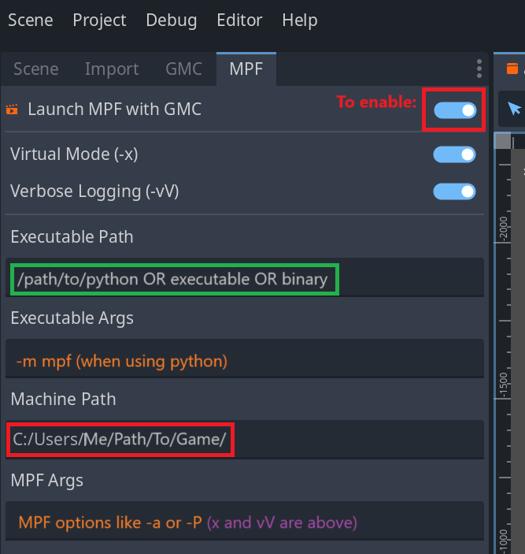

# Launching the MPF game with Godot

The Godot project can be set up to run your MPF game when you run it.
In the Godot editor, next to the "Scene" menu header, find the tab header for "MPF".

## Configuring your integration




There are many ways to run your mpf game, and the options below are intended to provide 
a good amount of flexibility depending on your configuration and use case. If you are having
problems with this, the most important thing to know is how you normally run your mpf game on the command line.

The options seen in this UI are assembled together to make a single shell command to run your game, with the following pattern:

``` console

    <executable_path> <executable_args> <machine_path> <mpf_args>
```

The UI menu for editing each of these options is discussed below, and your configuration in that UI is saved to gmc.cfg automatically.
See: [gmc-cfg:\[mpf\]](../reference/gmc-cfg.md#mpf)

The Godot editor misbehaves if you edit the `gmc.cfg` values while also editing in this UI form, so take care to save changes and reload the editor if you notice odd behaviors.


### Enable/Disable

You can always enable or disable this integration by checking the top option, "Launch MPF with GMC", and saving. If the top line "Launch MPF with GMC" is enabled, the values here will be used to spawn an MPF game instance when you press the **Play** button to play your GMC project. 


### Executable Options

MPF can be run in a variety of ways, depending on your operating system and your configuration choices.

#### `Executable Path`

The path to the executable entry point for the MPF process. It can be a Python interpreter, a symlink to a virtual environment mpf executable, or a precompiled MPF binary.


#### `Executable Args`

Additional arguments to pass to the executable. For example, if the executable is a Python interpreter then the executable args may be -m mpf to load the MPF module.

Note that MPF-specific command line args should not go here, even if the executable is an MPF binary.


### `mpf game` Options

#### Machine path

The path of the MPF machine folder, i.e. the root folder containing the */config* and */modes* folders for your project. If not specified, the GMC project folder (which contains `gmc.cfg`) will be used.

#### Virtual Mode and Verbose Logging

These common [mpf game CLI options](../../running/commands/game.md) can be set or removed by just enabling or disabling their buttons. These options will be added to the other options you provide.

#### Other options

MPF game can be run with a variety of options, too many to include custom configurations here in the Godot Editor UI.
Instead, you can provide any other arguments (like `-l <file>` or `-a`) in the freeform text field called `MPF Args`.
