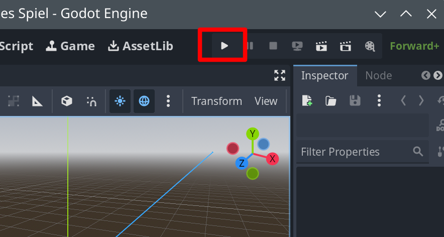
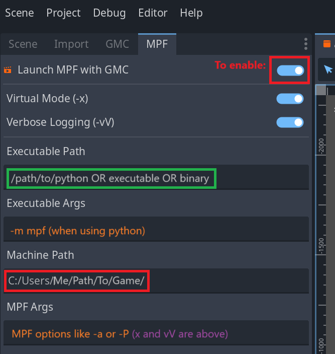
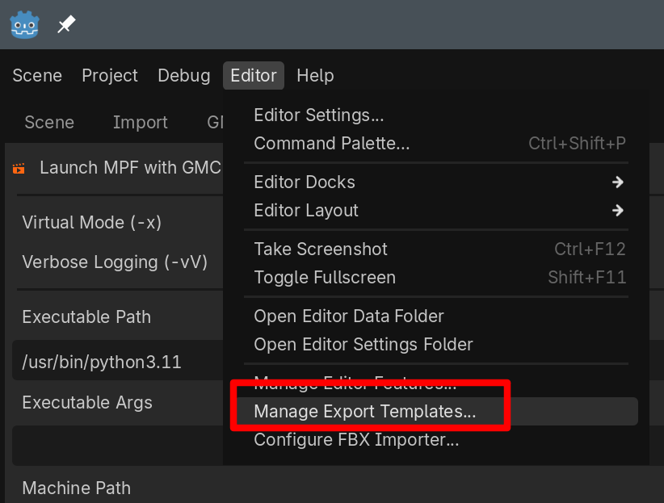
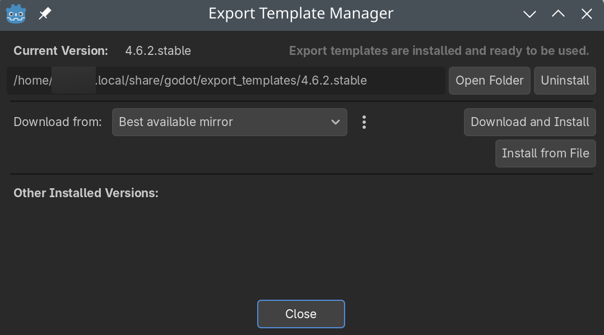
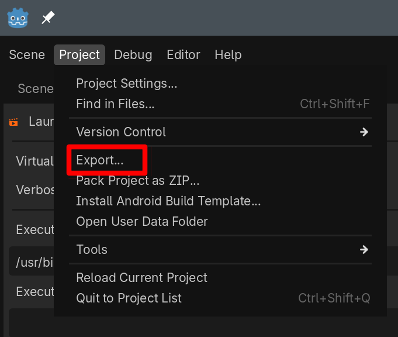
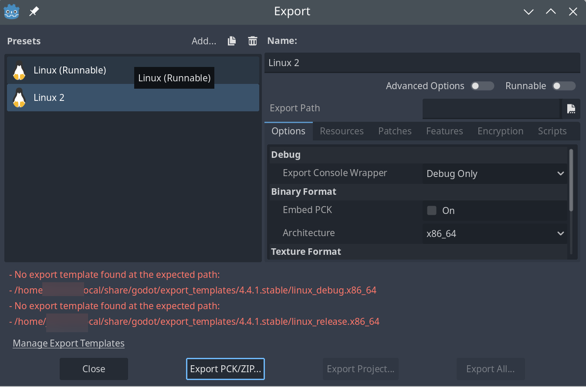
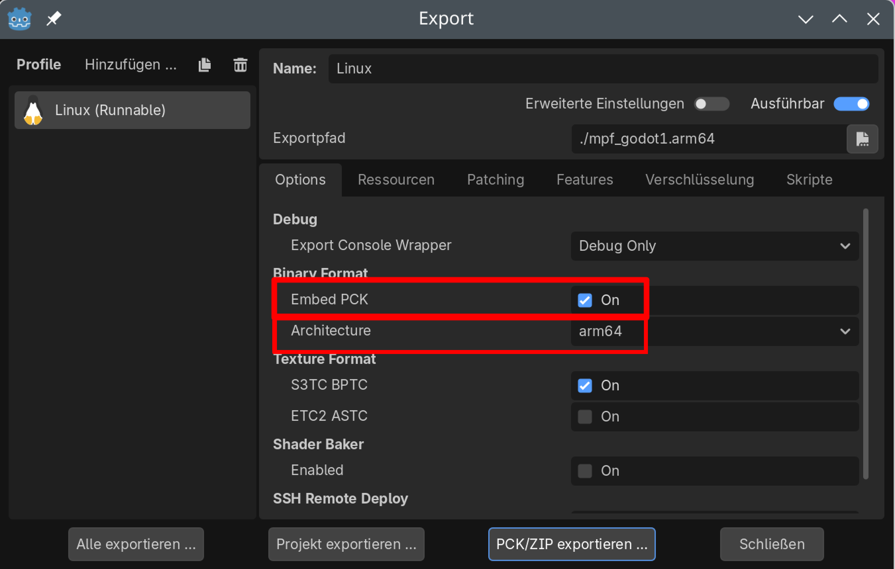

There are different ways how to launch Godot to be used with MPF. Each way has its own advantages and disadvantages.

* Launching Godot from the editor
  * Starting MPF manually
  * Starting MPF automatically with Godot
* Launching Godot executable without the Godot editor

# Launching Godot from the editor separately from MPF
The first way to get Godot and MPF working together is to start MPF and Godot separately. It doesn't matter what you start first, both programms will wait for each other. When being in your virtual environment start mpf like you did in the past, just make sure you don't pass in the parameter `-b`, that would tell MPF that there is no integration to your media controller.

e.g. use (other command line switches might be needed for you depeding on your setup)

``` shell
mpf <game folder> -v -t
```

After a while you will see a message on the console that MPF waits for BCP to connect.

``` shell
Connecting BCP to local_display at localhost:5050 ....
```

Now start your Godot editor and open your configured project. Once that is done simply press the play button



Now MPF will continue its boot up and will be ready to run together with Godot.

# Launching the MPF game with Godot

The Godot project can be set up to run your MPF game when you run your Godot project. This is very similar to the first option above, just you don't have to start MPF manually anymore.
In the Godot editor, next to the "Scene" menu header, find the tab header for "MPF".

## Configuring your integration



There are many ways to run your mpf game, and the options below are intended to provide 
a good amount of flexibility depending on your configuration and use case. If you are having
problems with this, the most important thing to know is how you normally run your mpf game on the command line.

The options seen in this UI are assembled together to make a single shell command to run your game, with the following pattern:

``` shell
<executable_path> <executable_args> <machine_path> <mpf_args>
```

The UI menu for editing each of these options is discussed below, and your configuration in that UI is saved to gmc.cfg automatically.
See: [gmc-cfg:\[mpf\]](../reference/gmc-cfg.md#mpf)

The Godot editor misbehaves if you edit the `gmc.cfg` values while also editing in this UI form, so take care to save changes and reload the editor if you notice odd behaviors.


### Enable/Disable

You can always enable or disable this integration by checking the top option, "Launch MPF with GMC", and saving. If the top line "Launch MPF with GMC" is enabled, the values here will be used to spawn an MPF game instance when you press the **Play** button to play your GMC project. 


### Executable Options

MPF can be run in a variety of ways, depending on your operating system and your configuration choices.

#### `Executable Path`

The path to the executable entry point for the MPF process. It can be a Python interpreter, a symlink to a virtual environment mpf executable, or a precompiled MPF binary.


#### `Executable Args`

Additional arguments to pass to the executable. For example, if the executable is a Python interpreter then the executable args may be -m mpf to load the MPF module.

Note that MPF-specific command line args should not go here, even if the executable is an MPF binary.


### `mpf game` Options

#### Machine path

The path of the MPF machine folder, i.e. the root folder containing the */config* and */modes* folders for your project. If not specified, the GMC project folder (which contains `gmc.cfg`) will be used.

#### Virtual Mode and Verbose Logging

These common [mpf game CLI options](../../running/commands/game.md) can be set or removed by just enabling or disabling their buttons. These options will be added to the other options you provide.

#### Other options

MPF game can be run with a variety of options, too many to include custom configurations here in the Godot Editor UI.
Instead, you can provide any other arguments (like `-l <file>` or `-a`) in the freeform text field called `MPF Args`.

# Launching Godot from an exported project
Running Godot from the editor has mainly two disadvantages. First of all the editor needs quite some resources which are not really necessary to run your game. Secondly you always need to press the play button, when running your machine you want to start things automatically in a scripted mode.

## Export Templates

In order to export your project as an executalbe you first need to make sure that the export templates from Godot are installed. They are not by default installed with the editor. If you have the export temaplates installed you can skip this step, this has to be done only once.

From the Godot menu bar choose Editor --> Manage Export Templates



In the upcoming window you can either download the export templates from a mirror or install some from a local file.



If you want to install from a file you first have to download the template file from [Godot Downloads](https://godotengine.org/download). In most cases you probably want to download directly from a mirror. These steps are MPF independent and pure Godot functionality. Further information can be found [here](https://docs.godotengine.org/en/latest/tutorials/export/exporting_projects.html)

## Export
This export needs to be done every time you change something in your Godot project.

From the Godot menu bar choose Project --> Export



Now you need to select to which target you want to export, where target basically means on what operating system you will run it.


In case you see an error like this



then you don't have export templates installed on your system, check above the section on export templates.

In the next step make sure to embed the PCK package, and to select the right architecture:



In the screen above the architecture is arm64 since it was done to run on a Raspberry Pi, you might have to choose a different architecture. Once the file is exported you can start it as an executable (on Linux platforms make it executable with chmod). Note that you can develop your Godot project on some kind of development computer and export it later for a different architecture and copy it to your pinball machine. The Godot executable contains all assets, e.g. sounds, there is no need to copy the sound to an MPF sound folder.
