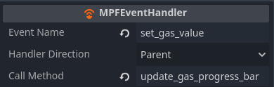
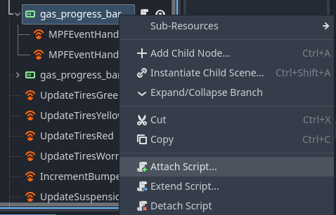

# MPF Events and Godot

MPF Events are able to be sent to and from Godot via the Godot Media Controller (GMC).

## Sending MPF Events to Godot

Godot is able to receive any event that MPF generates. The simple method is via [MPFVariables](../reference/mpf-variable.md) and using machine or player variables. Godot will automatically listen for updates to those variables and post changes to the corresponding MPFVariable.


### Custom MPF to Godot Events

You can create your own custom MPF events to send to Godot in order to handle more complex operations.

#### Example MPF Event

In this example, we want to send the player variable `gas_value` to Godot. 

``` yaml
event_player:
  send_gas_to_godot: #triggering event name
    set_gas_value:   #event we want to send to Godot
      gas_value:     #arguments we want to send with the event
        value: current_player.gas   #value of the argument
        type: int                   #data type of the argument
```

See ([here](../../config_players/event_player.md)) for more on dynamic event arguments

### MPFEventHandler - Linking MPF Events to Godot Scripts

When more is required of Godot than a simple text update, an [MPFEventHandler](../reference/mpf-event-handler.md) can be used to link between MPF and a custom Godot script.

#### Example MPFEventHandler



### Step 1: Create the MPFEventHandler in Godot. 

The following fields must be set:

  1. `Event Name`: the name of the event that will come from MPF to start things off
  1. `Handler Direction`: The parent or child node relative to the MPFEventHandler node in Godot. Parent is linked above, child is linked below. This node must have a Godot script attached to it.
  1. `Call Method`: The name of the function in the script attached to the handler specified in the Handler Direction (either attached to the Parent or the Child).

### Step 2: Godot Function

Implement the Godot function in the parent or child specified in the handler direction of the MPFEventHandler. You can do this by attaching a script to the parent or child by right-clicking and Attach Script.



Inside of this new script, you can add the function that you put in the `Call Method` of Step 1.

Example Godot Function:
``` gdscript
func update_gas_progress_bar(event_args):
  if (event_args["gas_value"] > 10):
    self.value = 10
  else:
    self.value = event_args["gas_value"]
```

## Sending Events back to MPF

Typically, Godot will only be used to receive events. In rare instances you may decide to let Godot handle processing and execution of code and will need to feed the results back to MPF. You will need a code execution entry point in Godot, such as MPFEventHandler or a Godot Timer. 

Once Godot is executing your desired function, you can use `MPF.server.send_event` or `MPF.server.send_events_with_args` to send your event to MPF. You will need to specify the event name to send as a string and if using arguments, define the kwargs as a Dictionary

Example Godot function without arguments:
``` gdscript
func send_lap_time_to_mpf():
    MPF.server.send_event_with_args("lap_time_from_godot")
```

Example Godot function with arguments 

(This example assumes my_lap_time and lap_time_delta are defined elsewhere. They can be replaced with a string or number.):
``` gdscript
func send_lap_time_to_mpf():
    var kwargs = {"lap_time_str": my_lap_time.text, "lap_time_delta": lap_time_delta}
    MPF.server.send_event_with_args("lap_time_from_godot",kwargs)
```