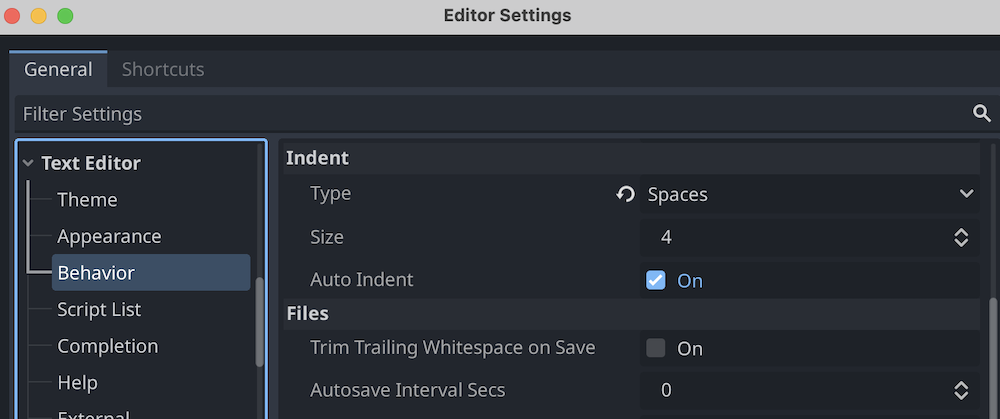
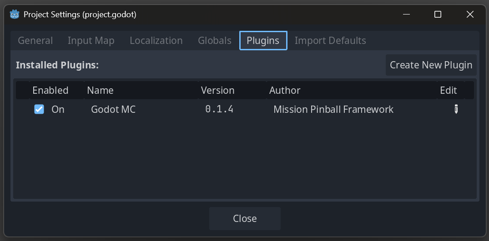
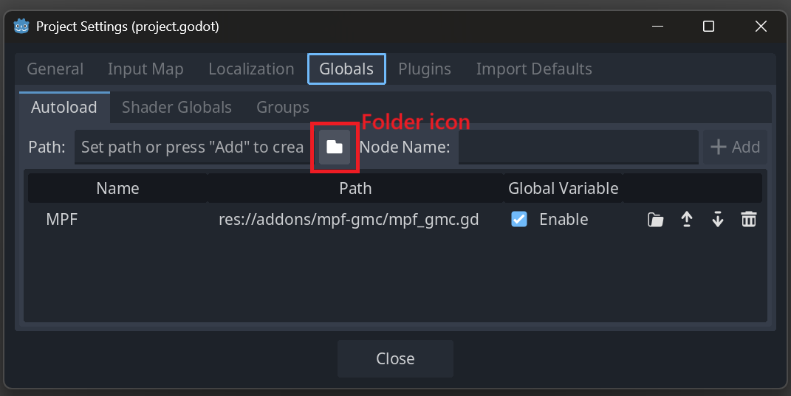

# Setup and Installation

!!! warning "Please use a repository"

    Because GMC is brand new, you will likely be the first to encounter a scenario or request a feature. Having your project in a repository means that GMC developers can clone and run your game to quickly identify and fix issues, understand your goals, and validate requested features against your code. This is the fastest and smoothest way to make GMC better!

## Upgrading a Legacy MPF-MC project (on 0.57.3) to GMC

For details regarding updating an existing project built on the 0.57 and earlier Media Controller (MPF-MC), see the
[Migrating to MPF 0.80 and Godot GMC](../install/0.80.md).

--8<-- "latest_versions.md"

## Install MPF 0.80

Before you get working with GMC, you need to install MPF 0.80 by following the [MPF Installation Guide](../install/index.md).

!!! note "Upgrade is available"

    If you already have a working MPF 0.57 installation, you can upgrade to MPF 0.80 with the command `pip install --upgrade --pre mpf`. However, to maintain the option of reverting back to 0.57 it's recommended to create a new, separate virtual enviroment for MPF 0.80 and install it there.

## Download Godot 4.5+

The Godot Media Controller is built on the Godot game engine. Visit [https://godotengine.org](https://godotengine.org) to download the latest version of the Godot Editor (4.5 or later) and place it wherever you typically keep applications on your machine (not in your game project folder).

After Godot is installed, open the editor and create a New Project. Select your MPF game project folder as the project path, and choose an appropriate render engine.

For most pinball games, *Mobile* rendering is the recommended balance between performance and featureset. If you plan to do advanced 3D graphics and complex rendering, choose *Forward+*. If you want to optimize your game to run on very low-powered hardware with limited rendering features, choose *Compatibility*. Note that you can change this setting at any time, so don't stress about it :)

Finally, in your Godot game project folder create a new folder called *addons* (Note that if your Godot project folder is not your MPF project folder, the addons should be in the Godot folder).

!!! note "Root project vs GMC subfolder"

    Some users prefer to create a distinct "gmc" subfolder in their MPF machine folder, and save their Godot project there. This keeps the Godot Editor *FileSystem* tree cleaner because it's not mixing Godot files with MPF config files, which can make it easier to navigate and maintain.

    However, note that Godot only has access to files in its project folder and subfolders. If you choose to make a "gmc" subfolder for your Godot project, all slides, widgets, sound files, and video files will need to be in those respective subfolders in the gmc folder (e.g. */gmc/slides/*), NOT in the MPF mode subfolders (e.g. */modes/attract/slides/*).


## Video Tutorial

The following video shows on Windows how to create your Godot project, install MPF-GMC, configure three audio busses, use Git LFS for large files in git, use gmc.cfg, and set up the basics in your Godot project. Not every part of setup is represented, such as Indentation Setup. Note that video tutorials can not easily be updated with new version numbers, so you should check [MPF Versions](../versions/index.md) for up to date information.

<div class="video-wrapper">
<iframe width="560" height="315" src="https://www.youtube.com/embed/IO3U1SMZ5-A" title="YouTube video player" frameborder="0" allow="accelerometer; autoplay; clipboard-write; encrypted-media; gyroscope; picture-in-picture" allowfullscreen></iframe>
</div>


## Setup Godot Editor

The Godot Editor includes some default configuration options that may cause headaches for users, so the following tweaks are recommended:

### Indentation Setup

The GMC code is written with tab-based indentation (per the offical Godot standards guide), and Godot not only defaults to tab-indendation but also defaults to auto-convert files. You are free to use spaces if that's your preference, but disabling the auto-convert will spare you grief.

From the *Editor* menu select *Editor Settings > Text Editor > Behavior*.
  *  In the *Files* section **disable** the `Convert Indent on Save` option.
  *  If you wish to use spaces in your project and edit in the Godot editor, in the *Indent* section change `Tabs` to `Spaces`.



### Other Good Things

Also in the *Editor Settings > Text Editor > Behavior* menu:

  *  In the *Files* section, **enable** the `Trim Trailing Whitespace on Save` option, because it's just good practice.
  *  If you use an external text editor like VS Code or Atom, in the *Files* section **enable** the option `Auto Reload Scripts on External Change`.

## Install the GMC Plugin

Installing GMC is the next step, and it can be done in a variety of ways.
Regardless of whether you use the Asset Library, use a manually downloaded copy, or use git and a symlink, you will need to follow up with the Activate step, as detailed at the end of this page.

### Simplest Installation: Godot Asset Library

The Godot editor features the Asset Library, a built-in library of plugins that you can download and install with a click.

The late 2025 development release of MPF (0.80.0.dev11) requires GMC plugin version 0.1.6, which is available on the Asset Library.

In the Godot editor, select **AssetLib** from the top center selector. You may need to enable online access to the asset library when prompted. Search for "GMC" and click on the GMC asset and press "Download". After the download completes, press "Install" -- the default installation directory should be correct, and you can confirm by looking at the root of your Godot project for the folder `<root>addons/mpf-gmc`.

#### Upgrading with the Asset Library

If you have already installed a previous version of GMC through the Asset Library, or you see a warning message during install about files in conflict with your project, you may want to reinstall GMC.
To do this, close the Godot editor completely. In the OS file manager find the addons folder in your project and delete the mpf-gmc/ folder completely.
Open the Godot editor again into your project; you should get warnings about missing dependencies - press "Open Anyway".
Then find GMC in the Asset Library as before, download, and install, and Reload the Godot project. If correctly reinstalled, the warnings should go away.

### Standard Installation: Download & Copy

You can download the GMC plugin from the MPF-GMC repository on GitHub. Visit https://github.com/missionpinball/mpf-gmc and click on the green **Code** button to show the Code dropdown, and select *Download ZIP* to download the plugin.


Extract the downloaded ZIP file and go to the *addons* folder, where you'll see a folder named *mpf-gmc*. Copy this folder into the *addons* folder in your Godot project folder.

!!! note "Manual Updates Required"

    When downloading and copying GMC in this way, you will need to manually update the GMC to get new features and bugfixes. Just follow the above instructions again and overwrite the *addons/mpf-gmc* folder to get the newest version.

### Expert Installation: Local Repository (MPF-GMC)

For complete control, you can clone the MPF-GMC repository to your computer and run it directly. First, open a terminal window to the directory where you keep your Git repositories, and then clone:

``` shell
git clone https://github.com/missionpinball/mpf-gmc
```

You now have a copy of the MPF-GMC source code on your machine, and you need to share it with your Godot project. To update GMC, go to the repository folder in your terminal and type `git fetch` and `git pull`.

#### Option 1: Symbolic Links

A symbolic link is a way to mirror one file or folder in a second location, which makes it easy to keep data synchronized. With a symbolic link from the GMC repository to your project folder, your project will always have the latest changes whenever you pull from the GMC repository.

You will create a symbolic link *mpf-gmc* in your project */addons* folder that points to the *mpf-gmc* folder in the GMC repository.

**Mac & Linux**

The syntax is `sudo ln -s <path to GMC repository/addons/mpf-gmc> <path to project folder/addons/mpf-gmc>`, and will look something like this:

``` shell
(mpf080) $> sudo ln -s /Users/tommy/git/mpf-gmc/addons/mpf-gmc /Users/tommy/pinballgame/addons/mpf-gmc
```

When successful, you should see a new *mpf-gmc* folder in the *addons* folder you just created. You can confirm that the folder is a symbolic link with the `ls -la` command, which will show the path that the symbolic link points to.

``` shell
(mpf080) pinballgame $> ls -la addons
(mpf080) pinballgame $> ls -la addons

total 0
drwxr-xr-x    96 Apr  8 19:09 .
drwxr-xr-x  1024 May  6 12:30 ..
lrwxr-xr-x    41 Apr  8 19:09 mpf-gmc -> /Users/tommy/git/mpf-gmc/addons/mpf-gmc
```

**Windows**

The syntax is `mklink /d <path to project folder/addons/mpf-gmc> <path to GMC repository/addons/mpf-gmc>` and will look something like this:

``` shell
(mpf080) $> mklink /d "C:\repos\pinballgame\addons\mpf-gmc" "C:\repos\mpf-gmc\addons\mpf-gmc"
>>>>>>> e6e7384f8 (reformat more code sample blocks)
```


#### Option 2: Copy the MPF-GMC Folder

If you do not create a symbolic link, you can manually copy the *mpf-gmc* folder from the GMC repository */addons* folder to your Godot project *addons* folder. You'll know it's in the right place if your Godot project root (in this example, "pinballgame") has the file path `/pinballgame/addons/mpf-gmc/plugin.cfg`.

The downside of copying the folder is that you will need to manually re-copy the folder each time you download a new update to the GMC.

## Keeping MPF-GMC Up-To-Date
MPF-GMC is in active development and changes frequently, including new features, fixes, and other changes. In order to ensure that you are experiencing the latest and greatest, please ensure that you periodically run the following commands to get the changes to both projects. Once they are pulled into your local copy, you will immediately have access to the new features in building your game.

If you downloaded MPF-GMC as a ZIP file from GitHub, follow those steps again and replace the old *addons/mpf-gmc* folder with the newly downloaded one.

If you cloned the MPF-GMC repository, you need to fetch and pull:

``` shell
(mpf080) ~/git $> cd mpf-gmc
(mpf080) ~/git/mpf-gmc $> git fetch
(mpf080) ~/git/mpf-gmc $> git pull
```

**Symlink Users:** If you are using a symlink to mirror the *mpf-gmc* folder in your project *addons* folder, the above steps are enough.

**Copy+Paste Users:** If you have copy+pasted the *mpf-gmc* folder from the GMC repository to your project *addons* folder, you will need to re-copy+paste the folder after you fetch and pull.

Because of how Godot processes and caches plugins and autoloads, sometimes pulling a fresh update of GMC will trigger errors and warnings in the Godot log.
This is expected the first time you open your project in Godot after a GMC update.
You can use the *Project > Reload Current Project* menu to refresh the Godot editor and clear out errors after updating.

!!! note "In Case of Catastrophe"

    In some cases, a godot project can get corrupted with cached variants of GMC autoload/class files that cause a slew of errors on startup, even after restarting the editor.

    In these rare cases, exit the editor and from the Project List, remove your project from the list of saved projects. Then in your project folder delete the */.godot* folder and re-import your project.godot file into the Project List.

## Activate the GMC Plugin

!!! note "There will be errors"

    During this step, at various points some pieces will be setup before others and Godot will present errors about files not found or scripts unable to be parsed. It is safe to ignore these errors for now: we will restart Godot after this step and everything will be in order.

In the Godot Editor, open the *Project > Project Settings* menu and select the *Plugins* tab.
You should see an option there for **Godot MC**, check the checkbox to enable the plugin.
If the plugin is not visible in the plugin list, you should check to see if you placed the *addons* folder in the wrong location.



Now go to the *Globals* tab, *Autoload* subtab, and add a new autoload by pressing the folder icon (*NOT* the "+ Add" button yet).
Navigate to the *addons/mpf-gmc* folder and choose the file *mpf_gmc.gd*.
Under *Node Name* set the name to "MPF" (all caps) and press *+ Add*.
You should see a new line appear with a checkbox enabled.

(Note: for Godot versions before 4.3, instead of "Globals" the project settings tab for "Globals" may be instead called "Autoload".)



!!! warning

    Godot exposes autoloads by the given Node Name, and various components of GMC reference one another by the name "MPF". When adding the *mpf_gmc.md* autoload, you _must_ set the Node Name to **MPF** or the GMC will not function.

Close the Project Settings menu, save the project, and restart Godot.

You can now proceed to your [project setup](setup.md)!
