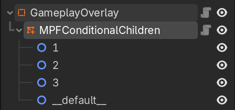
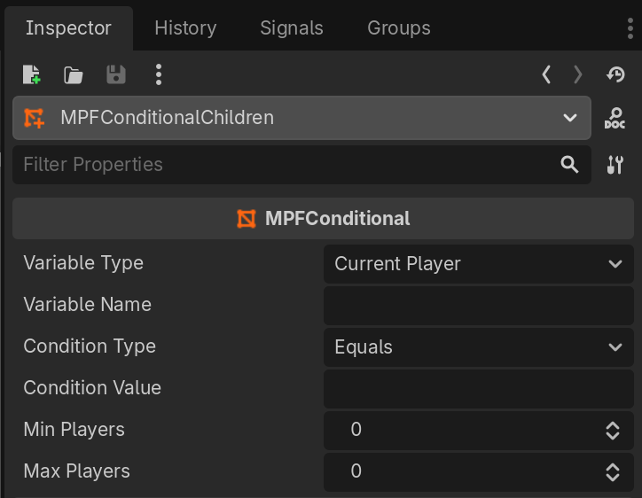

# MPFConditionalChildren

`MPFConditionalChildren` is node class that extends the [MPFConditional](mpf-conditional.md) but instead of showing or hiding *itself*, it shows and hides its *child nodes* based on a condition.

## Node Configuration

An `MPFConditionalChildren` node is set up much the same as an `MPFConditional`, except that the `condition_value:` is ignored.

Instead, each direct child of the node has a name that is the effective condition value of that child. Note that names can be strings or numbers, but all children must have unique names and must be evaluated against the same variable.

### Example

Given an `MPFConditionalChildren` node with `variable_type: Current Player`, `variable_name: ball`, and `condition_type: Equals`, that node would have three children named "1", "2", and "3". Whenever the slide or widget appears, the child with the name equal to the current ball will be shown, and the others will be hidden.

Or, with `variable_type: Event Arg` and `variable_name: hero`, this node would have a number of children with names corresponding to the various heroes. When the slide/widget player is called to play the slide/widget that contains the `MPFConditionalChildren` node and includes `hero: batman` in the `tokens:` configuration, then the child node named "batman" will be shown and the others will be hidden.

### Default / Fallback

A special child node can be named `__default__` with **two underscores** before and after the word "default". If this child node exists and none of the other children match the condition, this child node will be shown as a fallback. If any other child node condition evaluates true, this child node will be hidden.

## Parameters

### condition_value:

Single value, type: `String`. Default: `None`

This parameter is not used with `MPFConditionalChildren` - it only appears due to common set it shares with `MPFConditional`

### condition_type:

Single value, type: `op`. Default: `Equals`

This is the comparison that will be made between the `variable_name` value and the `condition_value`.

### max_players:

Single value, type: `integer`. Default: `0`

If greater than zero, the condition will be evaluated only when the total number of players in the game is less than or equal to this value. Otherwise, it will be false and this node will be hidden.

### min_players:

Single value, type: `integer`. Default: `0`

If greater than zero, the condition will be evaluated only when the total number of players in the game is greater than or equal to this value. Otherwise, it will be false and this node will be hidden.

### variable_name:

Single value, type: `String`. Default: `None`

This is the name of the variable that the `condition_value` will be compared to. If the comparison is true, this node will be shown. Otherwise, it will be hidden.

### variable_type:

Single value, type: `String`. Default: `"Current Player"`

This is the source of the variable that will be looked up and compared to.
