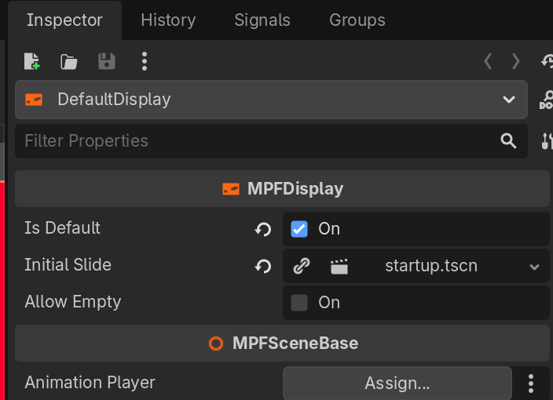

# MPFDMDDisplay

`MPFDMDDisplay` is a Godot Node class that extends the base `MPFDisplay` class and is special for hardware DMDs. The class includes special logic for rendering the display, transposing the pixel data, and sending the data back to MPF for delivery to the hardware DMD.

The DMD rendering flow does not use frames-per-second, but instead leverages the Godot engine's rendering system (`RenderingService.has_changed()`) to trigger display updates. This minimizes serial traffic by only sending new frame data when the frame changes.

## Node Configuration

Just like `MPFDisplay`, all `MPFDMDDisplay` instances must be first-level child nodes of the main `MPFWindow` root. The name of the `MPFDMDDisplay` node is the name of the DMD defined in the MPF config, and can be used in MPF configs as the `target:` value when targeting a slide or widget to a specific display.

When creating your Window scene, instead of adding an `MPFDisplay` node add a `MPFDMDDisplay` node instead. Or if you already have an `MPFDisplay` node, right-click the node and *Change Type...* to select MPFDMDDisplay.

## Parameters

The Godot Editor *Inspector* panel provides the following parameters for the `MPFDMDDisplay` node (in addition to all `MPFDisplay` node parameters):

### pixel_order:

Single value. Default: `RGB`

The order of pixel data (Red, Green, Blue) sent to MPF. If your hardware DMD uses pixels that are RBG or GRB, you will need to set the appropriate value here to get the correct colors.

### resolution:

Single value, type: `Vector2i`. Default: Display node viewport resolution.

This is the physical resolution of the hardware DMD. If specified, the rendered image will be scaled to this resolution for the pixel data sent to MPF (regardless of the size of the display node). If not specified, the display node dimensions will be used.

### use_gpu:

Single value. Default: `NEVER`

**Not Yet Implemented**

## Methods

`MPFDMDDisplay` does not have any public methods exposed.
