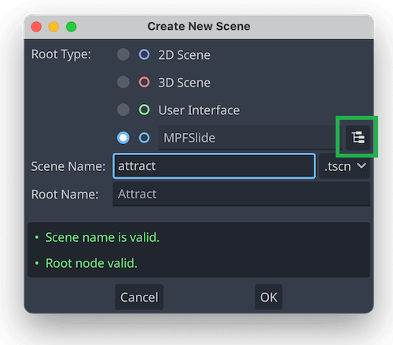

# Initial Project Setup

Before we can start building scenes, a few project setup steps are required. With your project open in the Godot Editor, go to *Project > Project Settings* to open the settings dialog.

## Set the Main Scene

Every slide, widget, and other UI file in Godot is called a "scene". When your Godot project runs, it needs to know which scene to load as its entry point.

When using GMC, the main scene will be the "window", the foundation on which all the rest of GMC is built. Each project has a single Window scene that initializes GMC, opens a connection to MPF, and mounts the "display" scenes that correspond to the screen (or screens) that your pinball machine has.

As your project becomes more complex and your knowledge of Godot improves, you may want to build a custom startup scene for your game. In the meantime, GMC comes with a default Window scene to get you started.

Since your Godot project is brand new, you need to tell it what scene is the entry point. On the left menu bar of Project Settings, select *Application > Run* and in the Main Scene picker, navigate to `/addons/mpf-gmc/slides/window.tscn` and select that to be your main scene.

## Set the Window Size

If you only have one display for your game, your Window size will be the size of that display. If you are using multiple displays, the Window size will be the size of the box necessary to encompass all of the displays.

On the left menu bar of Project Settings, select *Display > Window* and set the Viewport Height and Viewport Width to the height and width of your display. Not only will this set the window size when you run the project, it will also set default guidelines on the scene editor to help you lay out your slides.

The other settings here will be customized later, including windowed/fullscreen mode, window position, and borderless. However, now is a good time to uncheck Resizable to prevent the window from being resized.

You can now close the Project Settings and save your project.

# Create an Attract Mode slide

The first slide we will create is for Attract mode, so we can connect to MPF and verify that GMC is working properly. Slides can live in either a `slides` folder in the project root, or in a `slides` subfolder under any mode in your project modes folder (e.g. `/modes/attract/slides`). Create a slides folder in either location, and then in the Godot FileSystem panel right-click on the slides folder and select *Create New > Scene*.

Every slide in GMC must derive from the custom `MPFSlide` class, so in the *Create New Scene* dialog under **Root Type** click on the tree icon to pick a custom node class. Search for and select the `MPFSlide` class. Enter the name of your slide "attract" as the scene name, and press OK to create the scene.

## Decorate the Attract slide

You'll now be at the Scene Editor view for the attract slide, which is empty. We'll start by adding a nice background color: In the *Scene* panel in the upper-left, click on the **+** icon to add a new node. In the node panel, search for and select `ColorRect` to add a colored rectangle to the scene. Drag the rectangle's corners to fill the purple dimensions on screen (which correspond to your Window size). Use the color picker in the *Inspector* panel to set a nice color.

!!! tip

  You can enable grid snap to help get the rectangle node in the correct place, or you can manually enter the size to make it exact. In the *Inspector* panel on the right, go to *Layout > Transform > Size* to enter the exact dimensions you want.

Next we'll add some text to the slide. Back at the *Scene* panel, add another node and this time search for and select `Label`. Move the node to the middle of the slide and expand it to the full width of the slide.

In the *Inspector* panel, in the *Text* field type in the text "Welcome to GMC!", set the *Horizontal Alignment* to Center, and under *Theme Overrides > Font Sizes* set a nice big font, like 100px.

# Run MPF

You are now ready to run GMC and connect to MPF! Save the project and in the upper right corner of the Editor, click on the Play icon. You will see a window appear with the MPF logo, which is the default startup scene from GMC.

In your terminal, in your project folder with your virtual environment activated, run `mpf -xt` to start MPF.