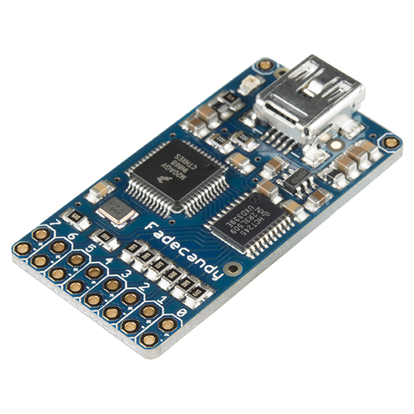

# How to configure a FadeCandy RGB LED Controller


Related Config File Sections:

* [hardware:](../../config/hardware.md)
* [lights:](../../config/lights.md)
* [fadecandy:](../../config/fadecandy.md)
* [open_pixel_control:](../../config/open_pixel_control.md)

MPF allows you to use a FadeCandy LED controller to drive the LEDs in
your pinball machine. A FadeCandy is a small, cheap (\$25) USB
controller which can drive up to 512 serially-controlled RGB LEDs.



You can use the FadeCandy in place of connecting your LEDs to a
P-ROC/P3-ROC controller, or you can choose to drive some LEDs via your
primary pinball controller and some via the FadeCandy. (This is useful
if you want to use more LEDs than what your controller platform
supports.)

You can connect up to four FadeCandy boards to drive a total of 2048
LEDs (Which would be insane. And awesome.)

You can read more about the FadeCandy on the main page of the [FadeCandy
software repository](https://github.com/scanlime/fadecandy) in GitHub or
on [Adafruit](http://www.adafruit.com/products/1689) or
[SparkFun](https://www.sparkfun.com/products/12821), where you can buy
one for \$25. The FadeCandy is very advanced, offering advanced light
processing capabilities such as dithering and interpolation that are not
available if you just control LEDs directly.

If you're not familiar with the FadeCandy, check out this intro video
from SparkFun:

<div class="video-wrapper">
<iframe width="560" height="315" src="https://www.youtube.com/embed/-4AUBjV7Y-w" title="YouTube video player" frameborder="0" allow="accelerometer; autoplay; clipboard-write; encrypted-media; gyroscope; picture-in-picture" allowfullscreen></iframe>
</div>

Overview video about serial LEDs:

<div class="video-wrapper">
<iframe width="560" height="315" src="https://www.youtube.com/embed/Q9BG9T7Kj4A" title="YouTube video player" frameborder="0" allow="accelerometer; autoplay; clipboard-write; encrypted-media; gyroscope; picture-in-picture" allowfullscreen></iframe>
</div>

## 1. Understanding all the parts and pieces

Before we dig in to setting up a FadeCandy with MPF, let's look at how
all the various components will fit together:

* The FadeCandy is a piece of hardware that talks to your host
    computer via USB. (So if you use it in a pinball machine then
    you'll have two devices connected via USB---your pinball controller
    and your FadeCandy.)
* The FadeCandy hardware is driven a FadeCandy server software that
    you'll run on your host computer along side the MPF game engine and
    the MPF media controller. The FadeCandy server talks to the
    FadeCandy hardware via a USB driver.
* The FadeCandy server receives instructions for LEDs connected to the
    FadeCandy via a protocol called [Open Pixel
    Control](http://openpixelcontrol.org/) (OPC).

Putting it all together, MPF talks to the FadeCandy server via OPC, and
the FadeCandy server talks to the FadeCandy hardware via USB.

## 2. Download the FadeCandy package from GitHub

The first step is to download the [FadeCandy
package](https://github.com/scanlime/fadecandy/releases/latest) from
GitHub. You can unzip it to wherever you want.

## 3. Install the FadeCandy drivers

When I plugged the FadeCandy hardware into my Windows computer, the
driver did not install automatically. Running the fcserver (next step)
said it was installing the drivers, but that didn't do anything for me.
(It just said "this may take awhile" but I killed it when it didn't
seem like it was actually doing anything.)

In my case, I googled and found [this
procedure](http://www.libusb.org/wiki/winusb_driver_installation) to
build custom .inf files for Windows. It seems crazy but it wasn't too
bad. I had to build two: One for the FadeCandy device and one for the
FadeCandy boot loader. Either way, you can follow the docs and the
forums around the FadeCandy and get it setup.

## 4. Setup the fcserver

The FadeCandy download package includes pre-built binaries for Mac and
Windows. On Linux you can compile it. Again, the FadeCandy documentation
has details about how to do this.

At this point you should be able to run the fcserver and to talk to your
FadeCandy LEDs and get them to do things. There are a bunch of sample
apps in the FadeCandy package that are kind of cool.

## 5. Set your LEDs to use the "fadecandy" platform

Next you need to configure your LEDs in MPF to use the `fadecandy`
platform. By default, all types of devices are assumed to be using the
same platform that you have set in the
[hardware:](../../config/hardware.md) of your machine config
file. So if your platform is set to `fast`, MPF assumes your LEDs are
connected to a FAST controller, and if your platform is set to `p_roc`
or `p3_roc`, MPF assumes your LEDs are connected to a PD-LED board.

To configure MPF to use FadeCandy LEDs, you can add an entry to the
`hardware:` section of your machine config to tell it to override the
default platform for your LEDs and to instead use the `fadecandy`
platform, like this:

``` mpf-config
hardware:
  platform: p_roc
  driverboards: pdb
  lights: fadecandy
```

See the [Mixing-and-Matching hardware platforms](../platform.md) guide for
more information about setting device-specific default platforms versus
overriding the platform for individual devices.

## 6. Understanding FadeCandy LED numbering

The FadeCandy hardware has 8 connectors for LEDs, each of which can
support up to 64 RGB LEDs (for 512 RGB LEDs total). The connectors are
numbered 0-7.

The individual LED numbers are sequential across channels. The first LED
on Connector 0 is #0, the second is #1, etc., up #63 on Connector 0.
Then Connector 1 picks up where Connector 0 leaves off, with the first
LED on Connector 2 being #64, and so on. The FadeCandy doesn't actually
know how many LEDs are connected to each connector, so the first LED on
Connector 1 is always LED #64 even if you have less than 64 LEDs
physically connected to Connector 0.

The following diagram explains how the numbering works:


Consider the following config:

``` mpf-config
lights:
  l_led0:
    number: 0    # first LED on connector 0
  l_led1:
    number: 1    # second LED on connector 0
  l_led2:
    number: 128    # first LED on connector 2
```

(If you're familiar with the Open Pixel Control protocol, all of the
LEDs on a single FadeCandy board are on the same OPC channel, which is
technically what you're specifying with the number before the dash.)

### 6a. Numbering with multiple channels

You can also assign different OSC channels to your connectors. This has
certain performance advantages and allows nicer numbering.

Start your fadecandy server with the following config:

``` json
{
    "listen": ["127.0.0.1", 7890],
    "verbose": true,
    "color": {
        "gamma": 2.5,
        "whitepoint": [1.0, 1.0, 1.0]
    },
    "devices": [
        {
            "type": "fadecandy",
            "serial": "YOUR_FADECANDY_SERIAL",
            "map": [
                [ 0, 0, 0, 64 ],
                [ 1, 0, 64, 64 ],
                [ 2, 0, 128, 64 ],
                [ 3, 0, 192, 64 ],
                [ 4, 0, 256, 64 ],
                [ 5, 0, 320, 64 ],
                [ 6, 0, 384, 64 ],
                [ 7, 0, 448, 64 ]
            ]
        }
    ]
}
```

Replace [YOUR_FADECANDY_SERIAL](#) with the serial of your
fadecandy. The serial will be shown on the console of
[fcserver](#) when connecting your fadecandy.

Then configure your lights as follows:

``` mpf-config
lights:
  l_led0_0:
    number: 0-0    # first LED on connector 0
  l_led1_0:
    number: 1-0    # first LED on connector 1
  l_led1_1:
    number: 1-1    # second LED on connector 1
  l_led7_20:
    number: 7-20    # twentyth LED on connector 7
```

## 6b. Numbering with multiple Fadecandy Boards

If you want to use multiple FadeCandy boards we suggest the following
config:

``` json
{
    "listen": ["127.0.0.1", 7890],
    "verbose": true,
    "color": {
        "gamma": 2.5,
        "whitepoint": [1.0, 1.0, 1.0]
    },
    "devices": [
        {
            "type": "fadecandy",
            "serial": "YOUR_FADECANDY_SERIAL1",
            "map": [
                [ 0, 0, 0, 64 ],
                [ 1, 0, 64, 64 ],
                [ 2, 0, 128, 64 ],
                [ 3, 0, 192, 64 ],
                [ 4, 0, 256, 64 ],
                [ 5, 0, 320, 64 ],
                [ 6, 0, 384, 64 ],
                [ 7, 0, 448, 64 ]
            ]
        },
        {
            "type": "fadecandy",
            "serial": "YOUR_FADECANDY_SERIAL2",
            "map": [
                [ 8, 0, 0, 64 ],
                [ 9, 0, 64, 64 ],
                [ 10, 0, 128, 64 ],
                [ 11, 0, 192, 64 ],
                [ 12, 0, 256, 64 ],
                [ 13, 0, 320, 64 ],
                [ 14, 0, 384, 64 ],
                [ 15, 0, 448, 64 ]
            ]
        },
        {
            "type": "fadecandy",
            "serial": "YOUR_FADECANDY_SERIAL3",
            "map": [
                [ 16, 0, 0, 64 ],
                [ 17, 0, 64, 64 ],
                [ 18, 0, 128, 64 ],
                [ 19, 0, 192, 64 ],
                [ 20, 0, 256, 64 ],
                [ 21, 0, 320, 64 ],
                [ 22, 0, 384, 64 ],
                [ 23, 0, 448, 64 ]
            ]
        }
    ]
}
```

Replace [YOUR_FADECANDY_SERIAL1](#),
[YOUR_FADECANDY_SERIAL2](#) and
[YOUR_FADECANDY_SERIAL3](#) with the serials of your fadecandy
boards (you can use more or less than three). The serial will be shown
on the console of [fcserver](#) when connecting your fadecandy.

Afterwards, configure your lights as follows:

``` mpf-config
lights:
  l_led0_0:
    number: 0-0    # first LED on connector 0 on board 0
  l_led1_0:
    number: 1-0    # first LED on connector 1 on board 0
  l_led1_1:
    number: 1-1    # second LED on connector 1 on board 0
  l_led7_20:
    number: 7-20    # twentyth LED on connector 7 on board 0
  l_led8_0:
    number: 8-0    # first LED on connector 0 on board 1
  l_led8_1:
    number: 8-63    # last LED on connector 1 on board 1
  l_led17_1:
    number: 17-1    # second LED on connector 1 on board 2
```

## 7. Understanding MPF light numbers and channels

--8<-- "light_channels_numbers.md"

Fadecandy assumes RGB lights by default. For everything else (i.e. RGBW)
you have to use channels.

### Light Numbers

Fadecandy numbers use the format: `osc_channel`-`number`

If you mapped OSC channels as described in (6b/c) set them as
`osc_channel`. `number` is the index of your light in the chain.

Internally, Fadecandy assumes three channels per LED (RGB/GRB
[WS2811/WS2812 LEDs](../../mechs/lights/ws2812.md)).

### Channels

Fadecandy channels use the format: `osc_channel`-`channel_index`

`channel_index` is `number * 3`. This is because serial LEDs are
traditionally RGB (or GRB) LEDs with exactly three channels. However,
this is not true for RGBW or similar LEDs which do not work with this
style of numbering. Luckily, you can chain them instead and have MPF
calculate the internal channels for you:

``` mpf-config
lights:
  led_0:
    start_channel: 0-0
    subtype: led
    type: rgb    # will use red: 0-0, green: 0-1, blue: 0-2
  led_1:
    previous: led_0
    subtype: led
    type: rgbw   # will use red: 0-3, green: 0-4, blue: 0-5, white: 0-6
  led_2:
    previous: led_1
    subtype: led
    type: rgbw   # will use red: 0-7, green: 0-8, blue: 0-9, white: 0-10
```

See [WS2811 and WS2812 LEDs in Pinball](../../mechs/lights/ws2812.md) for details.

## 8. Launch the fcserver

In order for MPF to communicate with the FadeCandy, the fcserver has to
be running. Refer to the FadeCandy documentation for instructions for
this. On Windows, for example, it's just called `fcserver.exe`.

There are several command line options you can use with the server,
though you don't need any of them with MPF unless you have more than
one FadeCandy board connected.

You should launch fcserver in its own window since it will take over the
console when it's running. It's also safe to keep it running all the
time, or you can add it to a batch file to run it automatically. On my
system, the fcserver puts some error message on the screen about not
being able to connect to something, but everything still works even with
that message continually being written to the console. (I think it's
something to do with the P-ROC's FTDI driver? It only comes up when the
P-ROC is on.)

## 9. Additional FadeCandy LED options

The FadeCandy hardware supports some advanced options which are
configured in the [fadecandy:](../../config/fadecandy.md)
section of your machine configuration file. Specifically, you can set
the keyframe interpolation, dithering, gamma, white point, linear slope,
and linear cutoff. The defaults should be fine for almost everyone,
though you can go nuts if you want.

## 10. Color Correction

If you are using RGB LEDs, they might not be perfectly white when you
turn them on. They might be pinkish or blueish instead depending on the
brand of the LED. To a certain extend this is normal/expected and you
can compensate for it by configuring
[hardware color correction in the fadecandy](../../config/fadecandy.md). If you need more than one correction profile (e.g. for
multiple LED models) you need to fall back to
[software color_correction profiles in light_settings](../../config/light_settings.md). Hardware correction should be preferred and give you much
more dynamic range.

## What if it did not work?

Have a look at our
[fadecandy hardware troubleshooting guide](../../troubleshooting/index.md).

* [Troubleshooting Fadecandy](../../troubleshooting/index.md)
