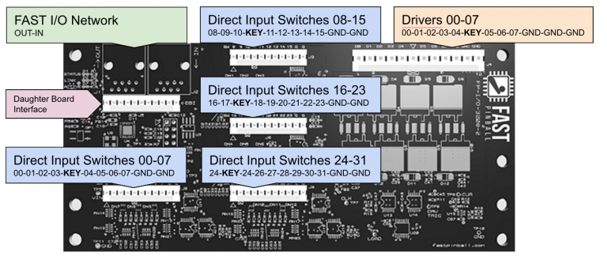

# How to configure switches (FAST Pinball)


Related Config File Sections:

* [fast:](../../config/fast.md)
* [switches:](../../config/switches.md)

To configure switches with FAST Pinball hardware, you can follow the
guides and instructions in the [Switches](../../mechs/switches/index.md) docs.

However there are a few things to know and some additional options you
get with FAST hardware that is discussed here.

## number:

When you're using FAST IO boards, switches plug into individual IO
boards. Then the IO boards are connected together in a loop.



The `number:` setting for each switch is its board's position number in
the chain, then the dash, then the switch input number. Note that the
position number starts with zero, so the first IO board in the chain is
0, the second is 1, etc.

``` mpf-config
switches:
  my_switch:
    number: 0-0    # first board, switch 0
  some_other_switch:
    number: 2-24    # third board, switch 24
```

Notes:

* The first board in the chain is board 0.
* The boards are counted in the direction of the "out" connector
    on the controller board.
* Different models of IO boards have different numbers of switches,
    and MPF will make sure that the numbers work for each type of
    board. (e.g. a switch number 10 isn't valid on an 0804 board
    since that board only has 8 switches numbered 0-7).

Also note that prior versions of MPF just numbered all the switches in
one continuous sequence from the first board through the last, but that
was confusing. You can still do that if you want (in integer format),
but we feel the board-input format is much easier to understand.

## Debounce options

FAST controllers have advanced capabilities when it comes to debouncing
switches. (More on what that is
[here](../../mechs/switches/debounce.md)).

Since FAST switches are directly connected (e.g. there is no switch
matrix), and since every FAST IO board has its own processor and
firmware, the states of switches are checked often (every 1ms). You can
specify the exact debounce time that a switch must consistently be in a
new state in both the open and close directions.

### Specifying default debounce settings

By default, MPF provides two debounce profiles for switches ("normal"
and "quick"). When using FAST pinball controllers, the "normal"
debounce profile is `4ms` for both the debounce open and debounce closed
times, and the "quick" debounce profile is `2ms` for both debounce
open and closed times.

You can change any of these in the `fast:` section of your machine-wide
config, like this:

``` mpf-config
fast:
  default_quick_debounce_open: 2ms
  default_quick_debounce_close: 2ms
  default_normal_debounce_open: 4ms
  default_normal_debounce_close: 4ms
```

(Note that other settings from the `fast:` section of your config have
not been included here for clarity.)

### Per-switch debounce settings

When using FAST Pinball controllers, you can also specify the debounce
open and debounce closed settings on a per-switch basis. To do that,
just add a `debounce_open:` and/or `debounce_close:` setting to an
individual switch, like this:

``` mpf-config
switches:
  my_switch:
    number: 1-0
    platform_settings:
      debounce_open: 5ms
      debounce_close: 20ms
  some_other_switch:
    number: 3-24
```

Valid values are 1 to 255 ms.

## What if it did not work?

Have a look at our
[FAST troubleshooting guide](../../troubleshooting/index.md).
