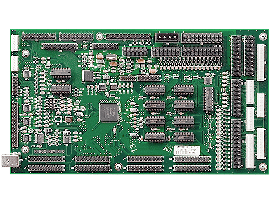

# Connecting P/P3-Roc to your Computer


This page is about connecting the P/P3-Roc to your computer. It roughly
covers connecting the bus between the nodes. For electronic details see
the [P-Roc section in the pinballmakers.com
Wiki](http://pinballmakers.com/wiki/index.php/P-ROC_Main_Page).

## P-Roc

If you got a P-Roc just connect it to your computer using USB.



Then connect switches and driver according to the manual (see
[leds](../../machines/index.md) for
specific machines). If you are using a PD-Master board see below for
switches and drivers.

[mpf hardware scan](../../running/commands/hardware.md) will show the firmware version and revision of your P-Roc if
it is connected correctly.

## P3-Roc

If you got a P3-Roc just connect it to your computer using USB.


Connect all your SW-16 boards to the switch bus and all your PD-16 and
PD-8x8 boards to your driver bus. Use twisted wires but connect + to +
and - to - on all nodes.


[mpf hardware scan](../../running/commands/hardware.md) will show the firmware version and revision of your P3-Roc
if it is connected correctly.

### SW-16


Set a unique address on every SW-16 board on your bus. Those addresses
can overlap with the driver addresses. It does not matter on which of
the two switch busses the boards are connected. Terminate the bus at the
last board. See [leds](switches_p3_roc.md) for how
to configure those boards.

You can list all SW-16 using
[mpf hardware scan](../../running/commands/hardware.md):

``` console
$ mpf hardware scan

Firmware Version: 2 Firmware Revision: 6 Hardware Board ID: 1
SW-16 boards found:
 - Board: 0 Switches: 16 Device Type: A3 Board ID: 0
 - Board: 1 Switches: 16 Device Type: A3 Board ID: 1
 - Board: 2 Switches: 16 Device Type: A4 Board ID: 2
```

### PD-16/PD-8x8


Set a unique address on every PD-16/PD-8x8 board on your bus. Those
addresses can overlap with the switch addresses. However, they overlap
with the PD-LED addresses so plan accordingly. It does not matter on
which of the two driver busses the boards are connected. Terminate the
bus at the last board. See [leds](drivers.md) and
[leds](lights.md) for how to configure those
boards.

MPF and the P3-Roc do not know if those boards are connected as the
communication is one-way only.

### PD-LED


Set a unique address on every PD-LED board on your bus. Those addresses
can overlap with the switch addresses. However, they overlap with the
PD-16 addresses so plan accordingly. It does not matter on which of the
two driver busses the boards are connected. Terminate the bus at the
last board. See [How to configure LEDs on the PD-LED (P-ROC/P3-ROC)](leds.md) for how to
configure those boards.

MPF and the P3-Roc do not know if those boards are connected as the
communication is one-way only.

## What if it did not work?

Have a look at our
[troubleshooting guide for the P/P3-Roc](../../troubleshooting/index.md).
