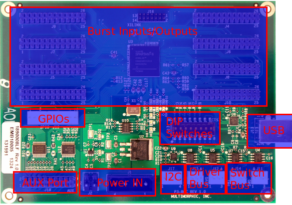

# How to configure switches (P3-ROC)


Related Config File Sections:

* [drivers](../../config/switches.md)

To configure switches on a P3-ROC, you can follow the guides and
instructions in the [drivers](../../mechs/switches/index.md) docs.

However there are a few things to know about using switches with a
P3-ROC.

## number:

Unlike the P-ROC, the P3-ROC does not have switch inputs on the P3-ROC
itself. Instead, you add SW-16 boards which each have 16 direct switch
inputs. (e.g. there is no switch matrix.) You can connect up to 16
SW-16s to support as many as 256 switches.


Each SW-16 has a unique `board number` which is set using DIP switches
(find that out now). On each board there are two `banks` (A and B) of 8
switches. Then each switch has an `input number` (0 to 7).

To configure the `number:` of a switch connected to an SW-16 board and a
P3-ROC, you have two options:

### Board Bank Switch Syntax

The first (and easier) option is to enter the number as a combination of
the SW-16 `board address` (0-15, as configured by the DIP switches),
then the `bank number` (Bank A is 0, Bank B is 1), then the switch
`input number` (0-7).

For example:

``` mpf-config
switches:
  my_switch:
    number: A0-B0-0    # SW-16 board at address 0, Bank A, Switch 0
  my_other_switch:
    number: A2-B1-5    # SW-16 board at address 2, Bank B, Switch 5
```

### Direct Numbering

You can also use the internal number. As mentioned in the SW-16 manual
you can calculate those using:

`Bank A switch: P3-ROC switch # = SW-16 address * 16 + Bank A switch input`
`Bank B switch: P3-ROC switch # = SW-16 address * 16 + 8 + Bank B switch input`

However, we recommend the above syntax because it will perform this
calcuation for you.

For example:

``` mpf-config
switches:
  my_switch:
    number: 0     # SW-16 board at address 0, Bank A, Switch 0
  my_other_switch:
    number: 45    # SW-16 board at address 2, Bank B, Switch 5
```

### Connecting Switches

Switches are connected between the input pin and ground. On SW-16
revision 1 those are pins 1, 3-9 for switch 0 to 7 on bank A (J2) and 1,
2, 4-9 for switch 0 to 7 on bank B (J6). Ground is on 10 for both banks.
On SW-16 revision 2 those are pins 2 to 9 for switch 0 to 7 and 10 for
ground on headers J2 (Bank A) and J6 (Bank B). Revision two has an
additional low current 12V output on pin 1.

## Burst Switch Inputs

Burst switch inputs (J3 to J10) on the P3-Roc can be used in two ways in
MPF.

* Burst Optos - As burst switch inputs in combination with a burst
    switcher driver can drive long-beam optos. This is how they were
    originally intended.
* Local Inputs - Alternatively you can use them as direct local inputs
    (and the burst drivers as outputs; see [How to configure coils/drivers/magnets (P-ROC/P3-ROC)](drivers.md) section for details).



### Burst Switches as Burst Optos

You can configure burst optos using the following syntax:

``` mpf-config
switches:
  burst_opto_1_20:
    number: burst-1-20     # burst input with switch 1 and driver 20
  burst_opto_2_20:
    number: burst-2-20     # burst input with switch 2 and driver 20
  burst_opto_10_5:
    number: burst-10-5     # burst input with switch 10 and driver 5
```

Make sure to disable DIP switches 1 and 2 on the P3-Roc. You can
configure up to five switches per driver.

!!! note

    There is currently no reliable way to read the initial state of burst
    optos. MPF will assume that all burst IRs are open on start-up. This
    might cause if you use it to track balls in a ball lock which might
    contain balls from a previous game. This limitation will probably go
    away in future firmware update of the P3-Roc.

### Burst Opto PCBs

Burst optos are unlike normal
[optos](../../mechs/switches/optos.md) and you
cannot use normal optos. Instead, they use 40kHz infrared transmitters
and receivers. Multimorphic sells them as single transmitter/receiver
(part number: PCBA-0011-0002) and as bank of 8 (part number:
PCBA-0003-0003).

### Burst Switches as Local Inputs

If you want to use burst switches as local inputs set DIP switch 2 to
`on` on the P3-Roc. You can use those 64 inputs as direct inputs:

``` mpf-config
switches:
  local_switch0:
    number: direct-0       # local input 0
  local_switch20:
    number: direct-20      # local input 20
```

Make sure to assign IDs >= 4 to all SW-16 boards if you set DIP 2.
Local switches behave just like any other switch on the P3-Roc. Hardware
rules, debouncing etc. will behave exactly the same way.

!!! note

    You need at least Firmware version 2.6 to use burst switches as local
    inputs on the P3-Roc.

!!! warning

    There is no electronic protection on the P3-Roc for burst switches
    (neither as local inputs nor as burst optos). Do not use them without
    additional protection. Any voltage above 3.3V or below 0V will
    irreversibly damage the P3-Roc. Make sure you know what you are doing
    before turning this on. We advise to use SW-16 for normal playfield/mech
    inputs and only use local inputs with additional circuits (not
    directly). If you plan to use burst optos have a look at the PCBs
    offered from Multimorphic for that purpose.

## Debounce options

The P-ROC has the ability to configure
[debounce settings](../../mechs/switches/debounce.md) for switches. A non-debounced switch which report its state
change immediately, while a debounced switch will report its state
change after it's been in the new state for two consecutive reads.

By default, MPF will enable debouncing in both directions (open and
close) for all switches. However you can override this on a per-switch
basis with a switch's `debounce:` setting.

Valid options are `normal`, `quick`, and `auto`.

To disable debouncing for a switch, add `debounce: quick` to the switch
config, like this:

``` mpf-config
switches:
  my_switch:
    number: A0-B0-0
    debounce: quick
```

To force debouncing to always be used (which is also the default on the
P-ROC, so not really needed), configure it like this:

``` mpf-config
switches:
  my_switch:
    number: A0-B0-0
    debounce: normal
```

## What if it did not work?

Have a look at our
[troubleshooting guide for the P/P3-Roc](../../troubleshooting/index.md).
