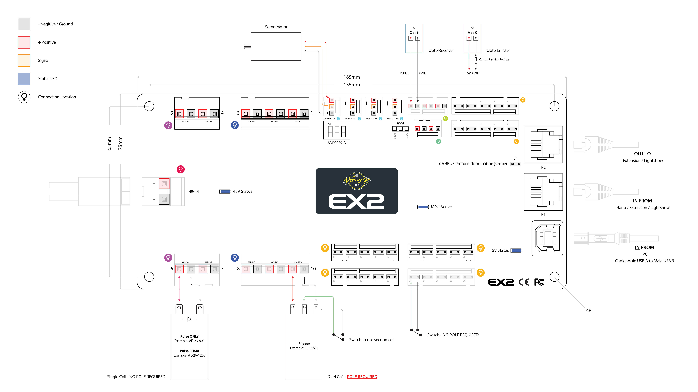

# Connecting PKONE to your Computer

This page explains how to connect an EX2, Switch and Lightshow chain to
the computer running MPF.

## Connect the EX2 by USB

Connect the EX2 USB port to the computer. MPF uses the EX2 as the USB
connection to the CAN chain.

Connect the EX2 CAN OUT port to the CAN IN port of the next EX2, Switch
or Lightshow board. Continue from OUT to IN until every board is in one
line. Give every board a unique Address ID with its DIP switches, then
restart the boards.

Notes:

* Connect the boards as one line, not as a star or loop. Fit a CAN
    termination jumper at each physical end of the chain. Remove it from
    every board in the middle. A correctly powered-down chain normally
    measures about 60 ohms between CAN-H and CAN-L.
* Set a unique Address ID before powering the chain. Restart a board after
    changing its DIP switches.
* Use firmware 3.0 or newer on EX2, Switch and Lightshow boards. The `X`
    used in an EX2 discovery reply is a wire-protocol identifier retained
    for compatibility; it does not refer to a separate board product.
* EX2 and Switch addresses range from 0 to 7. Lightshow addresses range
    from 0 to 3.
* No two boards on the chain may use the same Address ID, even when they
    are different board types.
* The physical chain order does not have to match Address ID order.
