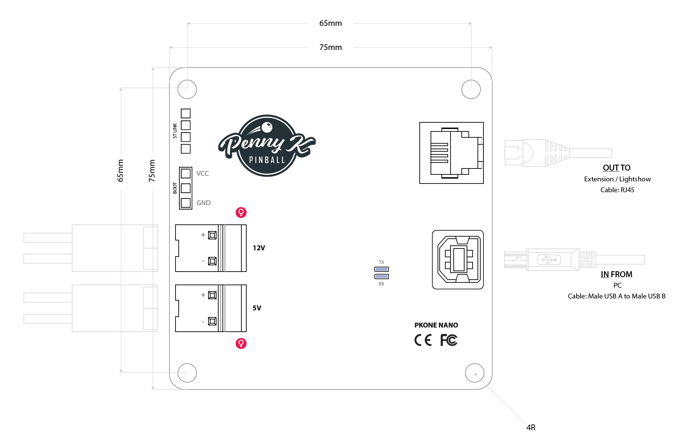

# Connecting PKONE to your Computer

This page is about connecting the PKONE system to your computer. It
roughly covers connecting the bus between the boards.

## PKONE Nano

Connect your PKONE NANO controller to your PC using USB.

Then connect the OUT port of your NANO to the IN port of your first
board (Extension or Lightshow). Consequently, connect the OUT port of
the first board to the IN port of your second board (etc.). Be sure each
Extension board or Lightshow board has a unique Address ID set using the
Address ID switches on each board. Finally, be sure the last board in
the chain has the CANBUS Protocol Termination Jumper set to properly
terminate the bus.

Notes:

* Connect the boards as one line, not as a star or loop. Fit a CAN
    termination jumper at each physical end of the chain. Remove it from
    every board in the middle. A correctly powered-down chain normally
    measures about 60 ohms between CAN-H and CAN-L.
* Set a unique Address ID before powering the chain. Restart a board after
    changing its DIP switches.
* EX2 firmware 3.0 is Extension-compatible and can act as the USB-connected
    controller for a chain. Switch and Lightshow boards remain discoverable
    downstream over CAN.

* Address ID values are numbered starting with zero (EX2 and Switch
    boards have addresses 0 to 7 while Lightshow boards have addresses
    0 to 3).
* An EX2 or Switch board cannot have the same Address ID number as a
    Lightshow board (all connected boards must have unique Address ID
    values).
* You do not have to chain the boards in the same order as their
    Address ID numbers.
