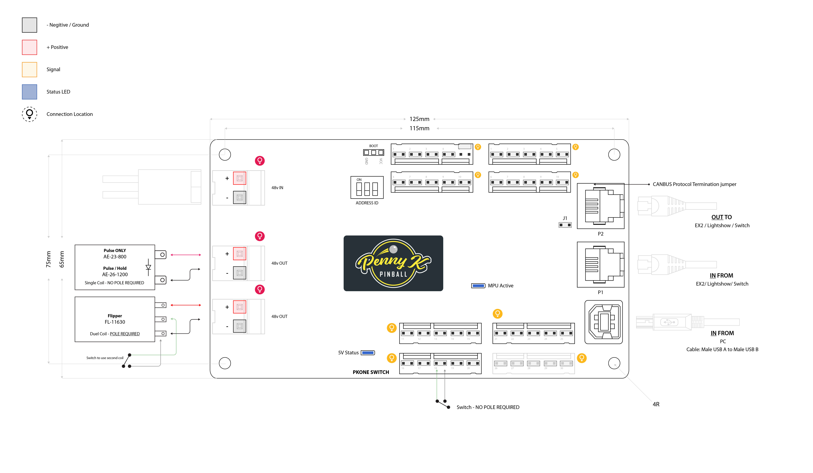

# How to configure switches (Penny K Pinball PKONE)


Related Config File Sections:

* [pkone:](../../config/pkone.md)
* [switches:](../../config/switches.md)

To configure switches with Penny K Pinball PKONE hardware, you can
follow the guides and instructions in the
[Switches](../../mechs/switches/index.md) docs.

However there are a few things to know and some additional options you
get with Penny K Pinball PKONE hardware that is discussed here.

## number:

Switch inputs may be connected to either an EX2 or a Switch board. EX2
provides 30 standard switch inputs plus five opto inputs. The Switch board
provides 40 switch inputs.




The `number:` setting for each switch is its board's Address ID number
in the PKONE chain, then the dash, then the switch input number. EX2 has
inputs 1-35; the Switch board has inputs 1-40.

``` yaml
switches:
  my_switch:
    number: 0-1    # EX2 board at address 0, switch 1
  some_other_switch:
    number: 2-24    # EX2 board at address 2, switch 24
```

Notes:

* The PKONE EX2 and Switch board Address ID switches can be set from 0 to
    7.
* EX2 inputs 31-35 are set up in the hardware to support optos and
    other normally closed (NC) switches. Do not list them as NC
    switches in your configuration as the hardware already inverts the
    values before sending them to MPF.
* The Switch board reports inputs 1-40. Its two physical coil connectors
    are disabled by firmware 3.0 and MPF rejects attempts to configure
    them as coils.

## What if it did not work?

Have a look at our
[PKONE troubleshooting guide](../../troubleshooting/index.md).
