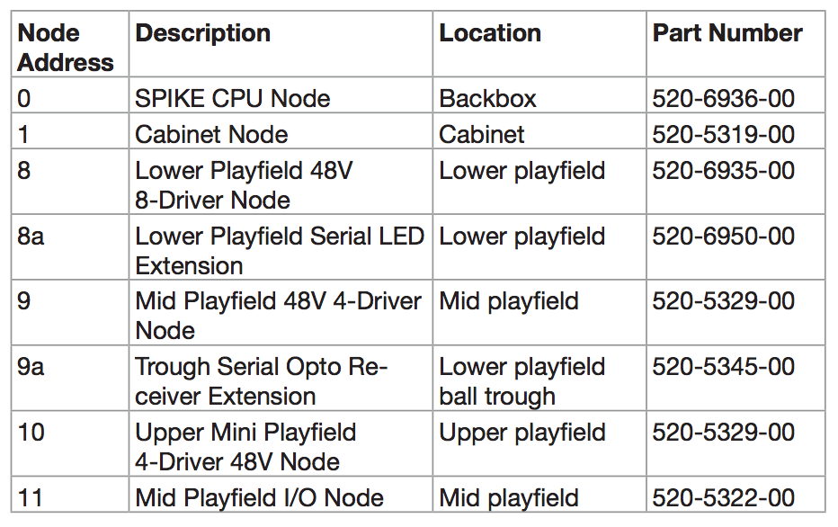

# How to configure MPF for Stern SPIKE hardware


Related Config File Sections:

* [hardware:](../../config/hardware.md)
* [spike:](../../config/spike.md)

This guide explains how to configure MPF to work with Stern SPIKE
pinball machines. It applies to SPIKE and SPIKE 2 systems.

## 1. Install the drivers for your USB-to-serial adapter

Before you proceed, make sure that you have the drivers properly
installed for your USB-to-serial adapter and that when you plug it in,
you see the serial port.

## 2. Configure your hardware platform for SPIKE

To use MPF with a SPIKE hardware, you need to configure your platform as
`spike` in your machine-wide config file. You'll also need to add a
"spike:" section with some additional settings:

``` mpf-config
hardware:
  platform: spike
spike:
  port: /dev/ttyUSB0
  baud: 115200
  flow_control: false
  debug: false
  nodes: 0, 1, 8, 9, 10, 11
  runtime_baud: 115200
```

Some notes on the settings:

port:

:   Use the port of your USB-serial adapter or of the internal serial on
    your computer. On Windows, this will have a name like "COM5".

baud:

:   This needs to match the value from Step 3 in the
    [MPF SPIKE bridge instructions](mpf-spike-bridge.md). It is used to initialize the connection to SPIKE only.
    Afterwards, the bridge will switch to `runtime_baud`.

flow_control:

:   If your hardware supports flow control and you connected "RTS" and
    "CTS" in the previous steps set this to True. It will make the
    connection much more stable at higher speeds. It can be `False` for
    a first test.

runtime_baud:

:   Note that since only control and switch information is sent across
    this bus, 115k baud is plenty fast enough if you choose not to use a
    DMD. However, if you want to use a DMD you need more speed (see
    below for details).

debug:

:   Set this to true for print more details in the log.

nodes:

:   This is a list of the node board addresses that your system has. You
    can get this from the manual. Here's an example from Wrestlemania
    Pro:

  

      Only map the node boards and ignore the extension boards because
    those   are transparent to MPF. Just consider 8 and 8a/8b to be the
    same node.

Once you got your game running you can increase the speed using
`runtime_baud`:

``` mpf-config
hardware:
  platform: spike
spike:
  port: /dev/ttyUSB0
  baud: 115200
  runtime_baud: 2000000
  flow_control: true
  debug: false
  nodes: 0, 1, 8, 9, 10, 11
```

This will increase the baudrate after the start of the mpf-spike-bridge.
You do not have to change anything to use this setting. The following
baudrate are supported:

* 230400
* 460800
* 576000
* 1000000
* 1152000
* 2000000
* 2500000
* 3000000
* 3500000
* 4000000

Depending on your hardware setup they might or might not work. Most
setups communicate reliably up to something beween 1Mbaud and 2.5Mbaud.
To stream full 30fps to your DMD you need about 2Mbaud. You need
flow_control at rates higher than about 0.5MBaud.

## What if it did not work?

Have a look at our
[SPIKE troubleshooting guide](../../troubleshooting/index.md).
