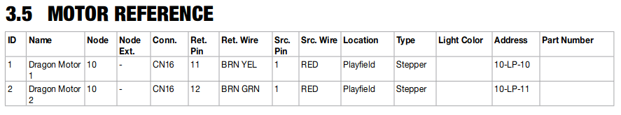

# How to configure steppers (Stern SPIKE)


Related Config File Sections:

* [spike:](../../config/spike.md)
* [switches:](../../config/switches.md)
* [steppers:](../../config/steppers.md)

Node board on Spike support up to four steppers. Steppers connect to
light outputs on the board and a homing switch (which may be on another
board). We guess that they are hardware-wise similar to the
[StepStick](../stepstick.md)
(but that does not matter if you are using an existing machine).

To configure a stepper in Spike you can use the following example:

``` mpf-config
switches:
  s_stepper_home:
    number: 11-4
steppers:
  stepper0:
    number: 10-0
    homing_mode: switch
    homing_switch: s_stepper_home
    platform_settings:
      speed: 20
      light_number: 10-10
    named_positions:
      100: test_1
      200: test_2
      500: test_3
```

This will configure Stepper `0` on node `10`. You can choose a number
from `0` to `3`. Which ones does not matter but you can only use every
number once.

Then you need to look up the motor reference number in your manual. This
is an example from Game of Thrones LE:



We are interested in `10-LP-10`. This is used as `light_number` above.
`10-LP-11` is not used and we guess that Spike automatically uses the
next output as well.

The home switch is called `Dragon Home` in GoT and has the number
`11-SW-4` according to the manual. We configure is as `s_stepper_home`
in this example.

You can change `speed` and `homing_speed` to configure how fast the
stepper will move. See [Stepper Motors](../../mechs/steppers.md) for more details about steppers.

## What if it did not work?

Have a look at our
[SPIKE troubleshooting guide](../../troubleshooting/index.md).
