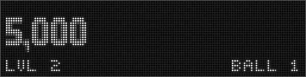
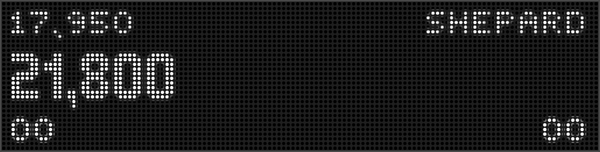

# How to configure a multiplayer display


This is an example walkthrough of creating a "score" slide that
dynamically adjusts as additional players are added to the game, and
displays custom player variables in addition to ball number and score.

## 1. Game Modes vs Player Modes

Unlike most events in MPF, adding players can occur both during a
player's turn and prior to it, so it's a good idea to run your base
slide as part of the "game" mode rather than inside a player-specific
mode. This is easy to do by creating a mode folder and config file for
the game mode, which MPF will automatically append to the default game
configuration. You do not need to add any mode start/stop events to
game.yaml, as those are all taken care of internally.

## 2. Create a base "single_player" slide in game.yaml



We'll start by creating the default single-player slide and showing it
when the game starts, which will always be single-player because a
second player can't be added until after the game starts.

We'll create each element of this slide as a separate widget, so we can
remove different pieces one-by-one as the number of players increases.
In this example, we have a large score for the current player, show the
player's custom-variable "level" in the lower-left, and their current
ball number in the lower-right

``` yaml
slides:
  base_slide: []
slide_player:
  single_player_ball_started: base_slide
widgets:
  base_score_widget:
    - type: text
      text: (score)
  base_level_widget:
    - type: text
      text: LVL (player|level)
  base_ball_widget:
    - type: text
      text: BALL (ball)
widget_player:
  # First event, before additional players have a chance to enter
  game_started:
    base_score_widget:
      slide: base_slide
    base_level_widget:
      slide: base_slide
    base_ball_widget:
      slide: base_slide
##! test
#! start_game
#! advance_time_and_run .1
#! assert_text_on_top_slide "0"
#! assert_text_on_top_slide "LVL 0"
#! assert_text_on_top_slide "BALL 1"
```

This is all we need to have a nice single-player slide that shows the
score, the ball, and a custom game-specific player variable.

## 3. Add a Second Player

With the addition of a second player we'll shrink the main score down a
little, and show a small player_1 indicator in the upper-left and a
player_2 indicator in the upper-right. Because the current player's
score is already shown in the middle, in this example we'll show
another player variable (in this case, the player's name) where their
score normally is.


The _[multi_player_ball_started](../../events/multi_player_ball_started.md)_ event happens when a player's turn
starts and there are multiple players in the game, so this will show our
multiplayer slide at the beginning of every ball.

The _[multiplayer_game](../../events/multiplayer_game.md)_ event happens as soon as a second player is
added, so we use it to swap the slides if player_2 joins after player_1
has already started their turn.

Because the "game" mode exists between player turns, its slides can
interfere with other slide behavior (e.g. bonus slides and start/end of
turn slides). We'll keep it clean and manually clear the score slide at
the end of each ball.

``` yaml
slides:
  base_slide:
    - type: text
      text: "Single Player Game"
  multiplayer_slide:
    - type: text
      text: "Multiplayer Player Game"
slide_player:
  single_player_ball_started: base_slide
  multi_player_ball_started: multiplayer_slide
  # If a second player joins during player1's turn, swap base_slide for multiplayer_slide
  multiplayer_game:
    base_slide:
      action: remove
    multiplayer_slide:
      action: play
  ball_will_end:
    base_slide:
      action: remove
    multiplayer_slide:
      action: remove
##! test
#! start_game
#! advance_time_and_run .1
#! assert_text_on_top_slide "Single Player Game"
#! add_player
#! advance_time_and_run .1
#! assert_text_on_top_slide "Multiplayer Player Game"
```

With only two players, we can keep the "level" and "ball" widgets in
the bottom left and right corners. We want to add the player_1 and
player_2 widgets in the upper corners, and swap out the big
"base_score_widget" for the slightly smaller "mp_score_widget" one:

    widget_player:
      { ... game_started: ... }

      # Player 2 has entered the game
      player_added{num==2}:
        mp_score_widget:
          slide: multiplayer_slide
        base_level_widget:
          slide: multiplayer_slide
        base_ball_widget:
          slide: multiplayer_slide
        # Start with player1 name and player2 score
        mp_name_widget_player_1:
          slide: multiplayer_slide
        mp_score_widget_player_2:
          slide: multiplayer_slide

    widgets:
      { ... base_widgets ... }

      mp_score_widget:
        - type: text
          text: (score)
          style: score_style_multiplayer

      # Player 1 score, for when they're not playing
      mp_score_widget_player_1:
        - type: text
          text: (player1|score)
          style: mp_player_1
      # Player 2 score, for when they're not playing
      mp_score_widget_player_2:
        - type: text
          text: (player2|score)
          style: mp_player_2

      # Player 1 custom variable, for when they are playing
      mp_name_widget_player_1:
        - type: text
          text: (machine|last_career_player_1)
          style: mp_player_1
      # Player 2 custom variable, for when they are playing
      mp_name_widget_player_2:
        - type: text
          text: (machine|last_career_player_2)
          style: mp_player_2

## 4. Adding a third and fourth player

Since the multiplayer slide is already being shown, adding player_3 and
player_4 is as easy as swapping out the "level" and "ball" widgets
for player scores.



    widget_player:
      { ... single and player_2 widget_player ... }

      # Player 3 has entered the game
      player_added{num==3}:
        mp_score_widget_player_3:
          slide: multiplayer_slide
        # Remove the "Level" widget and place the player3 score
        base_level_widget:
          action: remove
          slide: multiplayer_slide

      # Player 4 has entered the game
      player_added{num==4}:
        mp_score_widget_player_4:
          slide: multiplayer_slide
        # Remove the "Ball" widget and place the player4 score
        base_ball_widget:
          action: remove
          slide: multiplayer_slide

    widgets:
      { ... single and player_2 widgets .. }

      mp_score_widget_player_3:
        - type: text
          text: (player3|score)
          style: mp_player_3
      mp_score_widget_player_4:
        - type: text
          text: (player4|score)
          style: mp_player_4
      mp_name_widget_player_3:
        - type: text
          text: (machine|last_career_player_3)
          style: mp_player_3
      mp_name_widget_player_4:
        - type: text
          text: (machine|last_career_player_4)
          style: mp_player_4

## 5. Turn-by-turn display changes

It's nice showing a custom player variable for the current player
during their turn, but we want to swap out that widget for their score
after their turn ends.

Because we don't know how many players there will be, it's not safe to
use the next player's turn to reset the previous player's widget.
Instead, we set each player's custom variable widget at the start of
their turn and reset their score widget at the end of their turn.

    widget_player:
      { ... base and multi-player widgets ...}

      # Player Turns: Swap scores -> names when turn starts, revert when turn ends
      player_turn_started{number==1}:
        mp_score_widget_player_1:
          action: remove
        mp_name_widget_player_1:
          slide: multiplayer_slide
      player_turn_ended{number==1}:
        mp_score_widget_player_1:
          slide: multiplayer_slide
        mp_name_widget_player_1:
          action: remove
      player_turn_started{number==2}:
        mp_score_widget_player_2:
          action: remove
        mp_name_widget_player_2:
          slide: multiplayer_slide
      player_turn_ended{number==2}:
        mp_score_widget_player_2:
          slide: multiplayer_slide
        mp_name_widget_player_2:
          action: remove
      player_turn_started{number==3}:
        mp_score_widget_player_3:
          action: remove
        mp_name_widget_player_3:
          slide: multiplayer_slide
      player_turn_ended{number==3}:
        mp_score_widget_player_3:
          slide: multiplayer_slide
        mp_name_widget_player_3:
          action: remove
      player_turn_started{number==4}:
        mp_score_widget_player_4:
          action: remove
        mp_name_widget_player_4:
          slide: multiplayer_slide
      player_turn_ended{number==4}:
        mp_score_widget_player_4:
          slide: multiplayer_slide
        mp_name_widget_player_4:
          action: remove
