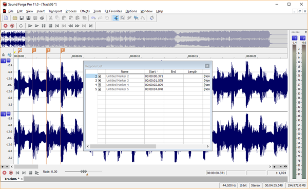

!!! warning "MPF-MC is being deprecated"

    This instruction page is for the legacy MPF-MC for MPF versions 0.57 and prior. For users of MPF 0.80 and later, please refer to the [Godot Media Controller (GMC) Documentation](../../gmc/index.md)

# Sound & Audio Tips & Tricks


This page contains a collection of miscellaneous tips and tricks when
working with the sound & audio features in MPF.

## Common Digital Audio Terms

### Bit Depth

The number of bits used to represent and store a single sample. Bit
depth (also commonly referred to as sample resolution) determines
the number of possible levels that can be captured during
digitalization. 16-bit represents 65,536 (2 to the 16th power)
possible values. The MPF-MC audio library only supports 16-bit audio
files.

### Brickwall limiter

A brickwall limiter is used to ensure an audio signal does not
exceed a certain threshold. Any input value exceeding the threshold
is set to the threshold value. This is used in the mixing engine to
ensure 16-bit integers do not exceed their maximum value and wrap
around (which adds ugly sounding distortion). It is important to set
sound and track volume levels properly in order to avoid the
clipping that brickwall limiting adds when mixing signals that are
too loud.

### [Ducking](ducking.md)

Ducking is an audio effect that lowers the level of one audio signal
based upon the level of another audio signal (one sound "ducks"
out of the way of another).

### FLAC

Free Lossless Audio Codec (FLAC) is an audio file format which
allows digital audio to be losslessly compressed such that file size
is reduced without any information being lost.

### Normalization

Normalization is the process of changing an audio recording's
overall volume by a fixed amount to reach a target level.

### Ogg Vorbis (OGG)

A free and open-source audio coding format. Ogg Vorbis is a lossy
compressed audio file format.

### Sample Rate

The number of samples per second taken from a continuous signal to
make a discrete signal. A common example of sample rate is CD audio
which is recorded at 44,100 Hz (44,100 samples per second).

### WAV

Waveform Audio File Format is a Microsoft and IBM audio file format
standard for storing an audio bitstream on computers. WAV is a
lossless uncompressed audio file format.

## Preparing your sound files for use in MPF

The custom audio library supports several audio file formats for sounds,
however only 16-bit audio files can be used (this is a SDL_Mixer
limitation). If you have sounds that do not have a bit depth of 16-bits
then you must use audio editing software to resample your files to
16-bits. [Audacity](http://www.audacityteam.org) is a full-featured,
free, open source, cross-platform audio software application for
recording and editing. It is fully capable of performing all the
necessary steps to prepare your audio files for use in MPF.

!!! note

    Do all your audio editing in a lossless audio format (such as WAV) and
    preserve a master copy in that format as well in case you may want to
    perform any future editing. Convert a copy of all your sound files to
    your machine's sample rate and bit depth (ex: 44,100 Hz 16-bit) for use
    in MPF. Use WAV format for the fastest loading sound files and Ogg
    Vorbis for the smallest file sizes (if storage space is at a premium).

Here is a typical workflow for preparing your sound files:

1.  Make a backup copy of all your original sound files (in case you
    accidentally mess one up while editing it you'll have a backup).
2.  Trim silence from the beginning and end of your sound files.
    Removing the silence from the file will make the sound feel more
    responsive and will take up less memory.
3.  Normalize your sound files using peak normalization to 0 dB. This
    will maximize the volume level of your sound files without clipping.
4.  Resample all your audio files to a bit depth of 16-bits and use the
    sample rate you will be using in your machine (a typical sampling
    rate is CD quality 44,100 Hz). This will save processing power when
    loading your samples are no resampling will need to take place.
5.  Save the files in your desired file format (WAV is recommended for
    loading speed).

Your files are now ready to begin using in MPF. The read the other basic
steps for setting up sounds, see
[How to set up sound](basic_setup.md).

## Review `max_queue_time` Settings for Long Sounds/Music

The `max_queue_time` settings for sounds can lead to some unexpected
behavior, especially for longer sounds (like music). This setting
specifies the maximum time a sound can be queued before it's played. On
a track that supports only a single sound at a time (like a typical
music track), playing a sound with a priority that is less than or equal
to the currently playing sound will have to wait until the current sound
is finished (it will be added to the queue). That may be acceptable to
you, but you may also be surprised when you hear the sound a minute or
two later.

It is suggested you review all your `max_queue_time` settings to make
sure they make sense for the sound and situation in which they will be
played. The default setting of `None` means the sound will eventually be
played, no matter how long the wait in the queue is. A value of `0`
specifies the sound will be immediately discarded if the track is
already busy playing its maximum number of sounds. A value of `2 secs`
specifies the sound will wait in the queue for 2 seconds to be played
before being discarded. Sound effects for things like slingshots and pop
bumpers probably don't make much sense if they are played more than 250
milliseconds after they are hit so setting `max_queue_time` to a value
between `0` and `250 ms` is recommended. On the other hand, an extra
ball callout is probably fine to play a few seconds after the ball is
earned. Go through your sounds and consider how to set this setting for
each one.

For more information, see the
[sounds](../../config/sounds.md) documentation.

## Synchronizing Sound With an LED Show

The key to synchronizing an LED show with a music track is to determine
at what times in the sound file you want events (such as LED color
changes) to occur. There are many ways to do this, but here are a few
suggestions:

* Use your favorite sound or editing software to open your music track
    and place markers in all the locations where you want LED changes to
    occur. This may take some trial and error and listening to portions
    of your music over and over again until you get it right. Once your
    markers are in place, export them to a text file (if your software
    supports it), or write down the times of each marker. Use the times
    as step times in your show and assign the LED settings you want in
    each step. This is a bit of a tedious process, but should give you
    nice synchronization when the show is played at the same time as the
    music track (you can even put the sound play action in the first
    step of your show). I work on a PC and use Sony Sound Forge for
    sound editing, but there are many good editors available on every
    platform that support inserting markers. Here is a screenshot of the
    process in the editor I use:

    

    This feature is also available in
    [Audacity](http://www.audacityteam.org) (free open-source
    cross-platform sound editing software) and many video editing
    packages.

* As an alternative, you can determine the tempo of your song in beats
    per minute (BPM) and from that number calculate the time for each
    beat. Once you have the time for each beat, you can use it to
    calculate various show step times (assuming you want LED changes to
    occur on the beat). There are some tools out there that will
    calculate the BPM of your song for you, but are not always very
    accurate depending upon the content of your song.

For more information on creating shows for your LED, see the
[Shows](../../shows/index.md) documentation

## Pausing Background Music While a Video is Playing

With the addition of the new
[track_player](../../config/track_player.md)
config player in 0.32, it is now possible to control audio tracks using
MPF events. One common use of this new functionality is to pause your
music track while you play a video and resume the music when the video
is finished playing.

The basic concept is to add an event to the video that is triggered when
the video is played and one when the video is stopped. Those events are
then added to the `track_player` section of your config file:

``` yaml
track_player:
  my_video_is_playing:
    music:
      action: pause
      fade: 1 sec
  my_video_has_stopped:
    music:
      action: play
      fade: 1 sec
##! test
#! advance_time_and_run .1
```

That's all there is to it. Now whenever the `my_video_is_playing` MPF
event is posted, the music track will be paused. It will be resumed when
the `my_video_has_stopped` MPF event is posted.

## When Two Drop Targets Are Hit Simultaneously How Do I Keep Two Sounds From Playing

A common scenario with drop targets is to play a sound when each target
is hit. Frequently a player will hit two targets with a single shot
dropping them both virtually at the same time. In this situation playing
a sound for each target is not always desired. Instead, it would be nice
to only have a single sound played when the targets are hit within a
short time window.

One possible way to solve this in MPF is to use
[counters](../../game_logic/logic_blocks/counters.md). Counters have a
[multiple_hit_window](../../config/counters.md)
setting that prevents accidental double hits within the configured time
period. Instead of using the target hit event to trigger the sound, the
target hit event will trigger the counter which in turn will post a hit
event that can be used to trigger the sound. Here is an example:

``` yaml
coils:
  reset_drop_targets:
    number: 1

switches:
  sw_drop_target_1:
    number: 1
  sw_drop_target_2:
    number: 2
  sw_drop_target_3:
    number: 3

drop_targets:
  target_1:
    switch: sw_drop_target_1
    reset_coil: reset_drop_targets
  target_2:
    switch: sw_drop_target_2
    reset_coil: reset_drop_targets
  target_3:
    switch: sw_drop_target_3
    reset_coil: reset_drop_targets

counters:
  drop_target_counter:
    count_events: drop_target_target_1_hit, drop_target_target_2_hit, drop_target_target_2_hit
    multiple_hit_window: 500ms
    events_when_hit: drop_target_counter_hit

sounds:
  drop_target_sound:
    file: blip1.ogg
    volume: 0.75

sound_player:
  drop_target_counter_hit:
    drop_target_sound:
      action: play
##! asset: sounds/blip1.ogg=sounds/sound.ogg
##! test
#! advance_time_and_run .1
```

Alternatively, you could also define a separate track which allows only
one concurrent sound at a time. See [Tracks](tracks.md) for details.
