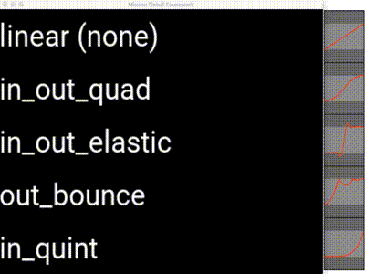

---
---

## Config file for the easing GIF

In case you're wondering how we created the easing GIF files, here are
the complete MPF machine config for them.

First, here's the GIF where we set the easing for the x (horizontal
position) property and move them left and right:



!!! note

    If you're viewing the PDF version of these docs, you won't see the
    GIFs since they're animated. You can view the docs online to see them.

In order to run this example, you do not need to run the MPF core
engine, just the MC. So name this file config.yaml and put it in a
config folder, and then run:

    mpf mc

Note that the graphs with the red lines on the right are not part of
this config, but it wouldn't be hard to add them.

Basically this file just creates a single display with a single slide
with five text widgets, sets up the animations for them, and then has a
slide_player entry to show that slide on the *init_done* event which is
posted by the media controller once it's ready to show slides. (That's
why we don't need the MPF core engine to run this example.)

``` mpf-mc-config
# config_version=5
displays:
  default:
    width: 400
    height: 300
slides:
  slide1:
    - type: text
      text: linear (none)
      y: 90%
      font_size: 35
      animations:
        show_slide:
          - property: x
            value: 205
            duration: 1s
            easing: linear
          - property: x
            value: 0
            duration: 1s
            easing: linear
            repeat: true
    - type: text
      text: in_out_quad
      y: 70%
      font_size: 35
      animations:
        show_slide:
          - property: x
            value: 215
            duration: 1s
            easing: in_out_quad
          - property: x
            value: 0
            duration: 1s
            easing: in_out_quad
            repeat: true
    - type: text
      text: in_out_elastic
      y: 50%
      font_size: 35
      animations:
        show_slide:
          - property: x
            value: 185
            duration: 1s
            easing: in_out_elastic
          - property: x
            value: 0
            duration: 1s
            easing: in_out_elastic
            repeat: true
    - type: text
      text: out_bounce
      y: 30%
      font_size: 35
      animations:
        show_slide:
          - property: x
            value: 220
            duration: 1s
            easing: out_bounce
          - property: x
            value: 0
            duration: 1s
            easing: out_bounce
            repeat: true
    - type: text
      text: in_quint
      y: 10%
      font_size: 35
      animations:
        show_slide:
          - property: x
            value: 275
            duration: 1s
            easing: in_quint
          - property: x
            value: 0
            duration: 1s
            easing: in_quint
            repeat: true
slide_player:
  init_done: slide1
```

And here's the example where we animate the opacity:


``` mpf-mc-config
# config_version=5
displays:
  default:
    width: 400
    height: 300
slides:
  slide1:
    - type: text
      text: linear (none)
      y: 90%
      font_size: 35
      animations:
        show_slide:
          - property: opacity
            value: 1
            duration: 1s
            easing: linear
          - property: opacity
            value: 0
            duration: 1s
            easing: linear
            repeat: true
    - type: text
      text: in_out_quad
      y: 70%
      font_size: 35
      animations:
        show_slide:
          - property: opacity
            value: 1
            duration: 1s
            easing: in_out_quad
          - property: opacity
            value: 0
            duration: 1s
            easing: in_out_quad
            repeat: true
    - type: text
      text: in_out_elastic
      y: 50%
      font_size: 35
      animations:
        show_slide:
          - property: opacity
            value: 1
            duration: 1s
            easing: in_out_elastic
          - property: opacity
            value: 0
            duration: 1s
            easing: in_out_elastic
            repeat: true
    - type: text
      text: out_bounce
      y: 30%
      font_size: 35
      animations:
        show_slide:
          - property: opacity
            value: 1
            duration: 1s
            easing: out_bounce
          - property: opacity
            value: 0
            duration: 1s
            easing: out_bounce
            repeat: true
    - type: text
      text: in_quint
      y: 10%
      font_size: 35
      animations:
        show_slide:
          - property: opacity
            value: 1
            duration: 1s
            easing: in_quint
          - property: opacity
            value: 0
            duration: 1s
            easing: in_quint
            repeat: true
slide_player:
  init_done: slide1
```
