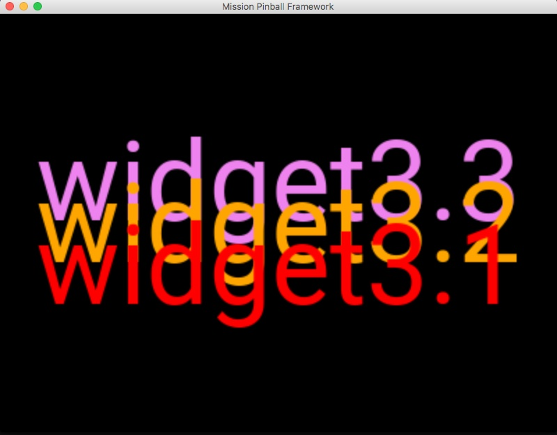

# Widget layers, z-order, & parent frames


When you have multiple widgets on a slide, you can control the layer (or
z-order) of the widgets, controlling which widgets are on top of others
in cases where two or more widgets overlap.

When adding a widget to an existing slide, you also have the option to
add it to the "parent frame" (and not to the slide), meaning that if
the slide changes, the widget will still be there.

Let's look at how all this works.

## Overlapping widgets, layers, & z-order

Any time you have two widgets that overlap, MPF must decide which widget
will be drawn "on top" of the other.

At the most basic level, any time you have more than one widget listed
in a config (whether it's in a `widget_player:`, `slide_player:`, or a
definition in a `slides:` or `widgets:` section), the widgets will be
drawn in the order they are in the config.

For example, here's a slide that has widget3.1, then widget3.2, then
widget3.3:

``` mpf-mc-config
slides:
  3_widgets:
    - type: text
      text: widget3.1
      color: red
      font_size: 80
      y: 40%
    - type: text
      text: widget3.2
      color: orange
      font_size: 80
      y: 50%
    - type: text
      text: widget3.3
      color: violet
      font_size: 80
      y: 60%
#! slide_player:
#!   show_slide: 3_widgets
##! test
#! post show_slide
#! advance_time_and_run .1
#! assert_text_on_top_slide "widget3.1"
```

The result is like this. Note that widget3.1 is on top of widget3.2,
which is on top of widget3.3:



In this example, all three widgets are 100% opaque, but if any of them
had opacity of less than 100%, then you would see the lower level widget
through the higher one. See the [Widget Opacity & Transparency](opacity.md)
guide for details.

You can also use the `z:` setting to manually set the relative order of
how you want the widgets to overlap. Widgets with higher `z:` values
will be drawn on top of those with lower values.

Here's the same example as before, but with `z:` values added:

``` mpf-mc-config
slides:
  3_widgets:
    - type: text
      text: widget3.1
      color: red
      font_size: 80
      y: 40%
      z: 1
    - type: text
      text: widget3.2
      color: orange
      font_size: 80
      y: 50%
      z: 100
    - type: text
      text: widget3.3
      color: violet
      font_size: 80
      y: 60%
      z: 2
#! slide_player:
#!   show_slide: 3_widgets
##! test
#! post show_slide
#! advance_time_and_run .1
#! assert_text_on_top_slide "widget3.1"
```

And the results:


Note that *widget3.2* is on top since it's `z:` is 100, then
*widget3.3* is next with `z: 2`, and finally *widget3.1* is on the
bottom with `z: 1`

Notes about z-order:

* The default `z:` value is `0`, so anytime you have a widget without
    a `z:` setting, it's like you have `z: 0`.
* The order the widgets are listed in the config file is only used as
    a tie-breaker if multiple widgets have the same `z:` settings. (This
    is why the first example worked, since all three widgets had
    `z: 0`.)
* You can mix-and-match order and `z:` settings.
* The actual numeric `z:` settings don't matter. You can have 1, 2, 3
    or 100, 200, 300, or 1, 20000, 1000000 or whatever you want.
* Setting `z:` values for widgets on a slide is only really used if
    you want to later use the widget player to add a widget to a slide
    in between certain existing widgets.
* In most slides, you will not mess with `z:` settings and instead use
    the order of the widgets in the config file to set the order they
    are on the slide.

## Adding widgets to parent frames

When you use the `widget_player:`, it will add the widget to the current
slide on the default display.

If you want to target a specific slide, you can add a `slide:` setting
to your widget player with the name of the slide.

In both cases, the widget player will add the widget to a slide.

However, it's also possible to add a widget to the "frame" which
holds the slides, meaning that the widget is shown "on top" of the
slide rather than as part of the slide.

Why would you want to do that?

Sometimes it's useful to have a widget which "stays put" even as the
underlying slides change.

One example is for tilt warnings. When the player gets a tilt warning,
you might want to show the text "WARNING" for 2 seconds. However if
you use the regular widget player to add this widget to the current
slide, then if that slide is replaced by another slide during those 2
seconds, your tilt warning will disappear too.

Another example is the scores. Maybe you want those to show along the
bottom on top of every slide? Or maybe something like the news crawl on
the bottom of the *Dialed In* display?

To do this, you can add the setting `z: -1` under the `widget_settings:`
section of your desired widget. Here's an example:

``` yaml
widget_player:
    trigger_event:
        my_widget:
            widget_settings:
               z: -1
```

This will make the widget added to the frame, and not to a slide,
meaning your widget will ride "on top" of every slide (and even on top
of any slide transitions that take place).
