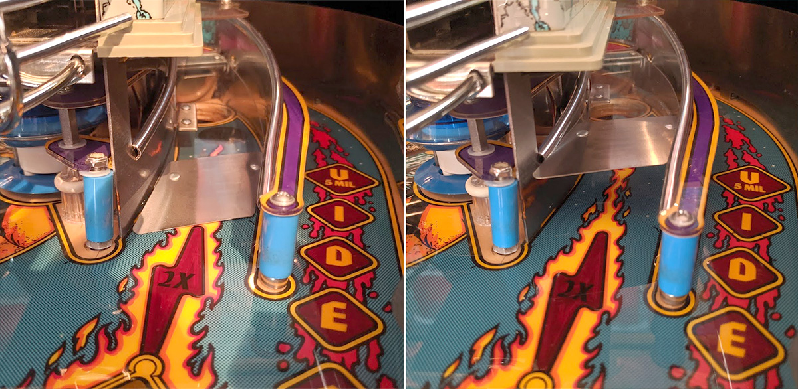

# Up-Down Ramps


Related Config File Sections:

* [index](../../config/diverters.md)

Some machines have ramps which can be moved up and down. Those mechanism
typically act as a diverter and should be configured as such.

## Hardware



Up-Down ramps either work with one coil or two coils. Single-coil ramps
use the coil to move the ramp up or down temporarily Typically, they use
a spring or gravity to move it back, However, since the coil has to stay
energized those ramps can only be active for a short amount of time.
Two-coil ramps only pulse one coil to move the ramp up or down. This
poses the advantage that the ramp stays at one position without
energizing a coil. However, this adds complexity (and a second coil) and
is only used if the ramp has to stay at both positions for extended
periods of time.

Some part numbers:

* Getaway: B-12576 assembly
* RFM: A-22989
* Apollo 13: #500-6044-00-44 assembly
* Golden Eye: #515-6494-00

## Config

Up-Down ramps are configured like a normal diverter:

``` mpf-config
#! coils:
#!   c_ramp1_up:
#!     number:
#!   c_ramp2_up:
#!     number:
#!   c_ramp2_down:
#!     number:
diverters:
  up_down_one_coil:
    activation_coil: c_ramp1_up
    type: hold
  up_down_two_coils:
    activation_coil: c_ramp2_up
    deactivation_coil: c_ramp2_down
    type: pulse
```

Related How To guides:

* [Diverters](../../index.md)
