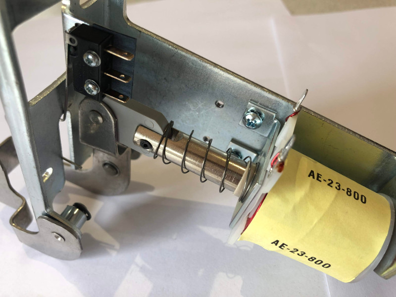

# Combo (mechanical + coil-fired) plungers


Related Config File Sections:

* [ball_devices:](../../config/ball_devices.md)
* [playfields:](../../config/playfields.md)

This guide explains how to configure a "combo" plunger lane which has
both a mechanical spring-powered plunger as well as a coil-fired auto
plunge option.

Here's an example of this:




If you have a purely mechanical plunger with no autolaunch option,
follow the [/mechs/playfields/ball_tracking](mechanical_with_switch.md) guide
instead. If you have a standard coil-fired plunger or launch device with
no mechanical spring plunger, follow the [/mechs/playfields/ball_tracking](coil_fired.md) guide instead.

!!! note

    If you're reading through this guide and comparing it to the guide for
    the coil-fired plunger lane, you'll find that they're almost
    identical, except that this guide adds the `mechanical_eject: true`
    setting to the plunger.

## 1. Add the switches

The first step is to add your plunger's switches to the `switches:`
section of your machine config file. Create an entry in the `switches:`
section for the switch which is in the plunger lane that's activated by
a ball waiting to be plunged.

You might also have a button which the player can hit to launch balls
into play. Some machines have this (Like *Stern Star Trek* with the
button on the apron), while others only let the player launch the ball
with spring plunger and they use the coil for ball save and multiballs
only.

So add one (or both, if you have a launch button) to your machine config
if you haven't done so already:

``` mpf-config
switches:
  s_plunger_lane:
    number: 2-6
  s_launch_button:
    number: 1-5
```

Note that we configured this switches with numbers `2-6` and `1-5`, but
you should use the actual switch numbers for your control system that
the switches are connected to. (See
[How to configure "number:" settings](../../hardware/numbers.md) for instructions for
each type of control system.)

Be sure to set the `type: NC` if either of these switches is an opto and
to configure the other switch settings as needed.

## 2. Add the coil

Next, create an entry in your `coils:` section of your machine config
file for your plunger lane's eject coil. Again, the name doesn't
matter. We'll call this *c_plunger* and enter it like this:

``` mpf-config
coils:
  c_plunger:
    number: 2-1
    default_pulse_ms: 20
```

Again, the `number:` entries in your config will vary depending on your
actual hardware, and again, you can pick whatever name you want for your
coil.

You'll also note that we went ahead and entered a `default_pulse_ms:`
value of 20 which will override the default pulse time of 10ms. It's
hard to say at this point what value you'll actually need. You can
always adjust this at any time. You can play with the exact values in a
bit once we finish getting everything set up.

## 3. Add your plunger / launcher ball device

Remember a [ball device](../ball_devices/index.md) is anything in your pinball machine that holds a ball (even
if it's just for a short time). So your plunger lane / ball launcher is
a ball device.

In this case, you can add an entry for your plunger to the
`ball_devices:` section of your machine-wide config, and then create sub
entries for the ball switch and eject coil.

Here's an example. Note that in this case, we've left out the other
ball devices (such as your trough and/or drain):

``` mpf-config
#! switches:
#!   s_plunger_lane:
#!     number: 2-6
#! coils:
#!   c_plunger:
#!     number: 2-1
#!     default_pulse_ms: 20
ball_devices:
  bd_plunger:
    ball_switches: s_plunger_lane
    eject_coil: c_plunger
```

In the example above, we named the plunger device *bd_plunger*, but if
course you can name it whatever you want. You might use *bd_catapult*
for a catapult-style launcher, or *bd_right_plunger* and
*bd_left_plunger* for a game like Judge Dredd that has plunger lanes on
both sides.

Note that the `ball_switches:` entry will just be a single switch. It's
the switch that's active when a ball is sitting in the plunger waiting
to be launched. (This is NOT the switch the player hits to launch the
ball if you have one of those.)

Since there's only one switch listed in the `ball_switches:` section,
that will tell MPF that this device can hold one ball.

## 4. Add the mechanical eject setting

Since your plunger ball device has an option for the player to manually
plunge the ball with the spring rod, we need to give MPF a "heads up"
that a ball sitting in the plunger lane might suddenly disappear, and
that when that happens, that means the player has attempted to eject the
ball from this device.

To do that, add `mechanical_eject: true` to your plunger device, like
this:

``` mpf-config
#! switches:
#!   s_plunger_lane:
#!     number: 2-6
#! coils:
#!   c_plunger:
#!     number: 2-1
#!     default_pulse_ms: 20
ball_devices:
  bd_plunger:
    ball_switches: s_plunger_lane
    eject_coil: c_plunger
    mechanical_eject: true
```

## 5. (Optional) Configure the launch switch

If your machine also has a launch button which you'd like to
(optionally) use for the player to hit to launch the ball into play with
the plunger lane's eject coil, then you can add a setting called
`player_controlled_eject_event:`.

At this point, you might be wondering why we configure a player
controlled eject "event". Why is it an "event" and not a "switch"?

This is due to MPF's flexibility to support the myriad of different
types of machines in the world.

For example, some machines launch the ball when a player hits a button.
Others launch it when the player *releases* a button. Still others play
a little show then launch. Etc.

So we decided, "Hey, we have this great events system in MPF, so let's
just use that."

Remember that by default, there are "active" events that are posted
when a switch becomes active, and "inactive" events that are posted
when a switch that was active becomes inactive.

### 5.1 Launching the ball when a player hits the launch button

Assuming the switch tied to the launch button (or gun trigger or fishing
rod button or whatever you have) is called *s_launch_button*, then that
means an event called *s_launch_button_active* will be posted as soon as
that switch is hit. In that case, you'd configure your plunger like
this:

``` mpf-config
#! switches:
#!   s_plunger_lane:
#!     number: 2-6
#!   s_launch_button:
#!     number: 1-5
#! coils:
#!   c_plunger:
#!     number: 2-1
#!     default_pulse_ms: 20
ball_devices:
  bd_plunger:
    ball_switches: s_plunger_lane
    eject_coil: c_plunger
    mechanical_eject: true
    player_controlled_eject_event: s_launch_button_active
```

Pretty straightforward.

### 5.2 Launching the ball when a player releases the launch button

If you want to launch the ball into play when the player *releases* the
launch button, then just use that switch's inactive event:

``` mpf-config
#! switches:
#!   s_plunger_lane:
#!     number: 2-6
#!   s_launch_button:
#!     number: 1-5
#! coils:
#!   c_plunger:
#!     number: 2-1
#!     default_pulse_ms: 20
ball_devices:
  bd_plunger:
    ball_switches: s_plunger_lane
    eject_coil: c_plunger
    mechanical_eject: true
    player_controlled_eject_event: s_launch_button_inactive
```

Note that whenever the `player_controlled_eject_event:` is used, MPF has
to specifically enable the ability for that event to eject a ball. In
other words, you don't have to worry about the player hitting that
switch to launch extra balls into play, and it's fine if that event is
posted in other places in your game.

## 6. Configure the eject confirmation, target & timeouts

Next you need to configure some settings that will let your plunger know
whether ball launch events were successful.

The first setting is called `eject_targets:`. (You may remember this
from when you
[configured your trough or drain device](../troughs/index.md).) This setting is a list of one (or more, if there's a
diverter) ball devices that your plunger lane ejects into.

In probably 99% of cases, the plunger device only ejects to the
playfield. In that case you do *not* need to configure your
`eject_targets:` because the playfield is the default setting.

However, if your plunger lane ejects to some other device (maybe another
launcher or a subway or something) other than the playfield, then you'd
configure that here.

Next up is the `confirm_eject_type:` which is how MPF knows that a ball
really made it out of the plunger and won't fall back in.

In most cases, the default setting of "target" is fine (because that
means that MPF just watches for the target device (from above) to get a
ball, and when it does, it assumes the eject from this device was
successful.

However, plunger lanes that eject to the playfield sometimes have a
switch that's activated when the ball leaves the plunger. You can use
this switch with a few caveats:

* If this switch has been hit, it means the ball is out for sure, and
    it's not possible for it to roll back.
* This switch must always be hit, e.g. the ball can't sneak around
    it.
* No other balls should be able to hit this switch while they're in
    play.

What this means is that this switch is pretty limited and almost never
used.

Finally, you need to configure the `eject_timeouts:` which is a time
setting for how long MPF will wait to confirm the eject. If a ball
re-enters that device before the timeout happens, then MPF assumes the
eject failed and will try it again.

For the `eject_timeouts:`, you want to figure out what the MAXIMUM time
is that a ball could be ejected from the plunger but still not make it
all the way out and then fall back into the plunger. You'll have to
play with this setting in your machine, but in most machines it's
probably around 3s.

Here are some examples of these settings in action.

First, for a typical coil-fired plunger lane / catapult that ejects the
ball directly to the playfield: (This is probably 99% of all cases)

``` mpf-config
#! switches:
#!   s_plunger_lane:
#!     number: 2-6
#! coils:
#!   c_plunger:
#!     number: 2-1
#!     default_pulse_ms: 20
ball_devices:
  bd_plunger:
#!     ball_switches: s_plunger_lane
#!     eject_coil: c_plunger
#!     mechanical_eject: true
    # ...
    eject_timeouts: 3s
```

Next, for a coil-fired plunger that has a switch at the exit of the
plunger lane that is only hit if the ball has made it out of the plunger
and cannot be hit by a random ball on the playfield:

``` mpf-config
#! switches:
#!   s_plunger_lane:
#!     number: 2-6
#!   s_plunger_lane_exit:
#!     number: 2-7
#! coils:
#!   c_plunger:
#!     number: 2-1
#!     default_pulse_ms: 20
ball_devices:
  bd_plunger:
#!     ball_switches: s_plunger_lane
#!     eject_coil: c_plunger
#!     mechanical_eject: true
    # ...
    confirm_eject_type: switch
    confirm_eject_switch: s_plunger_lane_exit
    eject_timeouts: 3s
```

Next, if your plunger lane ejects into another ball device (a cannon, in
this case):

``` mpf-config
#! switches:
#!   s_plunger_lane:
#!     number: 2-6
#!   s_canon:
#!     number: 3-1
#! coils:
#!   c_plunger:
#!     number: 2-1
#!     default_pulse_ms: 20
#!   c_canon:
#!     number: 2-2
#!     default_pulse_ms: 20
ball_devices:
#!   bd_cannon:
#!     ball_switches: s_canon
#!     eject_coil: c_canon
  bd_plunger:
#!     ball_switches: s_plunger_lane
#!     eject_coil: c_plunger
#!     mechanical_eject: true
    # ...
    eject_targets: bd_cannon
    eject_timeouts: 2s
```

## 7. Set your trough/drain device eject_targets

Once you have your plunger device set up, you need to go back to your
trough or ball drain device and add the new plunger to your trough's
`eject_targets:`, like this:

``` mpf-config
#! switches:
#!   s_plunger_lane:
#!     number: 2-6
#!   s_trough1:
#!     number: 3-1
#!   s_trough2:
#!     number: 3-2
#!   s_trough3:
#!     number: 3-3
#!   s_trough4:
#!     number: 3-4
#!   s_trough_jam:
#!     number: 3-5
#! coils:
#!   c_plunger:
#!     number: 2-1
#!     default_pulse_ms: 20
#!   c_trough_eject:
#!     number: 2-2
#!     default_pulse_ms: 20
ball_devices:
  bd_trough:
    ball_switches: s_trough1, s_trough2, s_trough3, s_trough4, s_trough_jam
    eject_coil: c_trough_eject
    tags: trough, home, drain
    jam_switch: s_trough_jam
    eject_coil_jam_pulse: 15ms
    eject_targets: bd_plunger
#!   bd_plunger:
#!     ball_switches: s_plunger_lane
#!     eject_coil: c_plunger
#!     mechanical_eject: true
```

Of course you'd add the name that you gave your plunger device, which
could be something like "bd_catapult" or whatever you called it.

Also, if you have a two-stage drain (like a System 11 machine), you'd
add this to the second device (the one that feeds the plunger).

## 8. Add the plunger as a default_source_device

Next you need to add your plunger lane ball device
`default_source_device` to your playfield to tell MPF that this ball
device is used to add a new ball into play.

To do that, add your new plunger ball device as `default_source_device`
in the default `playfield`, like this:

``` mpf-config
#! switches:
#!   s_plunger_lane:
#!     number: 2-6
#! coils:
#!   c_plunger:
#!     number: 2-1
#!     default_pulse_ms: 20
#! ball_devices:
#!   bd_plunger:
#!     ball_switches: s_plunger_lane
#!     eject_coil: c_plunger
#!     mechanical_eject: true
playfields:
  playfield:
    default_source_device: bd_plunger
    tags: default
```

## 9. Tag your playfield switches

Since the plunger lane ejects balls to the playfield, it's important
that you have your playfield switches tagged properly since that's how
MPF knows that a ball is loose on the playfield.

See the [How MPF tracks the number of balls on a playfield](../playfields/ball_tracking.md)
documentation for details.

## Complete config example

Here's a complete machine config with a "standard" coil-fired plunger
that ejects the ball directly to the playfield. Note that this config
does not include the switches and coils for the trough.

This config is what probably 99% of machines with coil-fired plungers
will use:

``` mpf-config
switches:
  s_plunger_lane:
    number: 2-6
  s_launch_button:
    number: 1-5
  s_trough1:
    number: 3-1
  s_trough2:
    number: 3-2
  s_trough3:
    number: 3-3
  s_trough4:
    number: 3-4
  s_trough_jam:
    number: 3-5
coils:
  c_plunger:
    number: 2-1
    default_pulse_ms: 20
  c_trough_eject:
    number: 3-1
    default_pulse_ms: 20
ball_devices:
  bd_trough:
    ball_switches: s_trough1, s_trough2, s_trough3, s_trough4, s_trough_jam
    eject_coil: c_trough_eject
    tags: trough, home, drain
    jam_switch: s_trough_jam
    eject_coil_jam_pulse: 15ms
    eject_targets: bd_plunger
  bd_plunger:
    ball_switches: s_plunger_lane
    eject_coil: c_plunger
    mechanical_eject: true
    player_controlled_eject_event: s_launch_button_active
    eject_timeouts: 3s
playfields:
  playfield:
    default_source_device: bd_plunger
    tags: default
```

## What if it doesn't work?

Have a look at our
[troubleshooting guide for ball_devices](../ball_devices/troubleshooting.md).
