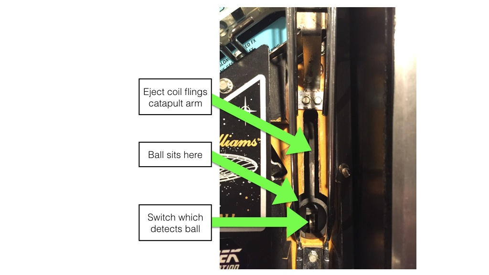

# Plungers & Ball Launch Devices

Related Config File Sections:

* [ball_devices:](../../config/ball_devices.md)

A Plunger is a type of ball device. MPF supports mechanical (traditional
"spring" plungers), coil-fired plungers, and combo auto/manual
plungers.

Here are the options:

* [Mechanical plunger w/ shooter lane switch](mechanical_with_switch.md)
* [Mechanical plunger no shooter lane switch](mechanical_no_switch.md)
* [Coil-fired ball launcher](coil_fired.md)
* [Combo mechanical plunger with auto-launch option](auto_manual.md)

Since there are so many different options, you need to first identify
which type of plunger or ball launch system your machine has. So look at
the following pictures to match up what you have, and then follow the
specific links to see how to configure MPF to use it in your machine.

## Option 1: Spring plunger with ball switch

The most "traditional" style plunger is a spring-powered mechanical
plunger lane. In modern machines, there's a switch at the bottom of the
plunger lane which is activated by a ball sitting in the plunger lane
waiting to be plunged.

Here's an example of this from a Pin\*Bot machine:

If you have this type of spring-powered plunger with a switch that's
active when a ball is sitting in it ready to be plunged, follow the
[Mechanical plunger with shooter lane switch](mechanical_with_switch.md) guide to
configure it in MPF.

## Option 2: Spring plunger with no ball switch

Older pinball machines (typically those that only have one ball) have
what appear to be traditional plungers like in Option 1, but if you look
closely, you'll notice that there is no switch which is active when the
ball is sitting in the plunger lane.

Here's an example of this from Gottlieb Big Shot:

If you have this type of spring-powered plunger with **no** switch
that's active when a ball is sitting in it ready to be plunged, follow
the [Mechanical plunger with no switch](mechanical_no_switch.md) guide to
configure it in MPF.

## Option 3: Combo spring plunger with coil-fired autolauncher

Many modern machines have a combination-style plunger which combines a
mechanical spring-powered plunger with an autolauncher coil. These types
of plungers allow game to decide whether the player should manually pull
back on the plunger handle to launch the ball with spring power or
whether the game should pulse a coil to eject the ball into play.

Here are two examples of slightly different versions of these, the left
from a Stern Star Trek Premium, and the right from a Gottlieb Brooks 'n
Dunn machine:

If you have this type of auto/manual combo plunger, follow the
[guide](auto_manual.md) to configure it in
MPF.

## Option 4: Coil-fired plunger (no mechanical spring option)

The final plunger option is the fully automatic coil-fired option that
has no mechanical spring-based option.

There are a few different physical forms of this. Here's a typical
example from Judge Dredd where a coil shaft with a plastic tip is pulsed
to launch the ball directly:

And here's an example from Williams Star Trek: The Next Generation
which uses a catapult-style mechanism in order to launch the ball into
play.

Note that both of these options are "identical" as far as MPF is
concerned. They both have switches which are active when a ball is able
to be launched, they both pulse coils to launch the ball, and neither
one has a manual plunge option.

If you have this type of coil-powered plunger, follow the
[guide](coil_fired.md) to configure it in MPF.

Related How To guides:

* [Tutorial step 8: Add your plunger lane](../../tutorial/8_plunger.md)
* [Troubleshooting P-Roc/P3-Roc](../ball_devices/troubleshooting.md)
Related Events

* [balldevice_ball_missing](../../events/balldevice_ball_missing.md)
* [balldevice_balls_available](../../events/balldevice_balls_available.md)
* [balldevice_(name)_ball_missing](../../events/balldevice_ball_device_ball_missing.md)
* [balldevice_captured_from_(captures_from)](../../events/balldevice_captured_from_captures_from.md)
* [balldevice_(name)_ball_eject_attempt](../../events/balldevice_ball_device_ball_eject_attempt.md)
* [balldevice_(name)_ball_eject_failed](../../events/balldevice_ball_device_ball_eject_failed.md)
* [balldevice_(name)_ball_eject_success](../../events/balldevice_ball_device_ball_eject_success.md)
* [balldevice_(name)_ejecting_ball](../../events/balldevice_ball_device_ejecting_ball.md)

[mechanical_with_switch](mechanical_with_switch.md)
[mechanical_no_switch](mechanical_no_switch.md)
[coil_fired](coil_fired.md)
[auto_manual](auto_manual.md)
