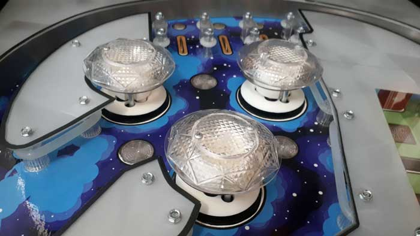
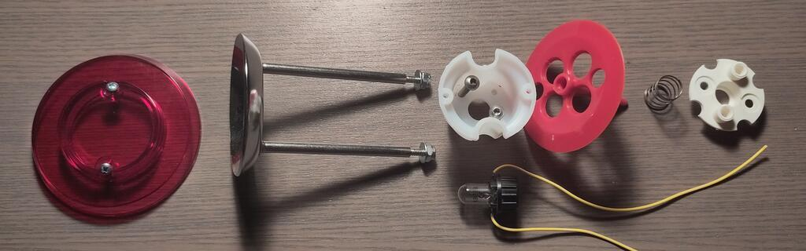
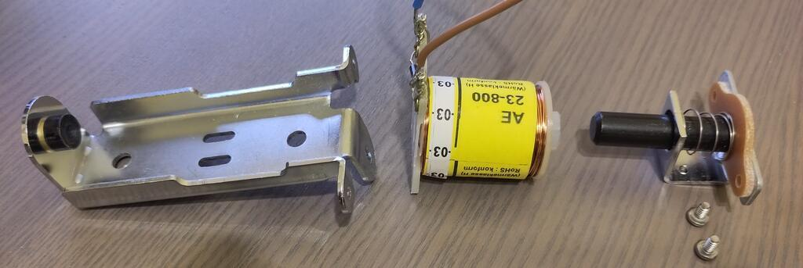

# Pop Bumpers


Related Config File Sections:

* [autofire_coils:](../../config/autofire_coils.md)
* [switches:](../../config/switches.md)
* [lights:](../../config/lights.md)
* [coils:](../../config/coils.md)

Popbumpers are configured as
[autofire_coils](../autofire_coils.md) in MPF.

## Hardware

Pop Bumper Data East/Sega/Williams 500-5227-00


Pop Bumpers Installed in Playfield



Pop bumpers are made of three elements relevant for MPF:

* A
    `blade switch </mechs/switches/mechanical_switches>` to notice balls
* A #444 or #249
    [bulb](../lights/matrix_lights.md)
    for light shows
* A [coil](../coils/index.md) to
    push the ball away.

There areother parts, like the pop bumper body, all parts
need to match in size and dimension of course. The complete assembly
consists of parts above the playfield and some parts below the
playfield. Above the playfield the following parts need to be
assembled in the following order:



A few notes which might help to assemble the parts above the
playfield:

* The nuts on the rod for the metal ring don't use a metric
    threading. To fasten them a 8mm wrench is good, but don't try
    to use a metric nut.
* The two screws to mount the cap are of size 3,0 x 12 mm, use pan
    head screws. When you screw the parts multiple times together
    turn the screw first counter clockwise to use exactly the same
    thread cut by the screw from the previous assembly. Otherwise
    the body will be worn out after a while.
* The two screws to mount the body to the board are of size 3,5 x
    25mm, use pan head screws.
* You need a 17mm Fostner drill to drill hole for the base.
* You need a 8mm drill for the metal ring rods.

Below the playfield the parts needed look like this:



A few notes which might help to assemble the parts below the playfield:

* The coil specification depends on the voltage you use and the
    strength you would like to have. Probably a trial and error
    approach is needed to find the coil you want.
* The piece with the spring on the right hand side consists of 5
    parts: yoke metal, yoke fiber, spring, metal bracket (plunger
    bracket), plunger
* The screws are again not metric
* If your coil has a fly back diode make sure to connect it the
    right way around. The ring of the diode has to point to positive
    voltage. You might not have a diode and you might not need one (if
    your controller board has that already built in)

Last but not least below the playfield you need a leaf switch:


The leaf switch is closed by the pin of the pop bumper skirt when the
skirt pressed down by the ball. It is important to adjust it very
precisely. Again a few notes:

* A diode on the switch is needed if you use a matrix input, for
    direct inputs no diode is needed
* You need the switch and a mounting bracket (like the left leaf
    switch on the picture above)
* The switches come in different heights, make sure to get the
    height you need. (compare the two variations on the picture)
* Try to get a translucent leaf that helps to adjust it later since
    the skirt's pin can be seen from below

When mounting the pop bumpers you have to drill quite a few holes for
homebrew machine, having a stencil might be helpful.


The above stencil has been created with openSCAD. Feel free to use the
[scad file](Pop-Bumper.scad) or
the [stl file](Pop-Bumper.stl) for
your own purposes.

Part numbers:

* Older one part plastic bumpers: 500-5227-00, AS-2999 (Turbo
    bumpers)
* Modern bumpers: 515-6459-04/A-9415 and B-9414

## Config

This is an example:

``` mpf-config
switches:
  s_popbumper_left:
    number: 7                 # depends on your platform
coils:
  c_popbumper_left:
    number: 4                 # depends on your platform
    default_pulse_ms: 23      # tune this for your machine
lights:
  l_popbumper_left:
    number: 13                # depends on your platform
    subtype: matrix           # might be differnt
autofire_coils:
  ac_popbumper_left:
    coil: c_popbumper_left
    switch: s_popbumper_left
```

Adjust `default_pulse_ms` and `default_pulse_power` in your coil to
control the strength and sound of your pop bumpers.

Related How To guides:

* [Mechanical Switches](../switches/mechanical_switches.md)
* [Matrix Lights (Bulbs)](../lights/matrix_lights.md)
* [Coils (Solenoids)](../coils/index.md)
* [Autofire Coils](../autofire_coils.md)
