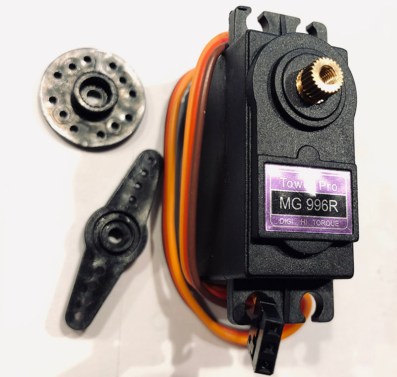

# Servos


Related Config File Sections:

* [servo_sequence](../../config/servos.md)



A servo is device which can move to a certain position based on internal
feedback. There is no need to add position switches and the servo will
hold its position even if something pushes it aside. On the downside,
there is no way to tell when the servo reached its position since it
will not provide any position feedback to the software side.

This is an example:

``` mpf-config
servos:
  servo1:
    servo_min: 0.1
    servo_max: 0.9
    positions:
      0.0: servo1_down
      0.8: servo1_up
    reset_position: 0.5
    reset_events: reset_servo1
    number: 1
  servo2:
    positions:
      0.2: servo2_left
      1.0: servo2_home
    reset_position: 1.0
    reset_events: reset_servo2
    number: 2
```

<div class="video-wrapper">
<iframe width="560" height="315" src="https://www.youtube.com/embed/wA6KEODwQ5w" title="YouTube video player" frameborder="0" allow="accelerometer; autoplay; clipboard-write; encrypted-media; gyroscope; picture-in-picture" allowfullscreen></iframe>
</div>

## Monitorable Properties

For
[dynamic values](../../config/instructions/dynamic_values.md) and
[conditional events](../../events/overview/conditional.md), the prefix for servos is `device.servos.(name)`.

*position*

:   Value, stored in memory of what servo position should be, on a scale
    from 0.0 to 1.0.

Related How To guides:

* [Programming Servo Sequences](servo_sequence.md)

## Related Events

None

* [Programming Servo Sequences](servo_sequence.md)
