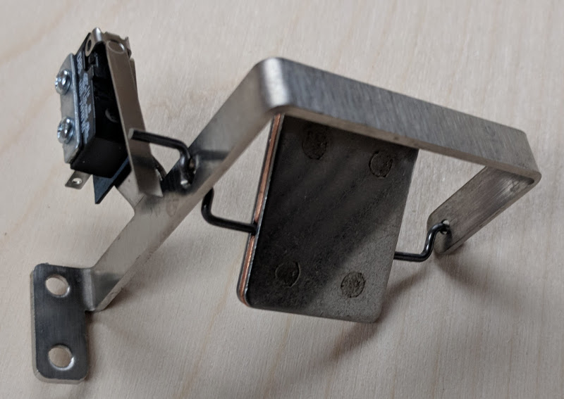

# Spinners


Related Config File Sections:

* [switches:](../config/switches.md)
* [spinners:](../config/spinners.md)

Spinners are rotating metal plates which close a switch once per
rotation.

## Hardware



Part numbers:

* Stern: #511-5113-00 or #100-0014-00

## Config

In MPF spinners are configured as follows:

``` yaml
switches:
  s_my_spinner:
    number: 42    # number depends on your platform

spinners:
  basic_spinner:
    switch: s_my_spinner
    active_ms: 500
```

It is very common to count the rotations of your spinner per player. You
can either use a player variable or a counter for that. This is an
example:

``` yaml
switches:
  s_my_spinner:
    number: 42    # number depends on your platform

spinners:
  basic_spinner:
    switch: s_my_spinner
    active_ms: 500
##! mode: my_mode
# in your base mode add 1 for every rotation to a player variable which you can use in slides
variable_player:
  s_my_spinner_active:
    spinner_rotations: 1
# in a game mode the player needs to spin the spinner 10 times
counters:
  spinner_rotations:
    count_events: spinner_basic_spinner_hit
    count_complete_value: 10
    events_when_complete: mode_finished
##! test
#! start_game
#! start_mode my_mode
#! hit_and_release_switch s_my_spinner
#! mock_event mode_finished
#! assert_player_variable 1 spinner_rotations
#! hit_and_release_switch s_my_spinner
#! hit_and_release_switch s_my_spinner
#! hit_and_release_switch s_my_spinner
#! hit_and_release_switch s_my_spinner
#! hit_and_release_switch s_my_spinner
#! hit_and_release_switch s_my_spinner
#! hit_and_release_switch s_my_spinner
#! hit_and_release_switch s_my_spinner
#! assert_event_not_called mode_finished
#! hit_and_release_switch s_my_spinner
#! assert_event_called mode_finished
#! assert_player_variable 10 spinner_rotations
```

## Related Events

* [spinner_(name)_hit](../events/spinner_spinner_hit.md)
* [spinner_(name)_inactive](../events/spinner_spinner_inactive.md)
* [spinner_(name)_idle](../events/spinner_spinner_idle.md)
* [spinner_(name)_active](../events/spinner_spinner_active.md)
* [spinner_(name)_(label)_hit](../events/spinner_spinner_label_hit.md)
* [spinner_(name)_(label)_active](../events/spinner_spinner_label_active.md)
