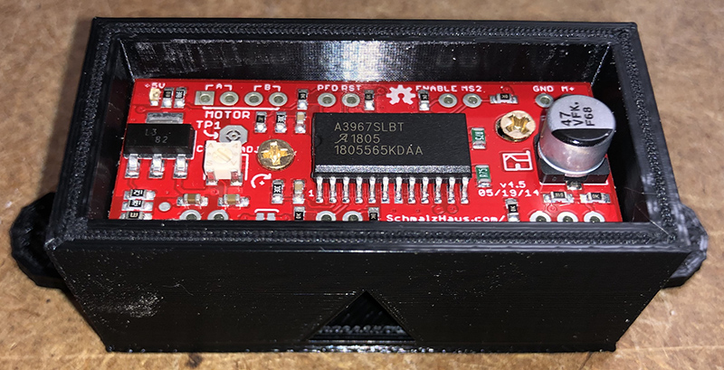

# Stepper Motors


Related Config File Sections:

* [steppers:](../config/steppers.md)




Stepper motors offer digitally controlled precise movement of
mechanisms. They require a separate driver board that interfaces with
the host computer by USB or through the pinball machine controller.
Steppers have a unique design with two or more sets of coils which when
energized sequentially turn the armature a set distance, typically 1.8
degrees.

Overview video about steppers:

<div class="video-wrapper">
<iframe width="560" height="315" src="https://www.youtube.com/embed/YaRNBU0OHGc" title="YouTube video player" frameborder="0" allow="accelerometer; autoplay; clipboard-write; encrypted-media; gyroscope; picture-in-picture" allowfullscreen></iframe>
</div>

## Steppers vs Servos

It is useful to compare stepper motors to servo motors. While in many
cases they can be used interchangeably, each has advantages and
disadvantages. The principle advantage of steppers is precision. If used
within their torque window, steppers can reproducibly count thousand of
steps, reverse them, and land back at the starting position. Generally
steppers are faster than servo motors which transmit torque through a
gear assembly. Disadvantages of steppers include less torque than
offered by servo motors and requiring a driver controller. Also, unlike
servos, steppers do not include a feedback mechanism to report the
rotational angle of the armature. This deficit requires that a stepper
use a homing mechanism (typically a switch) to inform software when the
assembly is at an extreme of linear or rotational position. Lastly,
steppers are subject to rotational drift when not energized, whereas
servos maintain position in their off state.

Stepper controller boards require a minimum of two digital inputs, one
for rotational direction and one to trigger a rotational step. Usually
one or more additional inputs are also used to control the power state
of the driver board and/or motor coils. Some driver boards also allow
programming of microstepping to command rotation at less than that of a
full step.

MPF abstracts the nitty gritty of stepper control allowing steppers to
be used with a minimum of YAML programming. On startup, an event is
issued to rotate the motor to a home position. Once homed, further
events can be issued which rotate the motor an arbitriary number of
steps in either direction as required by the application.

See [Servos](servos/index.md) for more
details.

## Example config

``` mpf-config
#config_version=5
switches:
  s_home:
    number:
steppers:
  stepper1:
    number: 1              # depends on your hardware
    homing_mode: switch
    homing_switch: s_home
    named_positions:
      10: move_to_position_1
      20: move_to_position_2
      50: move_to_position_3
```

When you post `move_to_position_1` the stepper will move to the position
`10`. Similarly, it will move to `20` when you post `move_to_position_2`
and to `50` when `move_to_position_3` is posted. It will track its
current position internally.
