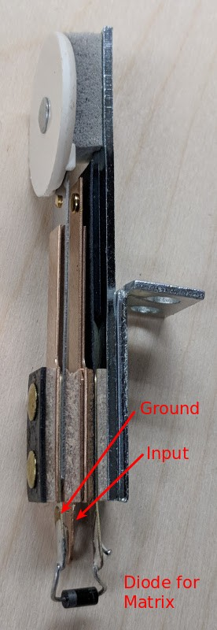

# Mechanical Switches


Related Config File Sections:

* [switches:](../../config/switches.md)

Most switches in pinball machines are mechanical switches which are open
by default and close a circuit when pushed.

Video about wiring switches:

<div class="video-wrapper">
<iframe width="560" height="315" src="https://www.youtube.com/embed/7G8LFBbYNOY" title="YouTube video player" frameborder="0" allow="accelerometer; autoplay; clipboard-write; encrypted-media; gyroscope; picture-in-picture" allowfullscreen></iframe>
</div>

There are two common types of mechanical switches:

## Leaf switches/Blade switches

First, blade switches which are very cheap and reliable but cannot be
used everywhere:



Typically, those are use for
[flipper buttons](../flippers/index.md)
and
[flipper end of stroke switches](../flippers/eos_switches.md).

Part numbers:

* Stern Flipper Leaf Switch: 500-6889-01 or 500-6890-01
* Data East/Sega Flipper Leaf Switch: 180-5122-00
* Williams/Bally Flipper Leaf Switch: SW-10A-48 or SW-1010A-13
* Data East End of Stroke Switch: 180-5018-00
* Williams/Classic Stern/Bally End of Stroke Switch: SW-10A-50,
    ASW-A20-23, SW-1A-193

Additionally, those are used for
[targets](../targets/stationary_targets.md):

Part numbers (Data East/Sega/Stern):

* 515-5966-xx
* 500-5835-xx
* 515-5124-xx
* 500-5232-xx
* 515-5162-xx
* 515-5967-xx
* 515-6027-xx

xx defines the color of the target in most cases.

## Micro switches

Second, micro switches which are very small and commonly used for roll
over switches. Those usually have three connectors:

* `C` - common pin for `NO` and `NC`
* `NO` - normally open - connected to `C` only when the switch is
    pressed
* `NC` - normally closed - connected to `C` only when the switch is
    not pressed

Usually, you connect `C` to ground and `NO` to your direct input (see
below for switch matrices).


Electronically and logically both switches work similarly.

Part numbers (Data East/Sega/Stern):

* 180-5010-xx
* 180-5053-xx
* 180-5119-xx
* 180-5118-xx
* 180-5052-xx
* 180-5186-xx
* 180-5057-xx
* 500-5442-xx
* 180-5175-xx

xx defines the shape of the blade for most parts.

## Direct inputs

Switches can be connected to a direct input and ground on almost all
platforms. Most direct inputs have an internal pull up which will pull
the level to VCC (usually around 10 kOhm). When pushed the switch will
pull the input to ground which will be detected as a closed switch by
the platform.

[TODO: Add electronical drawing for switch on direct input.](../../about/help.md)

## Switch matrix

Additionally, you can use switches in a switch matrix. In a switch
matrix columns are connected to drivers and rows to switches. Columns
are then pulsed sequentially and the rows are read. Each switch has to
use a diode to prevent closing other columns.

[TODO: Add electronical drawing for switch in matrix.](../../about/help.md)

Switch matrices are driven using your hardware platform and MPF will
read the values from the platform. Usually the numbers for switches
reflect their row and column in the matrix. Consult your hardware
platform documentation for details.

## MPF Config

This is an example of switches in MPF:

``` mpf-config
switches:
  my_direct_switch:
    number: 23        # number depends on your platform
  my_matrix_switch_row_1_column_3:
    number: 1/3       # number depends on your platform
```
