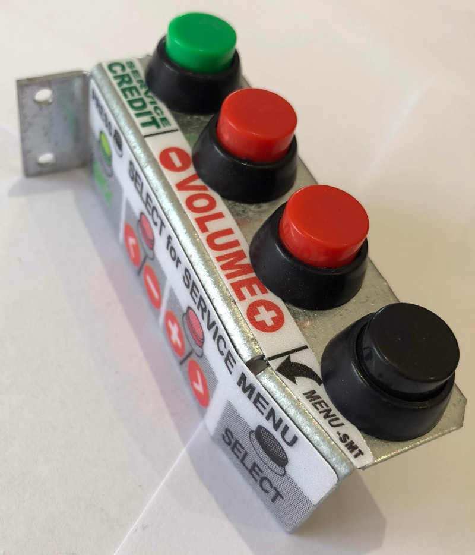

# Service and Door Switches

Related Config File Sections:

* [switches:](../../config/switches.md)

Most pinball machines have service switches inside their service door.
Additionally, there is usually a switch to detect if the door is open.

You can configure those to control your
[service mode](../../game_logic/service_mode.md).
