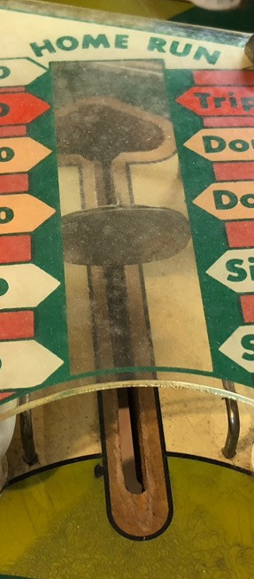
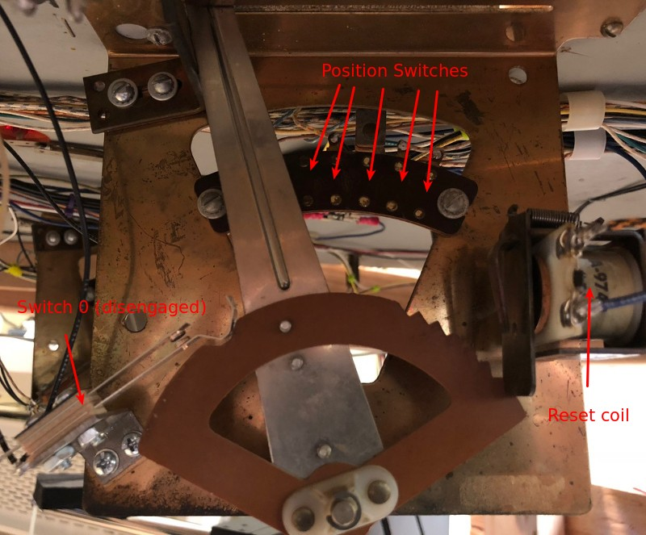

# Vari Targets

Related Config File Sections:

* [switches:](../../config/switches.md)

Mission Pinball Framework's (MPF) *vari target* device represents a
switch in a pinball machine. It is a metal arm that pivots under the
playfield and awards a scoring value associated with it that changes
depending on how hard the ball hits it. Typically the harder the ball
hit the more points awarded.

This is a vari-target in a Gottlieb Playball (1971):

Technically, a vari-target has one switch per position and a reset coil
to reset the target:

It can reset the target at any position. Either directly after a hit or
once it has moved till the end (or never). This is how a vari-target
looks fully engaged:

If you got an example config for a vari target
[please contribute it](../../about/help.md).
