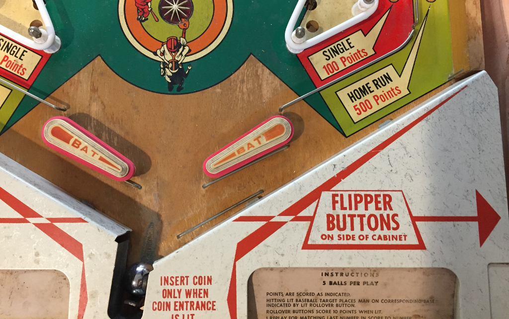

Related Config File Sections:

* [ball_devices:](../../config/ball_devices.md)
* [playfields:](../../config/playfields.md)

This guide will show you how to configure MPF to use an older-style
single ball drain without shooter lane. This is the type of
configuration that some single-ball machines use, from EM machines of
the 1950s through electronic single ball machines of the early 1980s.

Here's an example from a Gottlieb Playball (1971 EM):



## 1. Add the drain switch

The first step is to add the drain switch to the `switches:` section of
your machine config file.

``` mpf-config
switches:
  s_drain:
    number: 01
```

Note that we configured this switches with number `01`, but you should
use the actual switch number for your control system that the switch is
connected to. (See [How to configure "number:" settings](../../hardware/numbers.md) for
instructions for each type of control system.)

## 2. Add the eject coil

Next, create the entry in your `coils:` section for the drain eject
coil. Again, the name doesn't matter. We'll call it *c_drain_eject*
and enter it like this:

``` mpf-config
coils:
  c_drain_eject:
    number: 03
    default_pulse_ms: 20
```

Again, the `number:` entry in your config will vary depending on your
actual hardware, and again, you can pick whatever name you want for your
coil.

You'll also note that we went ahead and entered a `default_pulse_ms:`
value of 20 which will override the default pulse times of 10ms. It's
hard to say at this point what values you'll actually need. You can
always adjust this at any time. You can play with the exact values in a
bit once we finish getting everything set up.

## 3. Add your "drain" ball device

In MPF, anything that holds and releases a ball is a
[ball device](../ball_devices/index.md).
So in your `ball_devices:` section, create an entry called `bd_drain:`
like this: (If you don't have that section add it now.)

    ball_devices:
        bd_drain:

This means that you're creating a ball device called `bd_drain`. We use
the preface `bd_` to indicate that this is a ball device which makes it
easier when we're referencing them later. Then under your `bd_drain:`
entry, you'll start entering the configuration settings for your drain
ball device.

* Add `ball_switches: s_drain` which means this device will use the
    *s_drain* switch to know whether or not this device has a ball.
* Add `eject_coil: c_drain_eject` which is the name of the coil that
    will eject the ball from the drain.
* Add `tags: drain, home, trough` which tells MPF that balls entering
    this device mean that a ball has drained from the playfield, that
    it's ok to start a game with a ball here, and that this device is
    used to store unused balls.
* Set `eject_timeouts` to the maximum time the ball can take to return
    if the eject fails.

Your drain device configuration should look now look like this:

``` mpf-config
#! switches:
#!   s_drain:
#!     number: 01
#! coils:
#!   c_drain_eject:
#!     number: 03
#!     default_pulse_ms: 20
ball_devices:
  bd_drain:
    ball_switches: s_drain
    eject_coil: c_drain_eject
    tags: drain, home, trough
    eject_timeouts: 3s
```

## 4. Add the trough as default_source_device

Normally you would use your plunger device as source device for your
playfield. But since there is no plunger lane, that means we have to go
back to the trough ball device and use it as source device. Therefore,
you need to add your trough ball device as `default_source_device` to
your playfield to tell MPF that this ball device is used to add a new
ball into play.

To do that, add your trough device as `default_source_device` in the
default `playfield`, like this:

``` mpf-config
#! switches:
#!   s_drain:
#!     number: 01
#! coils:
#!   c_drain_eject:
#!     number: 03
#!     default_pulse_ms: 20
#! ball_devices:
#!   bd_drain:
#!     ball_switches: s_drain
#!     eject_coil: c_drain_eject
#!     tags: drain, home, trough
#!     eject_timeouts: 3s
playfields:
  playfield:
    default_source_device: bd_drain
    tags: default
```

Then when MPF needs to add a live ball into play, it will eject a ball
from the trough and you're all set!

## 5. Configure your virtual hardware to start with balls in the trough

While we're talking about the trough, it's probably a good idea to
configure MPF so that when you start it in virtual mode (with no
physical hardware) that it starts with the trough full of balls. To do
this, add a new section to your config file called
`virtual_platform_start_active_switches:`. (Sorry this entry name is
hilariously long.) As its name implies,
*virtual_platform_start_active_switches:* lets you list the names of
switches that you want to start in the "active" state when you're
running MPF with the virtual platform interfaces.

The reason these only work with the virtual platforms is because if
you're running MPF while connected to a physical pinball machine, it
doesn't really make sense to tell MPF which switches are active since
MPF can read the actual switches from the physical machine. So you can
add this section to your config file, but MPF only reads this section
when you're running with one of the virtual hardware interfaces. To use
it, simply add the section along with a list of the switches you want to
start active. For example:

``` mpf-config
#! switches:
#!   s_drain:
#!     number: 01
virtual_platform_start_active_switches: s_drain
```

## Here's the complete config

``` mpf-config
#config_version=5
switches:
  s_drain:
    number: 01
coils:
  c_drain_eject:
    number: 03
    default_pulse_ms: 20
ball_devices:
  bd_drain:
    ball_switches: s_drain
    eject_coil: c_drain_eject
    tags: drain, home, trough
    eject_timeouts: 3s
playfields:
  playfield:
    default_source_device: bd_drain
    tags: default
virtual_platform_start_active_switches: s_drain
```

## What if it did not work?

Have a look at our
[troubleshooting guide for ball_devices](../ball_devices/troubleshooting.md).
