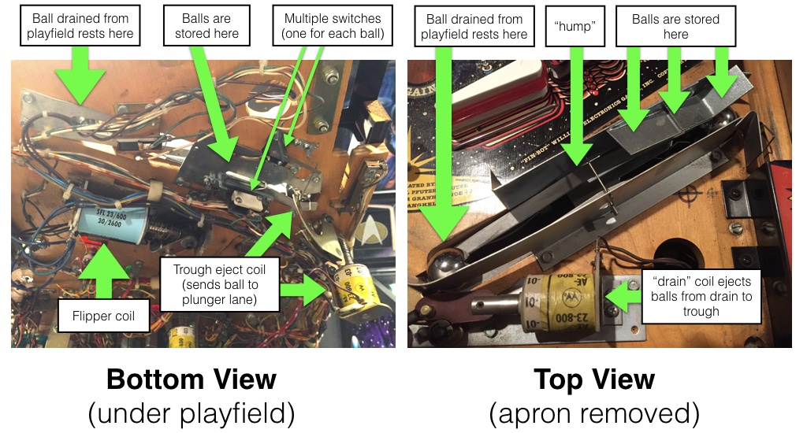

# Troughs / Ball Drains

Related Config File Sections:

* [ball_devices:](../../config/ball_devices.md)

Every pinball machine will have some kind of ball trough / drain device.
This is the place where the balls go when they drain from the playfield
before they're ejected into the plunger lane.

In many cases, this device (or series of devices) holds multiple balls
and is the location where unused balls are stored.

There are several different designs for troughs and drains that have
been used over the past 70 years, and (as far as we know), MPF supports
all of them. So regardless of what's in your machine, we're talking
about whatever is under here:

Here are the options:

* [Modern trough with opto sensors](modern_opto.md)
* [Modern trough with mechanical switches](modern_mechanical.md)
* [Older style with two coils and switches for each ball](two_coil_multiple_switches.md)
* [Older style with two coils and only one ball switch](two_coil_one_switch.md)
* [Classic single ball, single coil](classic_single_ball.md)
* [Classic single ball, single coil, no shooter lane](classic_single_ball_no_shooter_lane.md)

Since there are so many different options, you need to first identify
which type of trough or ball drain system your machine has. So look at
the following pictures to match up what you have, and then follow the
specific links to see how to configure MPF to use it in your machine.

Video on ball tracking in MPF:

<iframe width="560" height="315" src="https://www.youtube.com/embed/Yh8ittsuWIc" title="YouTube video player" frameborder="0" allow="accelerometer; autoplay; clipboard-write; encrypted-media; gyroscope; picture-in-picture" allowfullscreen></iframe>

## Option 1: Modern trough with opto sensors

Modern-style troughs (which have been used since about 1993 or so) are
mostly located underneath the playfield and hold the balls at an incline
so they roll down to the end. There is a single coil which fires to
eject a ball up and out where it's directed to the plunger lane.

--8<-- "todo.md"

The advantage of modern troughs are (1) the balls entering are
gravity-fed, meaning they only need one coil, and (2) they can hold a
lot of balls. (Most hold 4-6 balls but you can buy ones that hold up to
8.)

If you have a modern-style trough with a circuit board on each side,
that means your trough uses opto sensors to detect the presence of a
ball. One of those circuit boards contains infrared LEDs which are
always on which shoot invisible beams across the ball paths, and the
board has sensors that detect if a light beam is broken, meaning a ball
is sitting there blocking the path.

Common parts include:

* Williams: #A-16809
* Mantis Trough
* Stern #500-9820-00

If you have a modern trough with opto sensors, read the
[guide](modern_opto.md) to continue.

## Option 2: Modern trough with mechanical switches

Some modern-style troughs use mechanical switches to detect the balls
rather than infrared opto boards. (Other than that, they're the same as
the opto-based troughs.) Here's a photo of a modern trough with
mechanical switches from a Stern Star Trek Premium machine:

If you have a modern-style trough with mechanical switches instead of
opto boards, then read the [guide](modern_mechanical.md) to continue.

Common parts include:

* Stern: #500-6318-24 (trough assembly), #535-8393-00 (center drain
    ball guide), #535-7329-01 (entry/exit scoop)
* Spooky: #100-0015-00 (4 balls) or #100-0016-00 (8 balls),
    #100-0002-00 (drain guide + enter exit scoop)

## Option 3: Older style with two coils and switches for each ball

Many machines from the 1980s and early 1990s have a ball trough system
that consists of two separate coils and where the balls stay "on top"
of the playfield (under the apron).

In this case, when a ball drains, a coil in the drain area pulses to
eject the ball up over a hump where the balls are stored. Then a second
coil near the plunger lane is used to eject a single ball at a time into
the plunger lane.

Some of these types "two coil" systems have multiple switches on the
side that stores the balls, with there being one switch for each ball.
That lets the machine know exactly how many balls are sitting there
because each ball is sitting on a switch.

Here's a photo of this type of trough system from a Pin\*Bot machine:

If you have this kind of trough system, read the
[guide](two_coil_multiple_switches.md) to
continue.

## Option 4: Older style with two coils and only one ball switch

Another option is similar to Option 3 above, except there's only one
switch on the trough side instead of separate switches for each ball. In
these types of trough systems, the behavior of that switch changes
depending on how many balls are in the trough.

If there are fewer than the max number of balls in the trough, when the
drain coil pulses to eject the ball from the drain into the trough, the
ball will roll over that trough switch, meaning it's activated
momentarily and then deactivated again.

However, if the ball ejecting into the trough will be the final ball
that will fill the trough, then that ball will rest on that trough
switch, meaning that switch is solid active as long as the trough is
full.

Here's a photo from a Gottlieb System 3 machine (Brooks 'n Dunn) which
shows what this type of system looks like:

If your machine has a system similar to this, then read the
[guide](two_coil_one_switch.md) to continue.

## Option 5: Classic single ball, single coil

Older single-ball machines have a trough system that is on top of the
playfield under the apron, but they only have a single coil near the
ball drain position. The ball is stored in the drain area, and when it
needs to be ejected, a coil pulses to eject it from the drain all the
way into the plunger lane in a single action.

Here's an example from Gottlieb Big Shot:

If you have a system like this, read the
[guide](classic_single_ball.md) to continue.

## Option 6: Classic single ball, single coil, no shooter lane

Very similar to Option 5 but the drain directly ejects back into the
playfield. There is no shooter lane. This was used in early EM machines.

Here's an example from Gottlieb Playball:

If you have a system like this, read the
[guide](classic_single_ball_no_shooter_lane.md) to continue.

## Option 7: Something we haven't seen yet

If you're using MPF with a machine that has some kind of trough or
drain system that we haven't covered here, we would like to know about
it so we can write a how to guide and/or add support for it in MPF.

As far as we know, however, these 6 options should cover everything. For
example, you might have a machine that you think is different, but when
you really look at it, it's just a weird form of one of these 6
options. (Bally Fathom is a great example of this. It's like a classic
single-ball trough where there is a drain that ejects a ball all the way
into the plunger lane, but there are two additional switches in the
apron wall where balls rest before they land in the drain device. That
style of drain and trough is actually configured using Option 2, the
modern trough with mechanical switches.)

If you have something weird that you can't figure out, we're happy to
help! Just post a photo of it to [community forum](../../community/index.md) and we'll go
from there.

Related How To guides:

* [Tutorial step 7: Add your trough](../../tutorial/7_trough.md)
* [Troubleshooting P-Roc/P3-Roc](../ball_devices/troubleshooting.md)

Related Events

* [ball_drain](../../events/ball_drain.md)
* [balldevice_ball_missing](../../events/balldevice_ball_missing.md)
* [balldevice_balls_available](../../events/balldevice_balls_available.md)
* [balldevice_(name)_ball_missing](../../events/balldevice_ball_device_ball_missing.md)
* [balldevice_captured_from_(captures_from)](../../events/balldevice_captured_from_captures_from.md)
* [balldevice_(name)_ball_eject_attempt](../../events/balldevice_ball_device_ball_eject_attempt.md)
* [balldevice_(name)_ball_eject_failed](../../events/balldevice_ball_device_ball_eject_failed.md)
* [balldevice_(name)_ball_eject_success](../../events/balldevice_ball_device_ball_eject_success.md)
* [balldevice_(name)_ejecting_ball](../../events/balldevice_ball_device_ejecting_ball.md)
