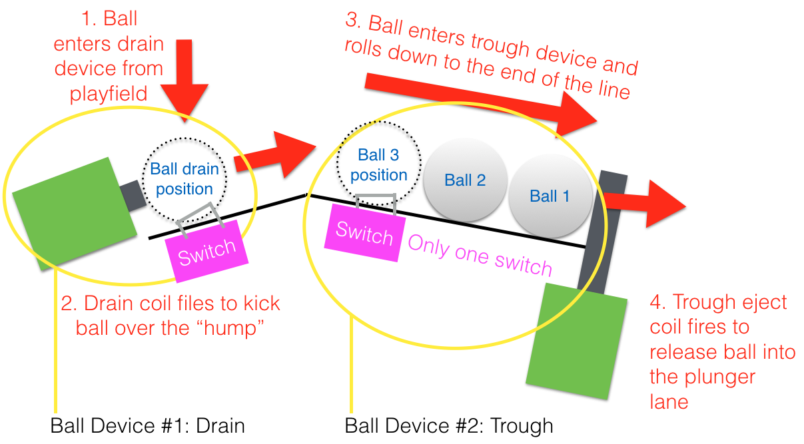

Related Config File Sections:

* [ball_devices:](../../config/ball_devices.md)
* [playfields:](../../config/playfields.md)

This guide will show you how to configure MPF to use an older-style
drain and trough combination that uses two coils (one to eject the ball
from the drain hole and a second to release a ball into the plunger
lane).

This guide is written for the types of devices that have only have one
switch on the trough side, like this example of a Gottlieb System 3
machine (Brooks 'n Dunn):


If your trough system has multiple switches in the trough (one for each
ball), then use
[this guide](two_coil_multiple_switches.md)
instead.

In the types of troughs this guide is for, a ball ejected from the drain
over the hump into the trough will only momentarily activate the trough
switch as the ball rolls by, unless the trough is full, in which case
the last ball that goes into it sits on the switch.

The following diagram shows a more clear view of the type of trough
system this guide is for: (This is a side view)



## 1. Add the switches

The first step is to add all the switches to the `switches:` section of
your config file. Create an entry in your `switches:` section for the
drain switch as well as each switch in your trough, like this: (This
example has three switches in the trough. Yours may have more or less.)

``` mpf-config
switches:
  s_drain:
    number: 1
  s_trough_enter:
    number: 2
```

Note that we configured this switches with numbers `01` and `02`, but
you should use the actual switch numbers for your control system that
the switches are connected to. (See
[How to configure "number:" settings](../../hardware/numbers.md) for instructions for
each type of control system.)

It makes no difference what the actual switch names are. We use
*s_drain* and *s_trough_entry*, though you can call them whatever you
want.

## 2. Add the coils

Next, create the entries in your `coils:` section for the drain eject
coil and the trough release coil. Again, the names don't matter. We'll
call them *c_drain_eject* and *c_trough_release* and enter them like
this:

``` mpf-config
coils:
  c_drain_eject:
    number: 3
    default_pulse_ms: 20
  c_trough_release:
    number: 4
    default_pulse_ms: 20
```

Again, the `number:` entries in your config will vary depending on your
actual hardware, and again, you can pick whatever name you want for your
coil.

You'll also note that we went ahead and entered `default_pulse_ms:`
values of 20 which will override the default pulse times of 10ms. It's
hard to say at this point what values you'll actually need. You can
always adjust this at any time. You can play with the exact values in a
bit once we finish getting everything set up.

Note that some trough coils use a shorter pulse to pop the ball into the
plunger lane. However, some machines have gates or rotational devices
that need to be active for much longer. However, if the pulse time is
over about 50ms, then that coil should be enabled with PWM and disabled
versus pulsed, so in that case, you also need to add
`default_pulse_power:` which tells MPF it's ok to enable this coil
(with 25% hold power in this case).

In other words, a trough with long release time would look like this:

``` mpf-config
coils:
  c_trough_release:
    number: 4
    default_pulse_ms: 20ms
    default_hold_power: 0.25
```

## 3. Add your "drain" ball device

In MPF, anything that holds and releases a ball is a
[ball device](../ball_devices/index.md).
With this drain/trough setup, there are actually two ball devices---one
for the drain and a second for the trough.

Let's add the drain device first, which we'll add to the
`ball_devices:` section of your machine config. (If you don't have that
section add it now.)

Then in your `ball_devices:` section, create an entry called
`bd_drain:`, like this:

    ball_devices:
        bd_drain:

This means that you're creating a ball device called *bd_drain*. We use
the preface *bd_* to indicate that this is a ball device which makes it
easier when we're referencing them later. Then under your `bd_drain:`
entry, you'll start entering the configuration settings for your drain
ball device.

* Add `ball_switches: s_drain` which means this device will use the
    *s_drain* switch to know whether or not this device has a ball.
* Add `eject_coil: c_drain_eject` which is the name of the coil that
    will eject the ball from the drain.
* Add `eject_targets: bd_trough` which tells MPF that this ball device
    ejects its balls into the device called *bd_trough*. (We'll create
    that device in the next step.)
* Add `tags: drain` which tells MPF that balls entering this device
    mean that a ball has drained from the playfield.
* Set `eject_timeouts` to the maximum time the ball can take to return
    if the eject fails.

Your drain device configuration should look now look like this:

``` mpf-config
#! switches:
#!   s_drain:
#!     number: 1
#!   s_trough_enter:
#!     number: 2
#! coils:
#!   c_drain_eject:
#!     number: 3
#!     default_pulse_ms: 20
#!   c_trough_release:
#!     number: 4
#!     default_pulse_ms: 20
ball_devices:
  bd_drain:
    ball_switches: s_drain
    eject_coil: c_drain_eject
    eject_targets: bd_trough
    tags: drain
    eject_timeouts: 4s
#!   bd_trough:
#!     entrance_switch: s_trough_enter
#!     entrance_switch_full_timeout: 500ms
#!     ball_capacity: 3
#!     eject_coil: c_trough_release
#!     tags: trough, home
#!     eject_timeouts: 3s
```

## 4. Add your "trough" ball device

Next create a second entry in the `ball_devices:` section called
`bd_trough` that will be for the trough device that holds the balls that
are ejected from the drain before they're released into the plunger
lane.

The configuration is pretty straightforward:

* Add `entrance_switch: s_trough_enter` which tells MPF which switch
    is used as the "entrance" switch to this device. (An entrance
    switch is the switch that's momentarily activated as balls enter
    this device.)
* Add `entrance_switch_full_timeout: 500ms` which tells MPF that if
    the entrance switch stays active for more than this amount of time,
    that means that this device is full.
* Add `ball_capacity: 3` (or whatever the number of balls is that can
    be stored on the trough side). This tells MPF how many balls are in
    this device when a ball is sitting on the entrance switch.
* Add `eject_coil: c_trough_release` which is the name of the coil
    that will be pulsed to eject the ball from the drain.
* Add `eject_targets: bd_plunger_lane` which tells MPF that this ball
    device ejects its balls into the device called *bd_plunger_lane*.
    (We won't actually create the plunger device in this How To guide,
    but you need to have it, so see the
    [Plungers & Ball Launch Devices](../plungers/index.md) documentation
    for full details since there are lots of different types of
    plungers.
* Add `tags: home, trough` which tells MPF that it's ok to store
    unused balls here and that it's ok for balls to be here when games
    start.

Your trough device configuration should look now look like this:

``` mpf-config
#! switches:
#!   s_drain:
#!     number: 01
#!   s_trough_enter:
#!     number: 02
#!   s_plunger:
#!     number: 10
#! coils:
#!   c_drain_eject:
#!     number: 03
#!     default_pulse_ms: 20
#!   c_trough_release:
#!     number: 04
#!     default_pulse_ms: 20
ball_devices:
#!   bd_drain:
#!     ball_switches: s_drain
#!     eject_coil: c_drain_eject
#!     eject_targets: bd_trough
#!     tags: drain
#!     eject_timeouts: 4s
  bd_trough:
    entrance_switch: s_trough_enter
    entrance_switch_full_timeout: 500ms
    ball_capacity: 3
    eject_coil: c_trough_release
    eject_targets: bd_plunger_lane
    tags: trough, home
    eject_timeouts: 3s
#!   bd_plunger_lane:
#!     ball_switches: s_plunger
#!     mechanical_eject: true
#!     eject_timeouts: 5s
```

If you need to enable `c_trough_release` for 1s (more than a few ms) it
would look like this:

``` mpf-config
#! switches:
#!   s_drain:
#!     number: 01
#!   s_trough_enter:
#!     number: 02
#!   s_plunger:
#!     number: 10
#! coils:
#!   c_drain_eject:
#!     number: 03
#!     default_pulse_ms: 20
#!   c_trough_release:
#!     number: 04
#!     default_pulse_ms: 20
ball_devices:
#!   bd_drain:
#!     ball_switches: s_drain
#!     eject_coil: c_drain_eject
#!     eject_targets: bd_trough
#!     tags: drain
#!     eject_timeouts: 4s
  bd_trough:
    entrance_switch: s_trough_enter
    entrance_switch_full_timeout: 500ms
    ball_capacity: 3
    eject_coil: c_trough_release
    eject_coil_enable_time: 100ms
    eject_targets: bd_plunger_lane
    tags: trough, home
    eject_timeouts: 3s
#!   bd_plunger_lane:
#!     ball_switches: s_plunger
#!     mechanical_eject: true
#!     eject_timeouts: 5s
```

## 5. Configure the balls installed

One of the downsides of only having one switch in the trough is that if
that switch is not active, then MPF doesn't actually know how many
balls are in it. (In the example diagram at the beginning of this guide
where the trough can hold three balls, if that trough entry switch is
not active, then there could be zero, 1, or 2 balls in the trough.)

MPF is able to keep track of how many balls are in the trough by
tracking balls entered versus balls released. However when MPF starts
up, if that entrance switch isn't active, then it won't know how many
balls are there.

There's a setting in the machine config called
`machine:balls_installed:` that tells MPF how many actual balls are
installed in the machine. So when MPF starts, it can count up all the
balls in all the devices and see if they're all there or if any are
missing. Since that's a bit tricky with the single switch in the
trough, you telling MPF how many total balls are installed in the
machine help it know what to do if that entrance switch isn't active
when MPF starts up.

Here's an example from the machine config:

``` mpf-config
machine:
  balls_installed: 4
```

## 6. Configure your virtual hardware to start with balls in the trough

While we're talking about the trough, it's probably a good idea to
configure MPF so that when you start it in virtual mode (with no
physical hardware) that it starts with the trough full of balls. To do
this, add a new section to your config file called
`virtual_platform_start_active_switches:`. (Sorry this entry name is
hilariously long.) As its name implies,
*virtual_platform_start_active_switches:* lets you list the names of
switches that you want to start in the "active" state when you're
running MPF with the virtual platform interfaces.

The reason these only work with the virtual platforms is because if
you're running MPF while connected to a physical pinball machine, it
doesn't really make sense to tell MPF which switches are active since
MPF can read the actual switches from the physical machine. So you can
add this section to your config file, but MPF only reads this section
when you're running with one of the virtual hardware interfaces. To use
it, simply add the section along with a list of the switches you want to
start active. For example:

``` mpf-config
#! switches:
#!   s_trough_enter:
#!     number: 2
virtual_platform_start_active_switches: s_trough_enter
```

## Here's the complete config

``` mpf-config
switches:
  s_drain:
    number: 01
  s_trough_enter:
    number: 02
  s_plunger:
    number: 10
coils:
  c_drain_eject:
    number: 03
    default_pulse_ms: 20
  c_trough_release:
    number: 04
    default_pulse_ms: 20
ball_devices:
  bd_drain:
    ball_switches: s_drain
    eject_coil: c_drain_eject
    eject_targets: bd_trough
    tags: drain
    eject_timeouts: 4s
  bd_trough:
    entrance_switch: s_trough_enter
    entrance_switch_full_timeout: 500ms
    ball_capacity: 3
    eject_coil: c_trough_release
    eject_targets: bd_plunger
    tags: trough, home
    eject_timeouts: 3s
  bd_plunger:
    ball_switches: s_plunger
    mechanical_eject: true
    eject_timeouts: 5s
playfields:
  playfield:
    default_source_device: bd_plunger
    tags: default
machine:
  balls_installed: 4
virtual_platform_start_active_switches: s_trough_enter
```

## What if it doesn't work?

Have a look at our
[troubleshooting guide for ball_devices](../ball_devices/troubleshooting.md).
