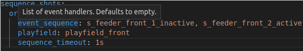
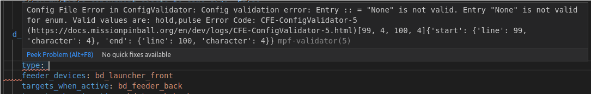
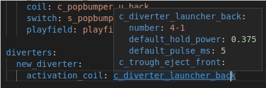

# Using the MPF Language Server in Your IDE to Edit Configs

The MPF language service implements the [language server protocol
(LSP)](https://microsoft.github.io/language-server-protocol/) to bring
syntax highlighting, auto completion, diagnostics and more to [numerous
IDEs](https://langserver.org/) (and not just to one of them). Your IDE
most likely supports LSP either directly or via a plugin. Even some text
editors (such as Sublime) support LSP.

You can also follow our video about the perfect IDE setup:

<iframe width="560" height="315" src="https://www.youtube.com/embed/QdDHEe2aEJo" title="YouTube video player" frameborder="0" allow="accelerometer; autoplay; clipboard-write; encrypted-media; gyroscope; picture-in-picture" allowfullscreen></iframe>

## Features

The MPF language server helps you to efficiently write MPF config. In
the following you find a selection of the features.

### Context Help

Hover over a setting and the LSP will give you context about the type.
In the future this will also show you the documentation entry about this
setting.

### Error Highlighting

### Auto Completion

### Go To Definition

## Installation

See the [Language Server
Documentation](https://github.com/missionpinball/mpf-ls) for now.
