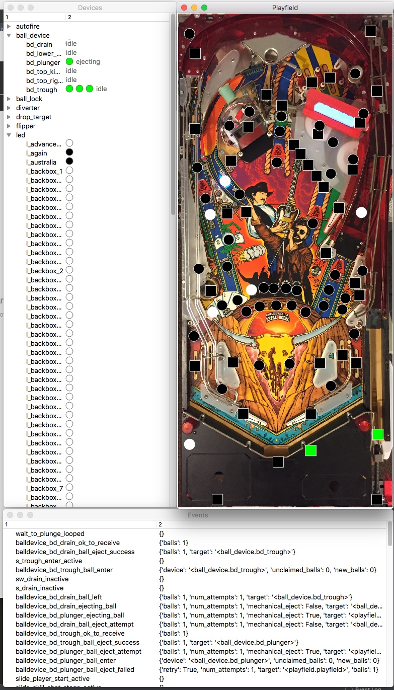

# The MPF Monitor

The MPF monitor is a graphical app that connects to a live running
instance of MPF and shows the status of various devices. (LEDs,
switches, ball locks, etc.) as well as a running list of recent
[MPF events](../../events/index.md). You can add
a picture of your playfield and drag-and-drop devices to their proper
locations so you can interact with your machine when you're not near
your physical machine and/or for developing your game. MPF Monitor is
also great when you have more than one person working on your MPF code
but your physical machine is at one person's house. :)

The MPF Monitor can run on Windows, Mac, and Linux. It uses
[PyQt6](https://www.riverbankcomputing.com/software/pyqt/intro) (Python
bindings for Qt6) for its visual framework.

The current version of Monitor is 0.57.2, which works with MPF 0.57 and 0.80.

Here's a screen shot of it in action:

!!! note

    The MPF Monitor is *not* a full pinball simulation with physics or
    moving balls or anything. But it does enough that you can use it to do
    real work on a machine when that machine is not nearby.

Video about developing your game without hardware:

<iframe width="560" height="315" src="https://www.youtube.com/embed/7XmIIhzEREk" title="YouTube video player" frameborder="0" allow="accelerometer; autoplay; clipboard-write; encrypted-media; gyroscope; picture-in-picture" allowfullscreen></iframe>

## Features

* Connects to a live running instance of MPF, locally or remotely

* Automatically discovers the pinball mechs and devices in the game.

* Device state is updated in real time in the "Devices" window.

* MPF events and their keyword arguments are posted in real time to "Events" window.

* You can add a photo of your playfield and then drag-and-drop LEDs,
    lights, and switches from the device tree onto the playfield.

    * LEDs (circle icons) show their color in real time.
    * Lights (circle icons) show their brightness in real time between black and white.
    * Switches (square icons) show their state (green = active, black = inactive).
    * Other device types and custom shape choices are available

* Left-click on a switch to "tap" it (activate & release).
    Right-click on a switch to "toggle" it (change its state and hold it).

* Devices added to the playfield image are saved & restored when you
    restart the monitor.

* Window sizes, positions, and which windows are open are remembered
    and restored on next use.

* You can start the monitor and leave it running, and it will
    automatically connect (and disconnect/reconnect) to MPF as MPF
    starts and stops.

## Next Steps

* [Installing MPF Monitor](installation.md)
* [Running the MPF Monitor](running.md)
* [Monitor: Playfield Devices](devices-and-using.md)
* [Monitor: Customizations](customizations.md)
