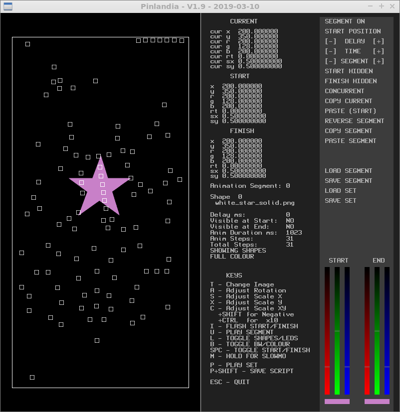
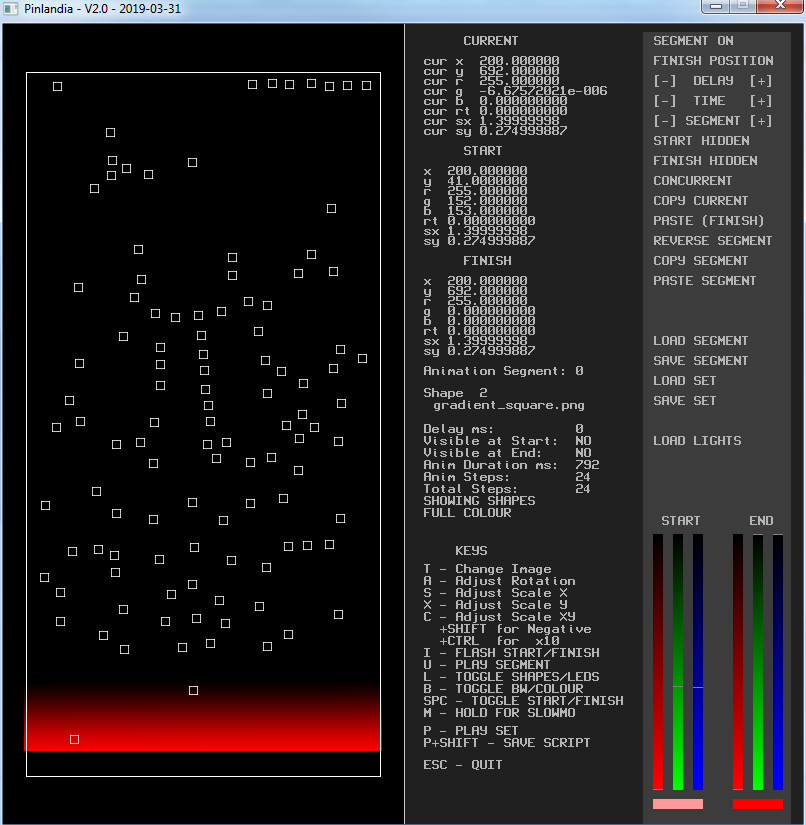

# MPF Showcreator


MPF supports playing [light shows](../shows/index.md) out of files in your config folder. Those are human readable
and can be created by hand. But isn't that a bit cumbersome for larger
shows? Especially, if you want to swipe over all (or most) of your LEDs
this might take days. Luckily, there are two tools for that.

## A) MPF Showcreator based on playfield layout

The [light show generator for
MPF](https://github.com/missionpinball/showcreator) loads your LED
positions from the [MPF Monitor](monitor/index.md)
config and lets you create show for transitions.

Video about showcreator:

<div class="video-wrapper">
<iframe width="560" height="315" src="https://www.youtube.com/embed/bjDWm_pO9_I" title="YouTube video player" frameborder="0" allow="accelerometer; autoplay; clipboard-write; encrypted-media; gyroscope; picture-in-picture" allowfullscreen></iframe>
</div>

[Shows](../shows/index.md) in MPF are written
in YAML and can be used
[universally](../config_players/index.md) to
control all kinds of things (such as
[lights](../config_players/coil_player.md),
[coils](../config_players/coil_player.md),
[slides](../config_players/slide_player.md),
[widgets](../config_players/widget_player.md),
[sounds](../config_players/sound_player.md)
and [more](../config_players/index.md)).
Basically, shows are a list of actions combined with a duration after
which the next element in the list is played. Here is an example of a
light show with three lights which sequentially turn blue over one
second:

``` mpf-config
##! show: my_show
#show_version=5
- duration: .25
  lights:
    l_arrow_1: off
    l_arrow_2: off
    l_arrow_3: off
- duration: .25
  lights:
    l_arrow_1: blue
    l_arrow_2: off
    l_arrow_3: off
- duration: .25
  lights:
    l_arrow_1: blue
    l_arrow_2: blue
    l_arrow_3: off
- duration: .25
  lights:
    l_arrow_1: blue
    l_arrow_2: blue
    l_arrow_3: blue
```

In this simple example it totally makes sense to create the show by
hand. You could also throw in [tokens](../shows/tokens.md) for the lights and reuse the show all over the machine for
different light triples.

However, imagine you want to swipe over all lights in your machine. That
would be a lot of text and also hard to get right manually. Luckily,
Mark, the maker of the [Nightmare before Christmas custom pinball
machine](https://pinside.com/pinball/forum/topic/the-nightmare-before-christmas),
created this awesome MPF Lightshow generator.



The tool allows you to set a shape (i.e. a star in the example), choose
a start and an end position and color. Based on that it will create a
light show for you which contains one section per step (at a defined
frame rate). Neat right? You might ask: How does it know where my lights
are located on the playfield?

Luckily, you probably already have them set if you used the
[MPF Monitor](monitor/index.md). It
allows you to use drag and drop to position all your switches and lights
on a playfield image. Those positions are then saved to the
`monitor/monitor.yaml` file in your machine folder. All you have to do
is point the light show creator to the `monitor/monitor.yaml` file on
startup.

You set the start and end positions, rotations, scales and colors of
that shape anywhere you want over the playfield.

Here we start with a gradient bar at the top of the playfield in a pink
color.


We want the final position to be here at the bottom, in a darker red
shade.



You can then adjust the length of the animation in milliseconds and
hence the number of steps in the final show. In this example, the shape
will be moved from the start to finish in 24 steps.

Based on these settings, it will create a light show for you which
contains all needed commands per step for each of the lights the shape
passes over. Lightshow playback speed can be adjusted in MPF.

You're not restricted to just the included shapes. You can make your
own shapes and drop them in the shapes folder.


Once you get the hang of animating a single shape, you can go further by
adding in more shapes. You can add a total of 256 shapes in animation
segments. Each segment can be set to `concurrent` (start and end same
time as the previous segment) or `follow` (start after previous segment)
This allows for more interesting multipart shows. For example you could
have several color swipes coming from different directions one after the
other or effects like multiple spotlights moving across the playfield
like a hollywood premiere.

### Running the showcreator on Windows

1.  Checkout or download the
    [showcreator](https://github.com/missionpinball/showcreator.git)
    repository.
2.  Double click on led.exe

### Running the showcreator on Mac x64

1.  Checkout or download the
    [showcreator](https://github.com/missionpinball/showcreator.git)
    repository.
2.  Double click on: led mac x64.app (you may not see .app in the name)

### Running the showcreator on Linux

The showcreator is developed with a development language called [Blitzmax](https://de.wikipedia.org/wiki/Blitz_Basic), there is no precompiled
executable for Linux available, so we need to follow the [Blitzmax homepage](https://blitzmax.org/) to set up the development environment to compile an executable.

As a first step some pre-requisites need to be met, follow these [guidelines](https://blitzmax.org/docs/en/setup/linux/) to install the packages needed. On that page you find
the instructions for some common Linux distros.

Next you need to download the Blitzmax environment from [here](https://blitzmax.org/downloads/), that is just a compressed folder you need to extract to any location on your computer. Inside that folder you should
see an executable called `MaxIDE`, that is the development IDE you need to start. You could follow this [Hello World Guide](https://blitzmax.org/docs/en/setup/get_started/#hello-world-with-maxide) to verify if the installation 
is correct until here, but it is not compulsory to do so.

Now you need the source code from the showcreator project, you need to clone the complete project


``` console
git clone https://github.com/missionpinball/showcreator.git
```

It is not sufficient just to download the led.bmx source file, though the build will succeed, the execution of the showcreator will fail earlier or later due to missing dependencies. Open the led.bmx source file in the `MaxIDE`. In the MaxIDE in the menu `Program --> Build Options --> Debug Build` you can switch off 
the debug build that is not really needed. Now compile (build) the source code by selection `Program --> Build`. When building the first time, it might run some time since Blitzmax needs to compile all kind of
dependencies. After the build is done, you find in the same folder where your source file is located an executable called `led`.

Afterwards you can run the showcreator using (from within your install folder):

``` console
./led
```

Note, that on the console, which might be hidden by the showcreator window, you are being asked for the monitor.yaml file. Enter the file location to load your light data.

### Key bindings

* A - adjust rotation
* S - adjust x scale
* X - adjust y scale
* C - adjust both x and y scales
* HOLD SHIFT to reverse above functions
* HOLD CTRL to increase functions by 10X
* I - flash between START and FINISH end points
* L - toggle between viewing SHAPES or affected LEDs
* B - toggle between BW and full colour output
* B+SHIFT - change the B/W Threshold (16-240)/256
* SPC - toggle between START and FINISH end points
* U - play segment
* P - play complete set
* M - HOLD for slow motion during segment/set play
* P+SHIFT - play set and create script file
* ESC - quit - Y/N confirm quit
* Left Mouse Button Down over playfield adjusts position of current
    end (START or FINISH) +SHIFT adjusts both START AND FINISH
    positions

### Dynamic Shows

The tool is handy to render static shows which will not change during
runtime. If you want to render shows dynamically (using your GPU) you
can also use
[your lights as display in MC](../config_players/display_light_player.md) but that will cost much more resources during runtime than
offline generated shows.

## B) MPF light and show creator
Another tool exists to create light shows. It is has a bit different approach and is not based on the monitor.yaml file. Take a look at the tool's [homepage](https://github.com/worldpeace-germany/mpfLightAndShowGenerator)
to see if this approach suites your needs.
