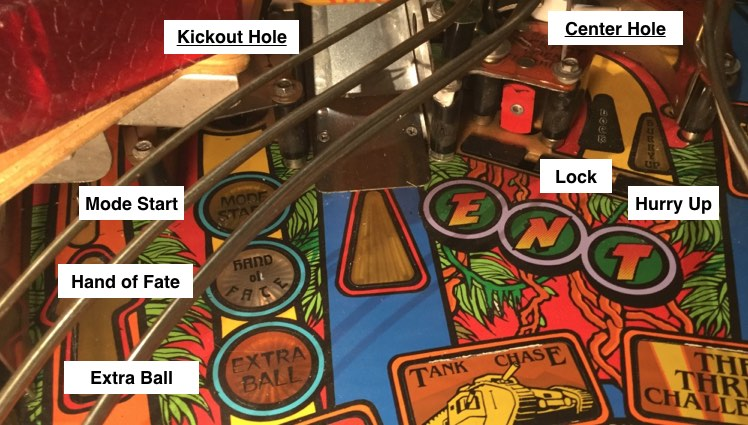
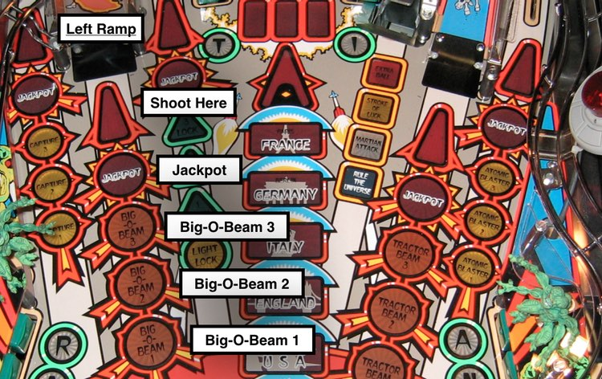

Strategy for shot configuration and blocking
============================================

This guide explains talks through a strategy for creating your shots, and then
for blocking (e.g. "disabling") shots from lower priority modes while higher
priority modes are running.

At the most basic level, "shots" in MPF tend to relate to physical shots in your
machine—left rame, right orbit, center target, etc.

However, many shots in pinball machines have more than one light associated with
them, meaning that in terms of game logic, a single physical shot might be more
than one logical shot.

Here's an example from Indiana Jones: The Pinball Adventure:

The image above shows two physical shots—a kickout hole and a subway entrance.
The the ``shots:`` section of your config, you would configure these two shots
something like this:

::

    shots:
        kickout:
            events: balldevice_center_kickout_ball_enter
        center_hole:
            events: balldevice_center_hole_ball_enter

(Note that since these shots are to ball devices, you want to use the ball
device's "ball enter" event to trigger shot being hit rather than tying it to
the switch since you want to be able to use the logic from the ball device for
entrance switch timings for the shot.)

From a physical shot standpoint, these two shots make sense. But when it comes
time to implement your game logic, you'll run into the problem.

The problem is that you "link" a shot to a certain light on the playfield via
the ``show_tokens:`` section of a shot. But if your shot has three different
lights that all mean different things, what do you enter for show tokens?

Solution: Multiple shots
------------------------

The easiest way to solve this is is to create separate shots for each light/shot
combination, like this:

::

    shots:
        mode_start:
            events: balldevice_center_kickout_ball_enter
            show_tokens:
                light: l_mode_start
        hand_of_fate:
            events: balldevice_center_kickout_ball_enter
            show_tokens:
                light: l_hand_of_fate
        extra_ball:
            events: balldevice_center_kickout_ball_enter
            show_tokens:
                light: l_extra_ball
        lock:
            events: balldevice_center_hole_ball_enter
            show_tokens:
                light: l_lock
        hurry_up:
            events: balldevice_center_hole_ball_enter
            show_tokens:
                light: l_hurry_up

So now you have five shots.

Having five separate shots means that you can enable/disable them all
separately, you can have different shot profiles applied to them all, and each
shot can be in a separate state.

For example, you could create shot profiles like this. (Remember shot profiles
are reusable throughout your game, so you might create these in your
machine-wide config):

::

    shot_profiles:
        tri_state:
            states:
            - name: unlit
              show: off
            - name: lit
              show: flash
            - name: complete
              show: on
        on_off:
            states:
            - name: unlit
              show: off
            - name: lit
              show: on
        flash:
            states:
            - name: lit
              show: flash
            - name: unlit
              show: off

Now you can apply the profiles to the five shots like this:

::

    shots:
        mode_start:
            events: balldevice_center_kickout_ball_enter
            show_tokens:
                light: l_mode_start
            profile: tri_state
        hand_of_fate:
            events: balldevice_center_kickout_ball_enter
            show_tokens:
                light: l_hand_of_fate
            profile: on_off
        extra_ball:
            events: balldevice_center_kickout_ball_enter
            show_tokens:
                light: l_extra_ball
            profile: on_off
        lock:
            events: balldevice_center_hole_ball_enter
            show_tokens:
                light: l_lock
            profile: on_off
        hurry_up:
            events: balldevice_center_hole_ball_enter
            show_tokens:
                light: l_hurry_up
            profile: flash

The above config is just an example where we thought through what we might want
the lights to do. Remember you can override the default profiles for each shot
in your mode configs, so it's really flexible.

Like we said, since each light/shot combination is configured as a separate
MPF shot, this gives you a lot of flexibility.

First, remember that each time a shot is hit, several events are posted which
you can use to trigger awards, slide shows, start modes, score, etc. Also
remember that the "state" a shot is in is also posted. So when the mode_start
shot is in the "lit" state, you'll get a "mode start lit hit" event, and when
the mode start is in the unlit state and hit, you'll get a "mode start unlit
hit" event.

This means you can key-in on the mode start being hit when it's lit, and you
don't have to worry about it being hit when it's unlit.

This is also really convenient for "stacking" shots. For example, it's quite
common to have two shots lit at the same time from the same shot. In Indiana
Jones, you can have "extra ball" and "mode start" both lit, and when that shot
is hit, it will award the extra ball *and* start the mode. In this case the
shot events for mode_start_lit and extra_ball_lit will both be posted.

"Blocking" shots in higher priority modes
-----------------------------------------

It's also common in modern pinball machines to have a higher-priority mode that
blocks ("disables") shots that are active in a lower priority mode. Consider
this example from Attack From Mars:

For just the left ramp alone, you'd probably have four shots configured (each
with ``show_tokens:`` linking the shot to the lights for it:

* left_ramp
* left_ramp_shoot_here
* left_ramp_jackpot
* big_o_beam

Since the "big_o_beam" lights are really a group of three lights for a single
shot, you could configure that as one shot, but then have 5 steps in the shot
profile (off, 1_lit, 2_lit, 3_lit, complete), and the show you'd tie to that
profile would handle the lighting and flashing of the shots for each start as
needed.

However, when the multiball mode is active and you have the jackpot shot lit,
you want to disable the big_o_beam shot. (Disabling it will stop its show and
prevent shots to it from posting their events which will prevent the Big-O-Beam
status from advancing while the jackpot mode is running.

So in this case, in your jackpot mode config, you would configure the shots like
this:

::

    # mode config file for jackpot mode

    shots:
        left_ramp_jackpot:
            profile: flash
        left_ramp_shot_here:
            disable_events: mode_jackpot_started
        left_ramp_big_o_beam:
            disable_events: mode_jackpot_started
        left_ramp:
            disable_events: mode_jackpot_started

If you don't want to disable the lower priority shot in a higher priority mode,
that's fine too—just don't enter that shot into your higher priority mode.

At first you might think this is a lot of work, since you'd have to think about
all the lower-priority shots that you'd like to block in a higher mode and then
manually enter them all. Unfortunately there's no way around this since only
you know which shots from lower modes should be enabled in higher modes, and
which should be blocked. (For example, in the jackpot mode of Attack From Mars,
you would want to keep the shot group enabled for the four circle lights above
the outlanes and inlanes since those still work when the multiball is running.)
