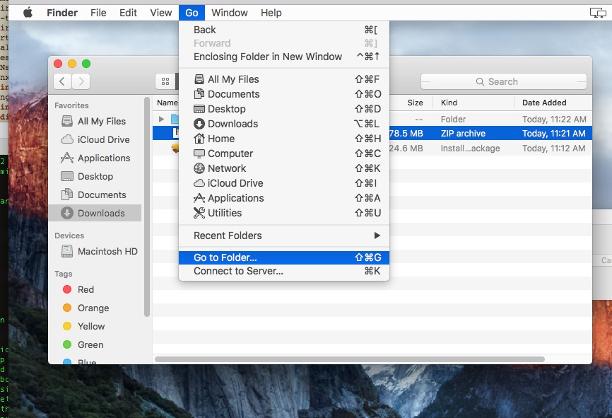
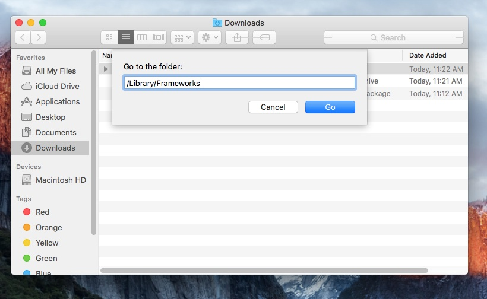
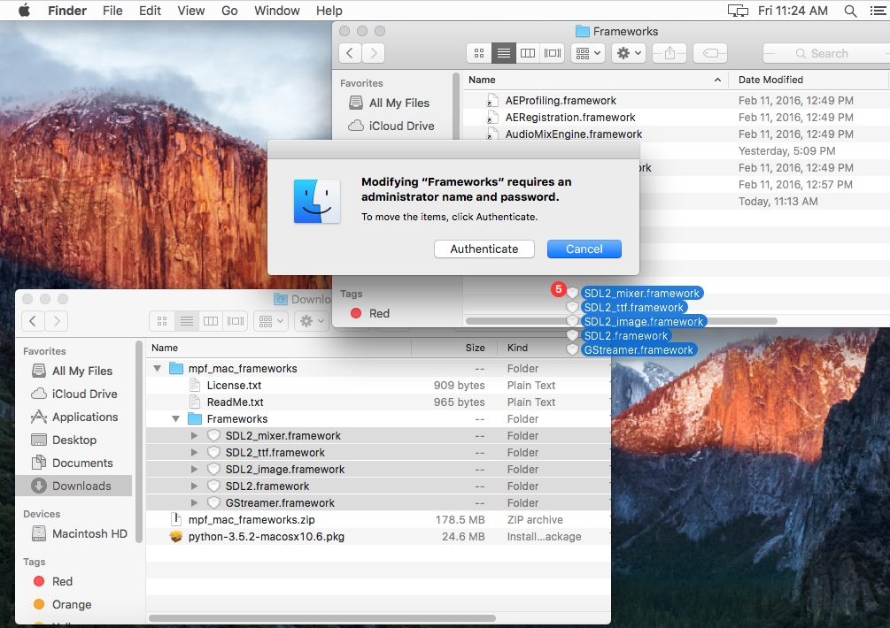
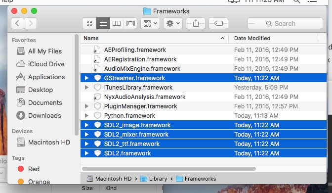
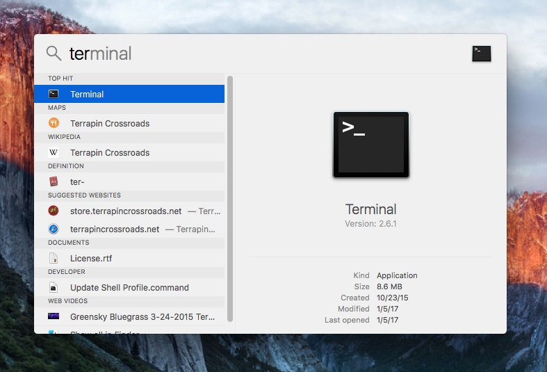
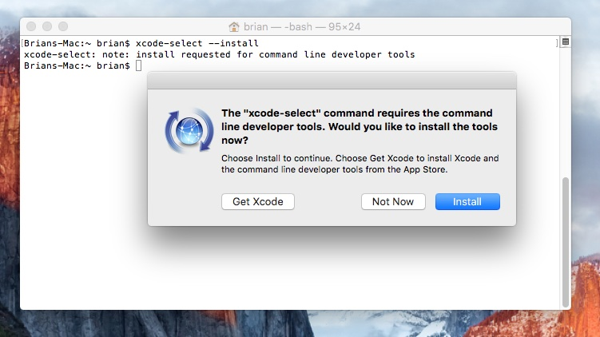
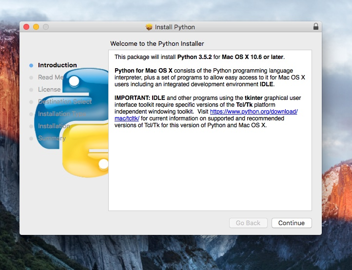
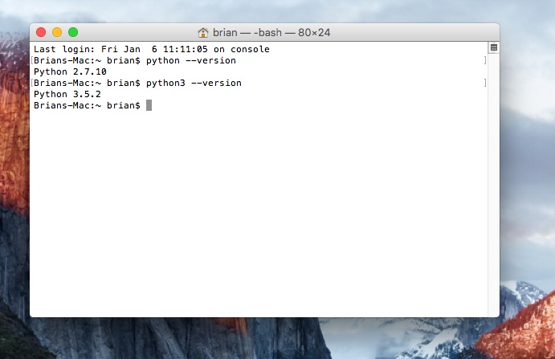

Installing MPF on Mac
=====================

MPF can be used on Mac OS X 10.9 and newer, including Mavericks, Yosemite,
El Capitan, Sierra and High Sierra.

.. note::

   MPF cannot run in a Mac virtual machine (like in VMware Fusion or Parallels)
   if the guest OS is Mac, though running MPF in a Windows or Linux VM on a
   Mac is fine.

Also at this time, installing all the components you need to run MPF on a Mac
will require almost 2 GB of disk space. MPF itself it only about 12 MB, but
there are a lot of supporting things that MPF needs as you'll see here.

We have a video which shows this entire installation process in action
which is available at `<https://www.youtube.com/watch?v=lJEfQGffXsA>`_

Here are the steps to install MPF on a Mac:

Step 0. Uninstall your previous MPF app installation
----------------------------------------------------

The process for running MPF on a Mac has changed as of Jan 10, 2017.
Previously we had an MPF.app that you downloaded which contained Python and
everything you needed.

If you used MPF on a Mac prior to this and you have the MPF.app, you need to
remove it first. If you have never installed MPF on your Mac before, then
proceed directly to Step 1 below.

To remove the old MPF Mac installation:

1. Delete the "MPF.app" from your Applications folder.
2. Delete the "mpf" alias in ``/usr/local/bin``.
3. Delete the "kivy" alias in ``/usr/local/bin``.

If you don't know how to find your ``/usr/local/bin`` folder, you can use
the "Go to Folder" technique shown in Step 1.

Prerequisites and Python Environment
------------------------------------

1. Download the Mac Multimedia Frameworks
^^^^^^^^^^^^^^^^^^^^^^^^^^^^^^^^^^^^^^^^^

MPF uses open source multimedia frameworks called GStreamer and SDL2 for its
graphics, video, and sound features. So next you need to download these
frameworks and copy them to your Mac's frameworks folder. There are actually
five different frameworks MPF needs, and downloading them all separately is
kind of a pain (especially finding the right versions and everything), so we
have created a single ZIP file which has everything you need.

Download the zip of the multimedia frameworks `here <https://mpf.kantert.net/mpf_mac_frameworks.zip>`_.
(Thanks to MPF developer Jan Kantert for hosting it!) The zipped download is 170 MB,
and the unzipped size is 529 MB.

Unzip it, and copy (or drag and drop) the five things in the zip file's
``Frameworks`` folder to your own Mac's ``/Library/Frameworks`` folder.

Depending on your Mac's settings, you might not see the ``/Library/Frameworks``
folder in Finder. If this is the case, use the *Go -> Go to Folder...* menu,
and then type "/Library/Frameworks" and hit enter.

The following three images illustrate the steps:

Note that you will need to authenticate (which just means you have to enter
your password) in order to be able to copy those frameworks into your Mac's
frameworks folder. The authentication message will automatically pop up when
you drag and drop the files:

When you're done, your Mac's ``/Library/Frameworks`` folder should have
the five new frameworks (plus whatever random ones you already had), which
should look something like this:

2. Install the Mac developer tools
^^^^^^^^^^^^^^^^^^^^^^^^^^^^^^^^^^

Next you have to install something called the "Command Line Developer Tools"
which is a package of software development tools created by Apple which MPF
relies on to get installed.

To do this, you need to use the "Terminal" app (which is essentially a
command prompt window for the Mac).

The easiest way to launch the Terminal app is to use Spotlight (press the
CMD + Spacebar) and then just type "Terminal", like this:

Next, type the following command into the prompt in the terminal and press
Enter:

.. code-block:: console

   xcode-select --install

That should pop up a box which gives you the option to install the command
line tools, like this:

Click the "Install" button here to get just the command line tools. The
"Get XCode" button installs more than you need.

The download will be about 150 MB, and the total install will be about 1.1 GB.

After the installation of the tools you may need to accept the license agreement from Apple.
The following command starts that process in the Terminal, just follow the instructions provided:

::

   sudo xcodebuild -license

If you already have the command line tools installed, that's fine. You'll get
some kind of error saying they're already installed and you can move on.

3. Install Python 3.6+
^^^^^^^^^^^^^^^^^^^^^^

MPF is written in a computer language called "Python". This means you have to install Python
first before you can use MPF. Luckily this is just a one-time install, and you don't have to
install it again if you update MPF later.

On Mac platforms, MPF requires Python 3.5 or newer. It is well-tested on 3.6 and somewhat tested on 3.7.

You can download Python 3.6 directly via `this link <https://www.python.org/ftp/python/3.6.8/python-3.6.8-macosx10.9.pkg>`_.
(Note that the final digit in the Python version number is the "patch" number,
so 3.6.8 is the latest version of Python 3.6 as of the time this document was last updated.)

Installing Python is pretty straightforward. It's a standard Mac installation
package. You can click next, next, next, agree to the license, enter your
password, and you're all set.

.. note::

   Macs have an older version of Python built in, but it's Python 2.x, and MPF
   requires Python 3, so that's why you have to install Python now. The new
   Python 3 that you install here will happily live alongside the Python 2.x
   that your Mac already has.

You can check to make sure Python 3 installed correctly from the Terminal
window. To do that, run the command:

.. code-block:: console

   python3 --version

You should see it print something like "Python 3.6.5". Note that you have
to run the command "Python3", not "Python", since the regular python command
without the "3" on the end points to the Python 2.x that's built into your
Mac. Here's a screenshot showing running "python" and "python3" and the
different between the two:

4. Create a Virtual Environment (recommended)
^^^^^^^^^^^^^^^^^^^^^^^^^^^^^^^^^^^^^^^^^^^^^

Python includes a utility call "virtual environment" that creates a safe,
isolated place to install packages and configure python. It's strongly
recommended to install MPF in a virtual environment, so that other Python
programs can't interfere with it (and it can't interfere with others).

To create a virtual environment, choose a folder where you want to install
a copy of python and keep the environment's packages. For this example, we'll
call the environment "mpfenv" and put it in our home directory (known as "~").

.. code-block:: console

  python3 -m venv ~/mpfenv

.. note::

  If you have multiple versions of Python3 (say, 3.4 and 3.6), you can specify
  which one to use in the virtual environment: ``python3.6 -m venv ~/mpfenv``

A virtual environment is recommended for any general-use computer you'll be
using MPF on. For a dedicated MPF machine that will have no other programs
installed (for example, a computer inside a pinball cabinet), a virtual
environment is not recommended.

.. warning::

  If you use a virtual environment you have to always activate it before
  starting MPF.
  Otherwise, you will encounter weird issues.

5. Activate your Virtual Environment
^^^^^^^^^^^^^^^^^^^^^^^^^^^^^^^^^^^^

To keep itself isolated from other programs, your virtual environment only activates when you tell it to.
You can enable the virtual environment with the dot command from the terminal:

.. code-block:: console

  . ~/mpfenv/bin/activate

Note that the first character is a period, followed by a space, then the path
to your virtual environment and "/bin/activate".

.. note::

  You may want to write this step down, as you'll run it every time you open up
  a terminal window to work on MPF

You'll know you're in the virtual environment because the console prompt will include
the name of your venv in parenthesis.

.. code-block:: console

  My-Mac:~ python --version
  Python 2.7.10
  My-Mac:~ . ~/mpfenv/bin/activate

  (mpfenv) My-Mac:~ python --version
  Python 3.6.8
  (mpfenv) My-Mac:~

.. note::

   The python you used to create the virtual environment will now be the
   default python. Outside the virtual environment "python" is Python 2 and
   you must type "python3" to use Python 3; inside the virtual environment,
   you can use "python" to refer to Python 3.

6. Install/upgrade some Python components
^^^^^^^^^^^^^^^^^^^^^^^^^^^^^^^^^^^^^^^^^

6.1 Upgrade Pip
"""""""""""""""

Python includes a utility called "pip" which is the name of the Python Package
Manager. Pip is used to install Python packages and applications from
the web. (It's kind of like an app store for Python apps.)
On most systems ``pip`` will default to the Python 2 version of pip and
``pip3`` will be the Python 3 version (unless you use a virtual env).
So to be safe just use ``pip3`` all the time.

.. code-block:: console

  (mpfenv) My-Mac:~ $ pip3 --version
  pip 19.0.1 from ~/mpfenv/lib/python3.6/site-packages/pip (python 3.6)

The versions of pip that come with Python aren't always the newest, so it's a
good idea to update pip by running the following command:

.. code-block:: console

  pip3 install --upgrade pip

The latest version of pip should now be installed.

6.2 Install Setuptools and Cython
"""""""""""""""""""""""""""""""""

Next, we need to install and update a few other python packages required to run mpf by
running the following command:

.. code-block:: console

    pip3 install --upgrade setuptools pillow
    pip3 install -I Cython==0.27.3

This command will download and install the latest versions of the *setuptools*
and the correct version of *cython* packages.
The results will look something like this (though the
exact version numbers might be different depending on what's the latest
whenever you're running this):

.. code-block:: console

   Collecting setuptools
     Downloading setuptools-32.3.1-py2.py3-none-any.whl (479kB)
       100% |################################| 481kB 4.3MB/s
   Collecting cython==0.25.2
     Downloading Cython-0.25.2-cp35-cp35m-macosx_10_6_intel.macosx_10_9_intel.macosx_10_9_x86_64.macosx_10_10_intel.macosx_10_10_x86_64.whl (3.8MB)
       100% |################################| 3.8MB 7.6MB/s
   Installing collected packages: setuptools, cython
   Successfully installed cython-0.27.3 setuptools-32.3.1

6.3 Install Kivy
""""""""""""""""

Finally, we need to install a graphics framework called Kivy.

By default, pip will download and install precompiled binaries. The Kivy binaries
include frameworks that can conflict with the Mac Library frameworks we
added in step 1, so instead we want pip to download the uncompiled Kivy files
and make a new binary.

We can tell pip to do that with the following command:

.. code-block:: console

  pip3 install kivy --no-binary :all:

The installation of Kivy may take a couple of minutes.

Installing MPF & MC
-------------------

7. Install MPF & MC (Stable Release)
^^^^^^^^^^^^^^^^^^^^^^^^^^^^^^^^^^^^

First, double-check that you've activated your virtual environment, if you set one up.
Next you can run pip to install MPF itself, along with MPF-MC (the
`Mission Pinball Framework Media Controller <http://docs.missionpinball.org/en/latest/start/media_controller.html>`_).

Install MPF and MC like this:

.. code-block:: console

   pip3 install mpf mpf-mc

.. note::

  If you are using High Sierra or newer and aren't using a virtual environment,
  you may encounter a permissions error. If so, add ``--user`` to the end of the
  above command.

Your results should look something like the results below. The MPF install will
download and install several other packages which what all these other things
are.

.. code-block:: console

   My-Mac:~ $ pip3 install mpf-mc
   Collecting mpf-mc
     Downloading mpf-mc-0.32.12.tar.gz (11.1MB)
       100% |################################| 11.1MB 29.6MB/s
   Collecting ruamel.yaml<0.11,>=0.10 (from mpf-mc)
     Downloading ruamel.yaml-0.10.23.tar.gz (228kB)
       100% |################################| 235kB 9.0MB/s
   Collecting mpf>=0.32.6 (from mpf-mc)
     Downloading mpf-0.32.6.tar.gz (556kB)
       100% |################################| 563kB 18.0MB/s
   Collecting kivy>=1.9.1 (from mpf-mc)
     Downloading kivy-1.9.1.tar.gz (16.4MB)
       100% |################################| 16.4MB 7.4MB/s
   Collecting ruamel.base>=1.0.0 (from ruamel.yaml<0.11,>=0.10->mpf-mc)
     Downloading ruamel.base-1.0.0-py3-none-any.whl
   Collecting pyserial>=3.2.0 (from mpf>=0.32.6->mpf-mc)
     Downloading pyserial-3.2.1-py2.py3-none-any.whl (189kB)
       100% |################################| 194kB 4.1MB/s
   Collecting pyserial-asyncio>=0.2 (from mpf>=0.32.6->mpf-mc)
     Downloading pyserial_asyncio-0.3-py3-none-any.whl
   Collecting Kivy-Garden>=0.1.4 (from kivy>=1.9.1->mpf-mc)
     Downloading kivy-garden-0.1.4.tar.gz
   Collecting requests (from Kivy-Garden>=0.1.4->kivy>=1.9.1->mpf-mc)
     Downloading requests-2.12.4-py2.py3-none-any.whl (576kB)
       100% |################################| 583kB 4.8MB/s
   Installing collected packages: ruamel.base, ruamel.yaml, pyserial, pyserial-asyncio, mpf, requests, Kivy-Garden, kivy, mpf-mc
     Running setup.py install for ruamel.yaml ... done
     Running setup.py install for mpf ... done
     Running setup.py install for Kivy-Garden ... done
     Running setup.py install for kivy ... done
     Running setup.py install for mpf-mc ... done
   Successfully installed Kivy-Garden-0.1.4 kivy-1.9.1 mpf-0.32.6 mpf-mc-0.32.12 pyserial-3.2.1 pyserial-asyncio-0.3 requests-2.12.4 ruamel.base-1.0.0 ruamel.yaml-0.10.23
   My-Mac:~ $

If you want to make sure that MPF was installed, run:

.. code-block:: console

   mpf --version

This command can be run from anywhere and should produce output something like
this:

.. code-block:: console

   My-Mac:~ $ mpf --version
   MPF v0.54.0

(Note that the actual version number of your MPF installation will be whatever
version is the latest.)

7.2 Install MPF & MC (Development Build)
^^^^^^^^^^^^^^^^^^^^^^^^^^^^^^^^^^^^^^^^

The stable release of MPF is updated every few months, after being tested and used
by the development team. If you want to play with the most up-to-date changes,
you can run MPF from the latest development build.
*This is not recommended for most users.*

.. note::

  The development builds may include new features in progress, changes to behavior,
  and bugs. Running the development builds is recommended for people who want to
  actively participate in the development and testing of MPF.

The installation instructions are the same, except for including ``--pre`` in the install command
(for "prerelease").

.. code-block:: console

   pip3 install --upgrade --pre mpf mpf-mc

The prereleases will have "dev" in their version number to indicate that they are under development.

.. code-block:: console

   $ mpf --version
   MPF v0.54.0.dev3

If you want to switch from the development build back to the stable release, uninstall
and run the install command without ``--pre``.

.. code-block:: console

  pip3 uninstall mpf mpf-mc
  pip3 install mpf mpf-mc

Running Pinball Games in MPF
----------------------------

8. Download & run the "Demo Man" example game
^^^^^^^^^^^^^^^^^^^^^^^^^^^^^^^^^^^^^^^^^^^^^

Now that you have MPF installed, you probably want to see it in action. The easiest way to do that is
to download a bundle of MPF examples and run our "Demo Man" example game. To do that, follow
the instructions in the :doc:`/example_games/demo_man` guide. But make sure to get the -dev Version for 0.50.

There's another example project you can also check out if you want called the "MC Demo" (for media controller demo)
that lets you step through a bunch of example display things (slides, widgets, sounds, videos, etc).
Instructions for running the MC Demo are :doc:`here </example_games/mc_demo>`.

9. Install whatever drivers your hardware controller needs
^^^^^^^^^^^^^^^^^^^^^^^^^^^^^^^^^^^^^^^^^^^^^^^^^^^^^^^^^^

If you're using MPF with a physical machine, then there will be some specific
steps you'll need to take to get the drivers installed and configured for
whatever control system you've chosen. See the :doc:`control systems </hardware/index>`
documentation for details. (You don't have to worry about that now if you just
want to play with MPF first.)

Running MPF
-----------

See the section :doc:`/running/index` for details and command-line options.

10. Keeping MPF up-to-date
^^^^^^^^^^^^^^^^^^^^^^^^^^

Since MPF is a work-in-progress, you can use the *pip* command to update your
MPF installation.

To to this, run the following:

.. code-block:: console

  pip3 install --upgrade mpf mpf-mc

This will trigger *pip* to contact the PyPI servers to see if there's a newer version of MPF or MC
(and any of their requirements). If newer versions are found, pip will download and install them.

.. warning::

   If you are upgrading from MPF 0.33 to 0.50 you will need to manually perform
   several migration steps to modify your configuration files or they will not
   work in MPF 0.50. Please refer to :doc:`Migrating from config version 4 to 5 of MPF </install/migrate4to5>`
   for step-by-step instructions.

The standard upgrade will only find stable releases, which are recommended for most users.
To install the latest development build, which may include new features and fixes (but might
also break or have new bugs), include "--pre" in your upgrade command:

.. code-block:: console

  pip3 install --upgrade --pre mpf mpf-mc

To downgrade (or install a specific release x.yy.z) run:

.. code-block:: console

  pip3 install mpf==x.yy.z
  pip3 install mpf-mc==x.yy.z

Next steps!
-----------

Now that MPF is installed, you can follow our
:doc:`step-by-step tutorial </tutorial/index>` which will show you how to start
building your own game in MPF!

Make sure to lookup mpf-monitor later, if you want to simulate and configure a machine you own in hardware.

.. include:: /install/common_problems_and_solutions.rst

Import errors when starting MPF-MC
^^^^^^^^^^^^^^^^^^^^^^^^^^^^^^^^^^

If you get import errors when starting MPF-MC the wheels we produced may be
incompatible with your XCode version, your python version or something else on
your Mac.

.. code-block:: console

   ImportError: dlopen(/Users/xxx/mpfenv/lib/python3.6/site-packages/mpfmc/uix/bitmap_font/bitmap_font.cpython-36m-darwin.so, 2): Library not loaded: @loader_path/../../.dylibs/GStreamer
     Referenced from: /Users/xxx/mpfenv/lib/python3.6/site-packages/mpfmc/uix/bitmap_font/bitmap_font.cpython-36m-darwin.so
     Reason: image not found

As a workaround try the following to skip downloading our wheels:

.. code-block:: console

  pip3 uninstall mpf-mc
  pip3 install --no-binary :all: mpf-mc

Please let us know in the `MPF User Forum <https://groups.google.com/forum/#!forum/mpf-users>`_
and report the following infos:

1. The exact version of MPF you installed (run ``pip3 show mpf``)
2. The exact version of MPF-MC you installed (run ``pip3 show mpf-mc``)
3. Your macOS version (i.e. 10.15.3)
4. Your xcode version (run ``/usr/bin/xcodebuild -version``)
5. The complete error message.
6. Did the workaround fix your problem?
