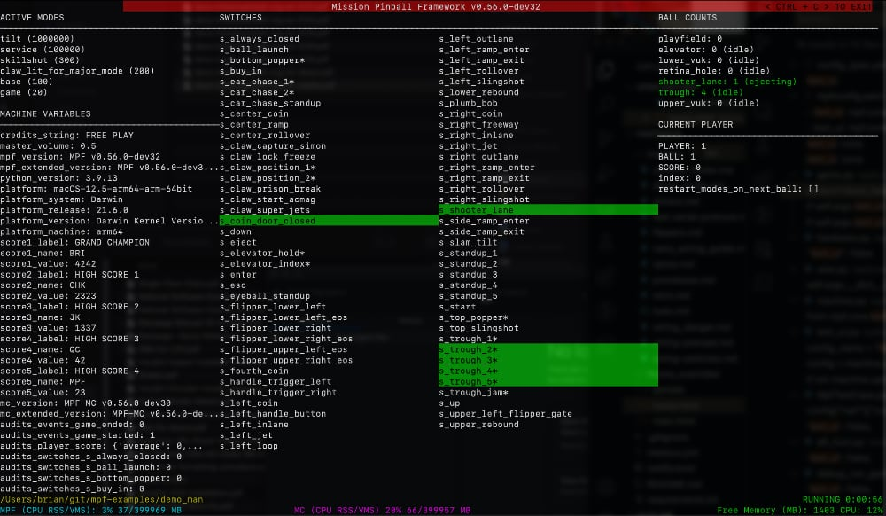

Installing MPF on Mac (Aug 22, 2022 update)
=========================================

This process is the new step-by-step process we are actively working out to get MPF 0.56 (current dev branch) installed on a Mac.

Overview of MPF on macOS
------------------------

MPF works on macOS running on both Intel and Apple Silicon (M1/M2 processors). The instructions are ALMOST the same for both, except Apple Silicon M1/M2 processors have a few extra steps for the time being. (We are still waiting for one of the libraries MPF needs to be compiled for M1/M2, so there's a workaround until then.)

Apple Silicon (M1/M2 processors) require macOS Monterey as well as Python 3.9. With Intel processors, MPF can work as far back as 10.14 (or so? let us know!), and can use Python 3.7, 3.8, or 3.9.

Here is the quick version:

1. If you do not have Python, install Python 3.9.13 from python.org. If you have an M1/M2 Mac, be sure to get the Universal installer, not the Intel one. (https://www.python.org/ftp/python/3.9.13/python-3.9.13-macos11.pkg)

2. Install Homebrew (https://brew.sh/). This will also install the Xcode command line tools if you don't have them. A lot of stuff will scroll by and it might take awhile.

3. Use brew to install the libraries and other support files MPF needs: ``brew install SDL2 SDL2_mixer SDL2_image gstreamer gst-plugins-base gst-plugins-good gst-plugins-bad gst-plugins-ugly pipx``

4. Run ``pipx ensurepath`` which will configure things pipx installs to be able to run from anywhere.

5. If you have an M1/M2 Apple Silicon Mac, run the following command: ``pip3 install --no-deps ruamel.yaml==0.15.100``

6. (Now we are back to the same instructionsf for M1 or Intel processors) Use pipx to install MPF with the Text UI components. ``pipx install "mpf[cli]" --pip-args="--pre" --python $(which python3) --verbose --include-deps``.

7. Use pipx to install MPF-MC into the mpf environment. ``pipx inject mpf mpf-mc --pip-args="--pre" --verbose --include-deps --include-apps``

At this point, MPF 0.56.0.devXX and MPF-MC 0.56.0.devXX are installed. (The "XX" in the version will be the dev build numbers.)

To test, download the ``mpf-examples`` repo from here: https://github.com/missionpinball/mpf-examples. You can either clone it locally, or download the zip file and unzip it. Either is fine, just do what you're most comfortable with. Be sure to download / switch to the ``dev`` branch.

Then back in the terminal, change into the ``mpf-examples`` folder (or whatever folder you just unzipped that into), then change into the ``mc_demo`` folder, then run ``mpf both``. That should launch the mc_demo code (which is Media Controller demo). A window should open with a red background and some text about slides, you should be able to use the right arrow key to advance to the next slide. You should be able to use the left arrow key to go back to the previous slide and you should hear a drum and cymbal sound when you change the slide.

You will see a bunch of warnings about some classes implemented in multiple locations, and how one will be used, but which one is undefined. It sounds scary, but this is normal. (For now.) We are investigating whether this is something we need to fix, and how we'll fix it if so. But for now it's fine.

You can also run the "demo_man" game from the ``mpf-examples`` folder. Change into the ``demo_man`` folder and run ``mpf both -X``. You should see the DMD window pop up. The window you ran the command from will have some warnings which cover up the nice
text UI display. Just grab a corner of the window with the mouse and resize the window (just make it a tiny bit bigger and smaller) and that will cause the window contents to completely refresh and you should see the expected MPF text UI display showing switch status, ball locations, etc. (See the screenshots below for details)

At this point, MPF is ready to go!

Installing MPF Monitor
----------------------

To install MPF Monitor, you also need to inject it into the mpf environment via pipx. You can do that with the following two commands:

.. code-block:: doscon

    pipx inject mpf PyQt5 --verbose --include-deps --include-apps
    pipx inject mpf mpf-monitor --pip-args="--pre" --verbose --include-deps --include-apps

Notes, Caveats & Next Steps
---------------------------

If have existing SDL and Gstreamer libraries installed (check the ``/Library/Frameworks`` folder), you can delete them. The versions that brew installs will go into the ``/opt/homebrew`` folder.

Do NOT use brew to install Python. Why? Because the Python in brew is meant to support other brew packages that need python, and as such it will automatically "upgrade" you to the latest Python, even on its own, which means your Python will flip to 3.10 and MPF won't work and you'll be sad. So that's why we install the "Framework Python" from python.org. (Why's it called "Framework Python"? Because it installs like a framework to that ``/Library/Frameworks`` folder.)

If you do not see the "normal" MPF text UI display, and instead see something like this:

.. image:: images/bad-display.jpg

This is because those warnings mentioned above print on top of the nice MPF display. To fix this, just grab a corner of the window with the mouse and resize it to be a bit bigger or smaller, which will cause the entire window to update and you should see the expected MPF text UI display showing switch status, ball locations, etc. (See the screenshots below for details)

Alternately if you don't want to resize the window every time, you can open two different terminal windows, and run ``mpf -X`` in one and ``mpf mc`` in the other.

Keeping MPF up-to-date
-----------------------

Once you have MPF installed via the procedure above, you can keep it up-to-date by running the final two pipx commands from above which you used to install MPF and MPF-MC.

Questions? Comments? Need help? You can post a reply into the MPF new installers for macOS thread in the MPF Users Google Group: https://groups.google.com/g/mpf-users/c/BIemtw17lx0

Or email me, Brian Madden, brian@fastpinball.com.

What if you borked it?
----------------------

Remove Homebrew: ``/bin/bash -c "$(curl -fsSL https://raw.githubusercontent.com/Homebrew/install/HEAD/uninstall.sh)"``
Homebrew installs everything to ``/opt/homebrew``, which means if you just delete that folder, everything will be gone.