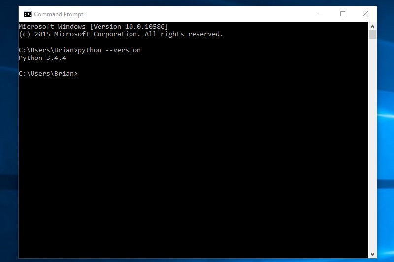

Installing MPF on Windows
=========================
MPF can be used on Windows 7, 8, and 10, in both 32-bit and 64-bit versions. The
installation process is pretty much automated, and the whole thing should only
take a few minutes.

Here are the steps:

1. Install Python 3.4
---------------------

On Windows platforms, MPF requires Python 3.4, (Python 3.5 will not work) which you can download and
install from the Python website. (Keep reading for links)

There are two versions of Python, a 32-bit version and a 64-bit version, and you
should pick the one that matches the version of Windows you're using.

The easiest way to tell whether you have 32-bit or 64-bit
Windows is to open a command prompt and run (note this is case-sensitive). If
you don't know how to open a command prompt, scan ahead for the instructions
later in this step.

::

    echo %PROCESSOR_ARCHITECTURE%

If it prints ``x86``, that's 32-bit. If it prints ``x64`` or ``AMD64``, that's 64-bit. (Note that it might print "AMD64"
even if you have an Intel processor.)

Here's an example of running this on a 64-bit Windows 10 machine:

.. image:: check_windows_processor_architecture.png

Then go to the Python website download the version you need. (Note that the final digit in the Python version
number is the "patch" number, so 3.4.4 is the latest version of Python 3.4.) Or use the direct-download links here:

+ `Download <https://www.python.org/ftp/python/3.4.4/python-3.4.4.msi>`_ the Python 3.4.4. x86 / 32-bit MSI installer.
+ `Download <https://www.python.org/ftp/python/3.4.4/python-3.4.4.amd64.msi>`_ the Python 3.4.4 x64 / 64-bit MSI installer.

.. image:: download_python_win.jpg

Installing Python 3 is pretty straightforward. It's a normal Windows installer.

The only thing you should change from the defaults is on the "Customize Python
3.4.4" screen, we like to select the option "Add python.exe to Path". That way
you can run ``python`` from any folder, rather than having to specify the full
path to it. (Also make sure the "pip" option is selected, but that should be
selected by default.)

.. image:: python_win_pip_path.jpg

Note that you have to log out and then log back in for the path to be updated
once you install Python. If you don't, then you'll get an error about Python not
being found when you try to install MPF.

Now open a command prompt and make sure you can run Python. To open a command
prompt, right-click on the Windows button and select "Command Prompt" from the
menu:

.. image:: windows_command_prompt.jpg

That will pop up a window where you can type commands. Then run the following
command:

::

    python --version

That should print which version of Python is installed, like this:

Note for running Python 2 and Python 3 side-by-side
~~~~~~~~~~~~~~~~~~~~~~~~~~~~~~~~~~~~~~~~~~~~~~~~~~~

If you're on a fresh computer that doesn't already have Python installed, you
can skip this section.

If you already have Python 2.x installed (perhaps from a previous version of
MPF), you can choose to uninstall Python 2 first and then install Python 3. That
is probably easier since you only have "one" Python.

If you install Python 3 when you already have Python 2, then you will have two
Pythons. That's perfectly fine. The only catch is that if you do that, you need
to add a "3" to the end of every Python command so your computer knows you want
the Python 3 version of that command.

For example, wherever you see ``python`` in the docs, you would actually type
``python3``, and wherever you see ``pip``, you would type ``pip3``.

Again, you only need this if you installed Python 3 on a system that already has
Python 2 on it. If you don't want to do this, just uninstall Python 2 first.

2. Upgrade pip
--------------

Python includes a utility called "pip" which is the name of the Python Package
Manager. This program is used to install Python packages and applications from
the web. (Kind of like an app store for Python apps.)

So the next step is to update the "pip" program itself to make sure you have the
latest one. It's not really important to know exactly what this means right now,
just run it. (If you just installed Python now, remember to log out and log in
again so the path setting can be updated).

Also if you have both Python 2 and Python 3 installed, remember to type
``pip3`` instead of ``pip``.

::

    pip install pip --upgrade

3. Install MPF
--------------

Now that Python is installed and pip is up-to-date, it's time to install MPF!
To actually install MPF, run the following command from the command prompt:

::

    pip install mpf-mc

*pip* is the name of the Python Package Manager that we discussed in Step 2.
This command is telling pip to install a package called "mpf-mc", which is the
*Mission Pinball Framework - Media Controller* package. When you run this,
pip will connect to the internet and the
`Python Package Index <http://pypi.python.org>`_  (the Python app store).

We have MPF registered with PyPI, and every time we update MPF, the copy of MPF
in PyPI is updated too.

So when you run this, *pip* downloads the MPF-MC package from PyPI and installs
it on your computer. What's cool about *pip* packages is that a package can also
include a list of other packages that it requires to run, and *pip* will see
this and automatically install the other packages that are needed too.

In fact, the *mpf-mc* package is actually just the MPF Media Controller--the MPF
core engine is in a separate package called *mpf*. But since *mpf-mc* includes
*mpf* in its list of requirements, installing *mpf-mc* automatically installs
the *mpf* core engine too. (And it installs a bunch of other things MPF needs,
like libraries to communicate with pinball hardware, graphics and sound
libraries, etc.)

When the installation is done, you'll probably see a yellow warning saying that
you do not have the latest version of *pip*, and telling you that you should
upgrade it. You can do that if you want. Or not. Doesn't really matter to MPF.

4. Install the video codec pack
-------------------------------

The MPF media player uses a project called Gstreamer to play video. Gstreamer is
an open source project, and it only comes with codecs that can play other open
source and free video formats. (Pretty much all those weird ones you've never
heard of.)

So the next step is to install a codec pack that will let MPF play just about
any kind of video (H.264, MPG, etc.)

You can also install this via pip, like this:

::

   python -m pip install kivy.deps.gstreamer --extra-index-url https://kivy.org/downloads/packages/simple/

Just copy-and-paste that entire line into the command line and press enter. It
will download the codec pack (from the kivy.org URL) which is about 90 MB and
install them.

5. Test your installation
-------------------------

Once MPF is installed, you can run some automated tests to make sure that
everything is working. To do this, open a command prompt, and then type the
following command and then press <enter>:

::

  python -m unittest discover mpf

When you do this, you should see a bunch of dots on the screen (one for each
test that's run), and then when it's done, you should see a message showing
how many tests were run and that they were successful. The whole process should
only take 15-30 seconds or so.

These tests are the actual tests that the developers of MPF use to test MPF
itself. We wrote all these tests to make sure that updates and changes we add
to MPF don't break things. :) So if these tests pass, you know your MPF
installation is solid.

Remember though that MPF is actually two separate parts, the MPF core engine and
the MPF media controller. The command you run just tested the core engine, so
now let's test the media controller. To do this, run the following command
(basically the same thing as last time but with an "mc" added to the end, like
this):

::

  python -m unittest discover mpfmc

(Note that ``mpfmc`` does not have a dash in it, like it did when you installed
it via *pip*.)

When you run these tests, you should see a graphical window pop up on the
screen, and many of the tests will put graphics and words in that window. Also,
some of the tests include audio, so if your speakers are on you should hear some
sounds at some point.

These tests take longer, maybe a minute or more, but when they're done, that
graphical window should close, and you'll see all the dots in your command
window and a note that all the tests were successful.

Note: Many of the media controller tests are used to test internal workings of
the media controller itself, so there will be lots of time when the pop up
window is blank. That's fine.

Also, the animation and transition tests include testing functionality to stop,
restart, pause, and skip frames. So if things look "jerky" in the tests, don't
worry, that doesn't mean your computer is slow, it's just how the tests work! :)

At this point you should have a fully working copy of MPF. Congrats!

Next we'd recommend following our :doc:`step-by-step tutorial </tutorial/index>`
which will show you how to start building your own game in MPF!

Running MPF
-----------

Starting with MPF 0.30, you run MPF by running the "mpf" command directly from
within your machine folder. (e.g. you do not have to run "python" from the
command prompt). For example, to launch both the MPF game engine and the media
controller, you simply run:

::

   mpf both

In other words, you only have to use those ``python`` commands above for testing
MPF and keeping it up to date. You actually run MPF via the ``mpf`` command.

See the section :doc:`/running/index` for details and command-line options.

Keeping MPF up-to-date
----------------------

Since MPF is a work-in-progress, you can use the *pip* command to update your
MPF installation.

To to this, run the following:

::

  pip install mpf-mc --upgrade

This will cause *pip* to contact PyPI to see if there's a newer version of the
MPF MC (and any of its requirements, like MPF). If newer versions are found, it
will download and install them.
