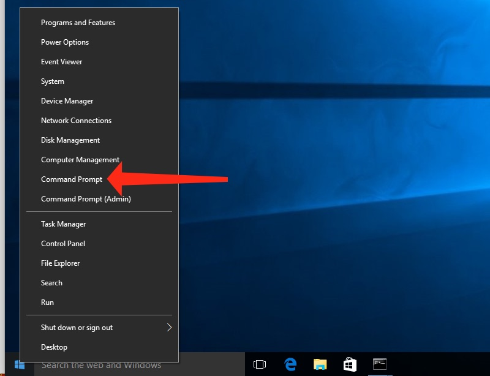
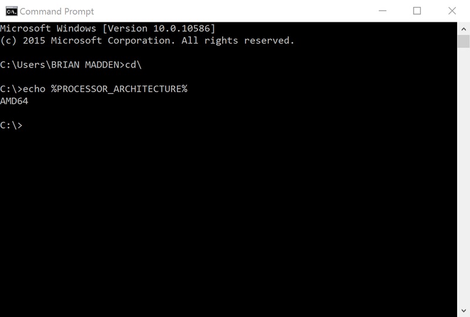
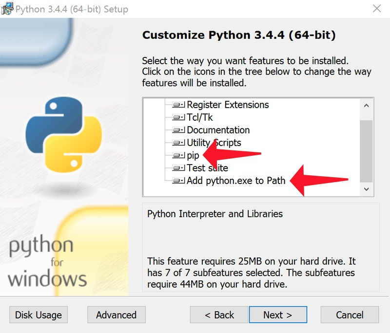

Installing MPF on Windows
=========================
MPF can be used on Windows 7, 8, and 10, in both 32-bit and 64-bit versions. The
installation process is pretty much automated, and the whole thing should only
take a few minutes.

Here are the steps:

1. Install Python (3.5, or 3.6)
---------------------------------------------

MPF is written in a computer language called "Python". This means you have to install Python
first before you can use MPF. Luckily this is just a one-time install, and you don't have to
install it again if you update MPF later.

On Windows platforms, MPF requires Python 3.5 through Python 3.7 (Python 3.8
and newer are not currently supported). While MPF will run on Python 3.4, some of our
dependencies dropped support for 3.4 and can no longer be installed. It is recommended
you use the newest supported version of Python available when you are setting up your PC
(Python 3.7 as of the time this document was last updated). You can download and install it
from the Python website. (Keep reading for links)

.. note::

   Python 3.5 and 3.6 support for Windows were added in version 0.50.  Prior versions of
   MPF did not support Python 3.5+ on Windows.

There are two versions of Python, a 32-bit version and a 64-bit version, and you
need to pick the one that matches the version of Windows you're using.

To find out whether you have 32-bit or 64-bit Windows, open a command prompt
by right-clicking on the Windows button and selecting "Command Prompt" from the
menu:



Then inside that window, type the following command and press Enter:

.. code-block:: doscon

    echo %PROCESSOR_ARCHITECTURE%

If it prints ``x86``, that's 32-bit. If it prints ``x64`` or ``AMD64``, that's 64-bit. (Note that it might print "AMD64"
even if you have an Intel processor.)

Here's an example of running this on a 64-bit Windows 10 machine:



Then go to the Python website download the version you need. (Note that the final digit in the Python version
number is the "patch" number, so 3.6.4 is a version of Python 3.6.) Or use the direct-download links here:

+ `Python 3.7 for 64-bit (x64 or AMD64) Windows <https://www.python.org/ftp/python/3.7.8/python-3.7.8-amd64.exe>`_
+ `Python 3.7 for 32-bit (x86) Windows <https://www.python.org/ftp/python/3.7.8/python-3.7.8.exe>`_
+ `Python 3.6 for 64-bit (x64 or AMD64) Windows <https://www.python.org/ftp/python/3.6.4/python-3.6.4-amd64.exe>`_
+ `Python 3.6 for 32-bit (x86) Windows <https://www.python.org/ftp/python/3.6.4/python-3.6.4.exe>`_

Installing Python is pretty straightforward. It's a normal Windows installer.

The only thing you should change from the defaults is on the "Customize Python
3.x.x" screen, we like to select the option "Add python.exe to Path". That way
you can run ``python`` from any folder, rather than having to specify the full
path to it. (Also make sure the "pip" option is selected, but that should be
selected by default.)



Note that you have to log out and then log back in for the path to be updated
once you install Python. If you don't, then you'll get an error about Python not
being found when you try to install MPF.

After you log out and log back in, (or just restart your computer), open a command prompt
again and type the following command, then press ENTER: (note there are two dashes before
the word "version")

.. code-block:: doscon

    python --version

That should print which version of Python is installed, like this:

.. image:: images/windows_python_from_command_prompt.jpg

Make sure the version is Python 3.5.xx. If you see a version number that starts with 2,
that means you also have Python version 2 installed. (This is ok. You can have Python 2
and Python 3 installed at the same time.) However, if this is your case, you need to
use a different command to start Python 3. See the :doc:`2_and_3` page for details.

2. Upgrade pip and setuptools
-----------------------------

Python includes a utility called "pip" which is the name of the Python Package
Manager. Pip is used to install Python packages and applications from
the web. (It's kind of like an app store for Python apps.) Pip references another package
called "setuptools" that is used to download, build, install, upgrade, and uninstall
Python packages.

So the next step is to update the "pip" and "setuptools" programs to make sure you have the
latest versions. It's not really important to know exactly what this means right now,
just run it.

.. code-block:: doscon

    pip install pip setuptools --upgrade

This command will upgrade pip and setuptools to the latest versions.

Note that if you're running the command prompt *without* admin rights, you might get
some red text and a permissions error. Launch the command prompt by right clicking and selecting "Run as administrator".

You can run the following command to show the versions of pip and setuptools (and the other
packages you have installed) like this:

.. code-block:: doscon

   pip list

That will print out something like this:

.. code-block:: doscon

   C:\Users\username> pip list
   Package    Version
   ---------- -------
   pip        19.3
   setuptools 41.4.0
   C:\Users\username>

Notice that pip is now version 19.3 (as of October 2019)and not the older version that came with Python 3.6.8.  Setuptools has also been updated to version 41.4.0 (as of October 2019).

3. Create a Virtual Environment for Python (recommended)
--------------------------------------------------------

Python includes a utility call "virtual environment" that creates a safe,
isolated place to install packages and configure python. **It's strongly
recommended to install MPF in a virtual environment**, so that other Python
programs can't interfere with it (and it can't interfere with others).

To create a virtual environment, choose a folder where you want to install
a copy of python and keep the environment's packages. For this example, we'll
call the environment "mpfenv" and put it in our home directory.

.. code-block:: console

  python3 -m venv C:\Users\username\mpfenv

.. note::

  If you have multiple versions of Python3 (say, 3.4 and 3.6), you can specify
  which one to use in the virtual environment: ``python3.6 -m venv ~/mpfenv``

A virtual environment is recommended for any general-use computer you'll be
using MPF on, because it keeps the MPF packages separate from the rest of your
machine. If you encounter any package issues while upgrading or reverting an
MPF version, you can easily delete the old virtual environment and start a clean one.

For a dedicated MPF machine that will have no other programs
installed (for example, a computer inside a pinball cabinet), a virtual
environment is not recommended.

.. warning::

  If you use a virtual environment you have to always activate it before
  starting MPF.
  Otherwise, you will encounter weird issues.

4. Activate your Virtual Environment
------------------------------------

To keep itself isolated from other programs, your virtual environment only
activates when you tell it to. You can enable the virtual environment with
a batch command from the command prompt:

.. code-block:: doscon

  ## Command Prompt: use the bat file
  C:\> C:\Users\username\mpfenv\scripts\activate.bat

  ## PowerShell: use the ps1 script
  C:\> C:\Users\username\mpfenv\scripts\activate.ps1

.. note::

  You may want to write this step down, as you'll run it every time you open up
  a terminal window to work on MPF

You'll know you're in the virtual environment because the console prompt will include
the name of your venv in parenthesis.

.. code-block:: doscon

  C:\> python --version
  Python 2.7.10
  C:\> C:\Users\username\mpfenv\scripts\activate.bat

  (mpfenv) C:\> python --version
  Python 3.7.5
  (mpfenv) C:\>

.. warning::

  By default, PowerShell is not allowed to execute scripts. If you encounter the error
  `activate.ps1 cannot be loaded because the execution of scripts is disabled on this system`,
  you need to enable scripts.

  Open a PowerShell window as Administrator and run the following command:
  ```
  set-executionpolicy remotesigned
  ```

5. Install MPF
--------------

In case you previously had MPF/MPF-MC 0.52 or earlier installed you need to
uninstall some kivy dependencies because their naming changed with Kivy 1.11
(you can skip this on a new install):

.. code-block:: doscon

   pip3 uninstall kivy.deps.sdl2 kivy.deps.sdl2_dev kivy.deps.glew kivy.deps.gstreamer

Now that Python is installed and pip is up-to-date, it's time to install MPF!
To do this, run the following command from the command prompt:

.. code-block:: doscon

   pip install mpf mpf-mc

This command is telling pip to install a package called "mpf-mc", which is the
*Mission Pinball Framework - Media Controller* package. When you run this,
pip will connect to the internet and download MPF-MC from the Python app store
and install it onto your computer.

.. note::

   If you want to install the development version of MPF you need to add **--pre**
   at the end which tells it to get the latest "pre-release" version.
   Normally, you do want the stable version unless you depend on a new feature
   or bugfix which is only in the dev version yet.

Pip packages can include dependencies, which means that when you run this
command, you'll see a bunch (like 20 or so) packages get downloaded and installed. The
total size of all these will be almost 200mb, and they include multimedia libraries,
graphics engines, codecs, and a bunch of other components that MPF needs.

The MPF MC package will also download and install the MPF game engine package.

Here's an example of what this looks like from the command prompt. (Note that the exact
versions and sizes might not be the same as what you have, but this should give you a
general idea. Also this may take a few minutes to run on your computer.)

.. code-block:: doscon

   C:\Users\username>pip install mpf mpf-mc
   Collecting mpf-mc
     Downloading mpf_mc-0.50.0.dev5-cp34-none-win32.whl (6.4MB)
       100% |################################| 6.4MB 176kB/s
   Collecting pygments (from mpf-mc)
     Downloading Pygments-2.2.0-py2.py3-none-any.whl (841kB)
       100% |################################| 849kB 1.0MB/s
   Collecting kivy.deps.gstreamer==0.1.12 (from mpf-mc)
     Downloading kivy.deps.gstreamer-0.1.12-cp34-cp34m-win32.whl (121.0MB)
       100% |################################| 121.0MB 6.7kB/s
   Collecting kivy.deps.sdl2-dev==0.1.17 (from mpf-mc)
     Downloading kivy.deps.sdl2_dev-0.1.17-cp34-cp34m-win32.whl (3.1MB)
       100% |################################| 3.1MB 322kB/s
   Collecting psutil (from mpf-mc)
     Downloading psutil-5.2.2-cp34-cp34m-win32.whl (187kB)
       100% |################################| 194kB 2.7MB/s
   Collecting mpf>=0.50.0-dev.10 (from mpf-mc)
     Downloading mpf-0.50.0.dev11-cp34-none-any.whl (863kB)
       100% |################################| 870kB 996kB/s
   Collecting kivy.deps.glew==0.1.9 (from mpf-mc)
     Downloading kivy.deps.glew-0.1.9-cp34-cp34m-win32.whl (170kB)
       100% |################################| 174kB 1.9MB/s
   Collecting pypiwin32 (from mpf-mc)
     Downloading pypiwin32-219-cp34-none-win32.whl (7.9MB)
       100% |################################| 7.9MB 140kB/s
   Collecting kivy>=1.10.0 (from mpf-mc)
     Downloading Kivy-1.10.0-cp34-cp34m-win32.whl (3.5MB)
       100% |################################| 3.5MB 316kB/s
   Collecting kivy.deps.sdl2==0.1.17 (from mpf-mc)
     Downloading kivy.deps.sdl2-0.1.17-cp34-cp34m-win32.whl (3.1MB)
       100% |################################| 3.1MB 315kB/s
   Collecting ruamel.yaml<0.11,>=0.10 (from mpf-mc)
     Downloading ruamel.yaml-0.10.23-py3-none-win32.whl (69kB)
       100% |################################| 71kB 2.6MB/s
   Collecting pyserial>=3.2.0 (from mpf>=0.50.0-dev.10->mpf-mc)
     Downloading pyserial-3.3-py2.py3-none-any.whl (189kB)
       100% |################################| 194kB 2.2MB/s
   Collecting typing (from mpf>=0.50.0-dev.10->mpf-mc)
     Downloading typing-3.6.1.tar.gz (66kB)
       100% |################################| 71kB 1.9MB/s
   Collecting asciimatics (from mpf>=0.50.0-dev.10->mpf-mc)
     Downloading asciimatics-1.8.0-py2.py3-none-any.whl (73kB)
       100% |################################| 81kB 2.5MB/s
   Collecting pyserial-asyncio>=0.3 (from mpf>=0.50.0-dev.10->mpf-mc)
     Downloading pyserial_asyncio-0.4-py3-none-any.whl
   Collecting Kivy-Garden>=0.1.4 (from kivy>=1.10.0->mpf-mc)
     Downloading kivy-garden-0.1.4.tar.gz
   Collecting docutils (from kivy>=1.10.0->mpf-mc)
     Downloading docutils-0.14rc2.tar.gz (1.7MB)
       100% |################################| 1.7MB 243kB/s
   Collecting ruamel.base>=1.0.0 (from ruamel.yaml<0.11,>=0.10->mpf-mc)
     Downloading ruamel.base-1.0.0-py3-none-any.whl
   Collecting Pillow>=2.7.0 (from asciimatics->mpf>=0.50.0-dev.10->mpf-mc)
     Downloading Pillow-4.2.1-cp34-cp34m-win32.whl (1.2MB)
       100% |################################| 1.2MB 744kB/s
   Collecting pyfiglet>=0.7.2 (from asciimatics->mpf>=0.50.0-dev.10->mpf-mc)
     Downloading pyfiglet-0.7.5.tar.gz (767kB)
       100% |################################| 768kB 925kB/s
   Collecting wcwidth (from asciimatics->mpf>=0.50.0-dev.10->mpf-mc)
     Downloading wcwidth-0.1.7-py2.py3-none-any.whl
   Collecting future (from asciimatics->mpf>=0.50.0-dev.10->mpf-mc)
     Downloading future-0.16.0.tar.gz (824kB)
       100% |################################| 829kB 930kB/s
   Collecting requests (from Kivy-Garden>=0.1.4->kivy>=1.10.0->mpf-mc)
     Downloading requests-2.18.1-py2.py3-none-any.whl (88kB)
       100% |################################| 92kB 2.9MB/s
   Collecting olefile (from Pillow>=2.7.0->asciimatics->mpf>=0.50.0-dev.10->mpf-mc)
     Downloading olefile-0.44.zip (74kB)
       100% |################################| 81kB 2.6MB/s
   Collecting certifi>=2017.4.17 (from requests->Kivy-Garden>=0.1.4->kivy>=1.10.0->mpf-mc)
     Downloading certifi-2017.4.17-py2.py3-none-any.whl (375kB)
       100% |################################| 378kB 1.7MB/s
   Collecting chardet<3.1.0,>=3.0.2 (from requests->Kivy-Garden>=0.1.4->kivy>=1.10.0->mpf-mc)
     Downloading chardet-3.0.4-py2.py3-none-any.whl (133kB)
       100% |################################| 143kB 2.2MB/s
   Collecting idna<2.6,>=2.5 (from requests->Kivy-Garden>=0.1.4->kivy>=1.10.0->mpf-mc)
     Downloading idna-2.5-py2.py3-none-any.whl (55kB)
       100% |################################| 61kB 2.0MB/s
   Collecting urllib3<1.22,>=1.21.1 (from requests->Kivy-Garden>=0.1.4->kivy>=1.10.0->mpf-mc)
     Downloading urllib3-1.21.1-py2.py3-none-any.whl (131kB)
       100% |################################| 133kB 3.3MB/s
   Installing collected packages: pygments, kivy.deps.gstreamer, kivy.deps.sdl2-dev, psutil, pyserial, typing, olefile, Pillow, pyfiglet, wcwidth, pypiwin32, future, asciimatics, pyserial-asyncio, ruamel.base, ruamel.yaml, mpf, kivy.deps.glew, certifi, chardet, idna, urllib3, requests, Kivy-Garden, docutils, kivy, kivy.deps.sdl2, mpf-mc
     Running setup.py install for typing ... done
     Running setup.py install for olefile ... done
     Running setup.py install for pyfiglet ... done
     Running setup.py install for future ... done
     Running setup.py install for Kivy-Garden ... done
     Running setup.py install for docutils ... done
   Successfully installed Kivy-Garden-0.1.4 Pillow-4.2.1 asciimatics-1.8.0 certifi-2017.4.17 chardet-3.0.4 docutils-0.14rc2 future-0.16.0 idna-2.5 kivy-1.10.0 kivy.deps.glew-0.1.9 kivy.deps.gstreamer-0.1.12 kivy.deps.sdl2-0.1.17 kivy.deps.sdl2-dev-0.1.17 mpf-0.50.0.dev11 mpf-mc-0.50.0.dev5 olefile-0.44 psutil-5.2.2 pyfiglet-0.7.5 pygments-2.2.0 pypiwin32-219 pyserial-3.3 pyserial-asyncio-0.4 requests-2.18.1 ruamel.base-1.0.0 ruamel.yaml-0.10.23 typing-3.6.1 urllib3-1.21.1 wcwidth-0.1.7

   C:\Users\username>

If you want to make sure that MPF was installed, you can run:

.. code-block:: doscon

   mpf --version

This command can be run from anywhere and should produce output something like
this:

.. code-block:: doscon

   C:\Users\username> mpf --version
   MPF v0.54.0

(Note that the actual version number of your MPF installation will be whatever
version was the latest when you installed it and might not match the version above.)

6. Download & run the "Demo Man" example game
---------------------------------------------

Now that you have MPF installed, you probably want to see it in action. The easiest way to do that is
to download a bundle of MPF examples and run our "Demo Man" example game. To do that, follow
the instructions in the :doc:`/example_games/demo_man` guide.

There's another example project you can also check out if you want called the "MC Demo" (for media controller demo)
that lets you step through a bunch of example display things (slides, widgets, sounds, videos, etc).
Instructions for running the MC Demo are :doc:`here </example_games/mc_demo>`.

7. Install whatever drivers your hardware controller needs
----------------------------------------------------------

If you're using MPF with a physical machine, then there will be some specific
steps you'll need to take to get the drivers installed and configured for
whatever control system you've chosen. See the :doc:`control systems </hardware/index>`
documentation for details. (You don't have to worry about that now if you just
want to play with MPF first.)

Running MPF
-----------

See the section :doc:`/running/index` for details and command-line options.

Keeping MPF up-to-date
----------------------

Since MPF is a work-in-progress, you can use the *pip* command to update your
MPF installation along with the pip and setuptools packages.

To to this, run the following:

.. code-block:: doscon

  pip install setuptools --upgrade
  pip install mpf mpf-mc --upgrade

This will cause *pip* to contact PyPI to see if there's a newer version of the
MPF and MPF MC (and any new requirements). If newer versions are found, it
will download and install them.

.. warning::

   If you are upgrading from MPF 0.33 to |version| you will need to manually perform
   several migration steps to modify your configuration files or they will not
   work in MPF 0.50. Please refer to :doc:`Migrating from config version 4 to 5 of MPF </install/migrate4to5>`
   for step-by-step instructions.

Install the dev version
-----------------------

To install the latest dev release (not generally recommended) which allows you to try bleeding-edge features run:

.. code-block:: doscon

  pip install mpf mpf-mc --pre --upgrade

To downgrade (or install a specific release x.yy.z) run:

.. code-block:: doscon

  pip install mpf==x.yy.z
  pip install mpf-mc==x.yy.z

Next steps!
-----------

Now that MPF is installed, you can follow our
:doc:`step-by-step tutorial </tutorial/index>` which will show you how to start
building your own game in MPF!

.. include:: /install/common_problems_and_solutions.rst

Permission errors on update
^^^^^^^^^^^^^^^^^^^^^^^^^^^

If you installed Python as Administrator you might get permissions error when
upgrading packages using pip:

.. code-block:: doscon

   pip install pip setuptools --upgrade
   Collecting pip
     Using cached https://files.pythonhosted.org/packages/d8/f3/413bab4ff08e1fc4828dfc59996d721917df8e8583ea85385d51125dceff/pip-19.0.3-py2.py3-none-any.whl
   Collecting setuptools
     Using cached https://files.pythonhosted.org/packages/d1/6a/4b2fcefd2ea0868810e92d519dacac1ddc64a2e53ba9e3422c3b62b378a6/setuptools-40.8.0-py2.py3-none-any.whl
   Installing collected packages: pip, setuptools
     Found existing installation: pip 9.0.1
       Uninstalling pip-9.0.1:
   Exception:
   Traceback (most recent call last):
     File "c:\program files\python36\lib\shutil.py", line 544, in move
       os.rename(src, real_dst)
   PermissionError: [WinError 5] Access is denied: 'c:\\program files\\python36\\lib\\site-packages\\pip-9.0.1.dist-info\\description.rst' -> 'C:\\Users\\XXX\\AppData\\Local\\Temp\\pip-81ah1j9u-uninstall\\program files\\python36\\lib\\site-packages\\pip-9.0.1.dist-info\\description.rst'

Run your console as Administrator to fix this.
This can be done by right clicking on the console (in the start menu) and selecting "Start as Administrator".
Re-run the command and it should work.
If not let us know!
