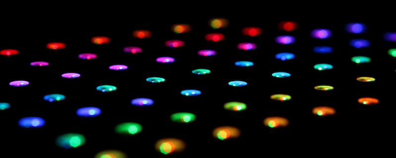

LEDs
====
+------------------------------------------------------------------------------+
| Related Config File Sections                                                 |
+==============================================================================+
| :doc:`/config/lights`                                                        |
+------------------------------------------------------------------------------+
| :doc:`/config/light_settings`                                                |
+------------------------------------------------------------------------------+
| :doc:`/config/light_stripes`                                                 |
+------------------------------------------------------------------------------+
| :doc:`/config/light_rings`                                                   |
+------------------------------------------------------------------------------+
| :doc:`/config/light_player`                                                  |
+------------------------------------------------------------------------------+

.. contents::
   :local:

MPF can control LEDs, including single-channel (single color) and full RGB
LEDs. (You can control the order too, so you can control RGB, BRG, etc.)
You can set default fade rates and control strips and rings of LEDs.

In general there are two ways to wire LEDs in a pinball machine.
Either parallel or serial.
With serial LEDs you got a chain of LEDs which are connected to a controller
board on one side.
In contrast, with parallel LEDs every LED has its own wire(s) to the controller.
While parallel LEDs are more robust in general they also require much more wiring.
Which kind of LEDs you're using usually depends on what is supported in your
platform (some support both).

Serial LEDs
-----------

With serial LEDs the order of colors is usually fixed. For instance, in WS2811
LEDs (a common serial LED controller embedded inside the LED), the first
channel is red, the second green and third is blue (RGB order).
Newer WS2812 LEDs have GRB order (green, red and blue).
Some LEDs also contain an additional white channel and thereby have four
channels (either RGBW or GRBW order).
Other serial LEDs contain three white LEDs (WWW order).
If nothing is specified MPF assumes RGB order so you need to specify it for any
LED with a different channel order.

Hardware
~~~~~~~~

There are two common types of serial LEDs: WS281x and LPD880x.
(See :doc:`ws2812` for more details about WS2811/WS2812 in pinball.)
Those LEDs are chained which means that the controller only connects to the
first LED.
The first LED will connect to the second.
The second to the third and so on.

Both types are spec'd for 4.5V to 5.5V operations and you should make sure that
the voltage does not drop below 4.5V inside the chain at full brightness.
Otherwise, your colors will be off and the LEDs might start to flicker.
We recommend you to turn on all your LEDs and measure this.
In most cases it is helpful to run your
:doc:`power supply </hardware/voltages_and_power/voltages_and_power>` at 5.5V
instead of 5V to give your LEDs some headroom.

Additionally, make sure to run separate ground lines for serial LEDs from
your PSU.
We recommend you to connect the ground at the PSU and not below the playfield
because coils will create a lot of spike in the ground line otherwise.
However, make sure that you connect your grounds or you will be in danger!

Config in MPF
~~~~~~~~~~~~~

You can define serial LEDS in MPF as :doc:`/config/lights`:

.. code-block:: mpf-config

  lights:
    my_ws2811:
      number: 0         # first LED in chain (with three channels)
      type: rgb
    my_ws2812:
      number: 1         # second LED in chain (with three channels)
      type: grb
    my_serial_white_leds:
      number: 2         # third LED in chain (with three channels)
      type: www

The numbering depends on your platform. Internally the first LED will
map to the first three LEDs in the chain (because one LED contains three
interal LEDs). The second will map to LED four to six and so on.

The config above is equivalent to the following (again numbers may be different per platform):

.. code-block:: mpf-config

  lights:
    my_ws2811:
      channels:
        red:
          - number: 0-0
        green:
          - number: 0-1
        blue:
          - number: 0-2
    my_ws2812:
      channels:
        red:
          - number: 1-1
        green:
          - number: 1-0
        blue:
          - number: 1-2

RGBW LEDs are special in most serial LED controllers since the controller
assumes that every LED has exactly three channels. Therefore, you have to
assign the channels directly:

.. code-block:: mpf-config

  lights:
    my_rgbw_serial_led:
      channels:
        red:
          - number: 3-0
        green:
          - number: 3-1
        blue:
          - number: 3-2
        white:
          - number: 4-0
    my_ws2812_after_rgbw:
      channels:
        red:
          - number: 4-1
        green:
          - number: 4-2
        blue:
          - number: 5-0

The RGBW shifts all the channels by one internally. As you can see this can
quickly become confusing so it might be wise to run RGBW LEDs (or any
non-three-channel LEDs) as a separate chain.

Starting with MPF 0.54 there is a new syntax to chain lights:

.. code-block:: mpf-config

    lights:
      led_0:
        start_channel: 0-0    # the exact number format depends on your platform
        subtype: led
        type: rgb    # will use red: 0-0, green: 0-1, blue: 0-2
      led_1:
        previous: led_0
        subtype: led
        type: rgbw   # will use red: 0-3, green: 0-4, blue: 0-5, white: 0-6
      led_2:
        previous: led_1
        subtype: led
        type: rgbw   # will use red: 0-7, green: 0-8, blue: 0-9, white: 0-10

Parallel LEDs
-------------

:doc:`TODO: Add a picture of a parallel RGB LED </about/help_us_to_write_it>`

With parallel LEDs you usually got a bit more flexibility with your channel
assignments. You can decide to make an LED with only a red channel for example.
MPF cannot guess your hardware layout in most platforms.
Therefore your have to explicitly tell MPF your channel layout:

.. code-block:: mpf-config

  lights:
    my_red_only_insert:
      channels:
        red:
          - number: 0
    my_rgb_insert:
      channels:
        red:
          - number: 1
        green:
          - number: 3
        blue:
          - number: 2
    my_white_light:
      channels:
        white:
          - number: 4

You can also have multiple channels per color (if you do not want to make them different lights):

.. code-block:: mpf-config

  lights:
    multi_white_channels:
      channels:
        white:
          - number: 5
          - number: 6
          - number: 7

With parallel LED you can also use ``start_channel`` to define the color
(starting from MPF 0.54):

.. code-block:: mpf-config

    lights:
      my_red_only_insert:
        start_channel: 0    # the exact number format depends on your platform
        type: r    # will use red: 0
      my_rgb_insert:
        start_channel: 1    # the exact number format depends on your platform
        type: rbg   # will use red: 1, green: 3, blue: 2
      my_white_light:
        previous: my_rgb_insert     # you can also chain those if you want
        type: w   # will use white: 4

Serial vs Parallel LEDs
-----------------------

There is a controversy if serial LEDs are feasible below the playfield or not.
In general, serial LEDs require much less wiring which make them much cheaper
during assembly.
However, if one LED fails within a chain all subsequent ones will likely also
fail until the broken LED is changed.
Interference will happen below a playfield and might disturb the colors.
In practise the refresh rate of serial LEDs are so high that you will not
notice any incorrect colors.
It is unclear how interference affects the reliability of the controller
chips of serial LEDs.
Jersey Jack Pinball tried serial LEDs in the Wizard of Oz (WoZ) and ran into
a lot of reliability issues.
Finally, they reverted back to parallel LEDs (one I2C driver chip per chain).
One of the problems they had was interferences in the ground line which is
why we recommend a separate power supply for serial LEDs and a separate ground
line (but still common ground;
see :doc:`the voltages and power guide </hardware/voltages_and_power/voltages_and_power>`
for details).

For production runs you should probably be careful with serial LEDs.
At least test extensively.
However, you might take some risks in a homebrew machine because serial LEDs
are quite cheap and easy to replace once broken.
In practise they seem to work just fine for all homebrew machines we know.

Can I used RGB LEDs below colored inserts?
------------------------------------------

There is no point to use RGB LEDs below colored inserts.
That simply does not work physically.
Those colored inserts act as filter and any other color simply shall not pass.

We recommend white LEDs below colored inserts.
Then define them as red or whatever color your insert is.
If you use parallel LEDs below colored inserts just buy plain white ones.
For serial LEDs you can buy bulk WS2811 PCBs from china and connect white LEDs
to any of the channels.

Which LED Types Are Supported in MPF?
-------------------------------------

MPF supports any white, single-color or multi-color LED.
This includes RGB, RGBW or any other combination you can imagine.
The ``type`` parameter just reads the channels and maps them without thinking
too much of it.
For instance you can use GRBW LEDs with a green, red, blue and white channel.
Similarly, RRBRGWBGWWR or even more crazy combinations work fine.

Currently, MPF support red, blue, gree and white channels.
White it calculated as the minimum brightness of all channels.
If you need other channels such as orange let us know in the forum.

Color Correction
----------------

If you are using RGB LEDs, they might not be perfectly white when you turn
them on. They might be pinkish or blueish instead depending on the brand of
the LED. To a certain extend this is normal/expected and you can compensate
for it by configuring
:doc:`color_correction profiles in light_settings </config/light_settings>`.

Monitorable Properties
----------------------

For :doc:`dynamic values </config/instructions/dynamic_values>` and
:doc:`conditional events </events/overview/conditional>`,
the prefix for LEDs is ``device.lights.<name>``.

* *color*
* *corrected_color*

+------------------------------------------------------------------------------+
| Related How To Guides                                                        |
+==============================================================================+
| :doc:`/tutorial/17_add_lights_leds`                                          |
+------------------------------------------------------------------------------+

+------------------------------------------------------------------------------+
| Related Events                                                               |
+==============================================================================+
| None                                                                         |
+------------------------------------------------------------------------------+

