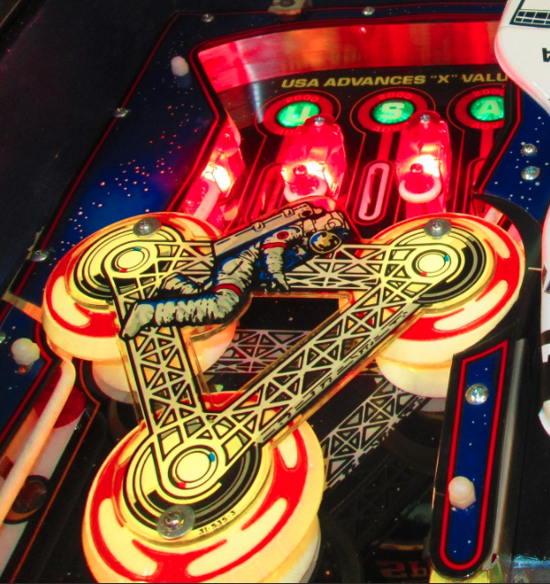
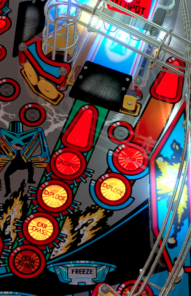

What Should You Consider When Planning a Playfield Layout?
==========================================================

In general, it is a good idea if you really played pinball before.
You need to get a feel for what is rewarding as a player and then you need to
understand how that works.
For instance, where are the switches to play the first sound when you hit the
entrance of a shot?
When and how does the machine count the shot as successful?

Otherwise, you might end up with switches that when hit do absolutely nothing.
Not even a blinking light, score increment or a basic sound effect because it
does not make sense at that point.
Anyone who had played even a little pinball would've known what people were
expecting.
As you observe and play more pinball, you get a knack for what types of things
will really immerse the player, and can then incorporate them into your own games.

Some notes from people in our community (:doc:`please tell </about/contributing_to_mpf_docs>` us if you have more):

Pop Bumpers
-----------
Pop bumpers are great for randomizing the action of the ball. They can also offer the player a bit of pause to consider where the ball is coming from. When designing your pop bumper area, it's generally good advice to have rubber surrounding the area to keep the ball action high.

Surrounding pop bumpers with steel (like ball guides, for instance) is a quick way to kill the action (and the fun).

Below is a picture of pop bumpers surrounded by steel, with large gaps to the lower playfield. Action here will be very limited:

.. image:: bumpers_bad.png

Below is a picture of pop bumpers surrounded by rubber, with a defined exit to the lower playfield. Action here will be very high:

Upper Flippers
--------------
Upper flippers are a great way to add a second dimension to the shot flow of a game. For example, if you have an upper right flipper, you can incorporate shots on the middle/upper left of the playfield behind other objects. These are generally harder shots on their own.  With that said, you should at least have a feed to the upper flipper (from a ramp, an orbit, or some other shot).  Generally its a good idea to make the access to the flipper easier, because the shots off of the flipper will be more difficult.

Inserts
-------
Make sure each shot has dedicated inserts so that you can indicate what you
want the player to shoot.
RGB arrow inserts are great for denoting shots to the player (you can color
code them) and you don’t have to put text over the arrow.
Lower inserts will generally be "mode specific".
You can look at the ramp/orbit shots on Demolition Man to get an idea for the
insert layout.
The arrows are generic, everything else is specific.

Ball Guides and Posts
---------------------

The ball should never ever ever hit metal directly unless its a ball guide.
Even then, the end of the ball guide should have a rubber post (positioned such that the edge of the guide is covered, but a ball rolling down the guide wont hit it and have its trajectory altered).
(I knew this and still managed to screw it up on Wizard Blocks as several shots
immediately hit the lane guides or metal ramps.
It causes the whole game to play like a big clunky metal piece of garbage.)

Also, when positioning ball guides for an orbit shot, it is generally a pleasing experience to the player to have the ball come off the orbit right toward the flipper. Some designs have placed orbits such that they hit the tip of the slingshot and bounce the ball out of control. This makes for a more difficult game, and if orbit shots are key to certain modes, this could be rather frustrating for a player who's trying to control the ball.

Shot Lines
----------

It goes without saying that any shot you place on a playfield should be makeable from one or multiple flippers. Fan layouts are a common occurence in playfield design (think of No Fear or Monster Bash), typically arranged into a fan of 7 or 8 shots.

If you find yourself doing more asymmetric playfield designs, you should pay special attention to make sure that the shots are makeable. You can draw shot lines from the flippers to measure this.

Every shot from the flipper generally leaves in a straight line. Take your playfield CAD/Drawing/etc and see if you can draw a straight line up the playfield to the shot you're testing. Be sure to account for half the diameter of the ball to make sure a collision with another object won't throw the ball off course.

Shot lines are also a great tool to see which shots are able to be back handed off the flipper on the same side.

Here's an example of shot lines on Demolition Man:

.. image:: shotlines.gif

Anything missing?
-----------------

Do you have more advice?
Did you make a stupid mistake (in retrospective) and want to tell other about
it?
Please
:doc:`contribute a section to this guide </about/contributing_to_mpf_docs>` or
tell us in the
`MPF Users Google Group <https://groups.google.com/forum/#!forum/mpf-users>`_.
