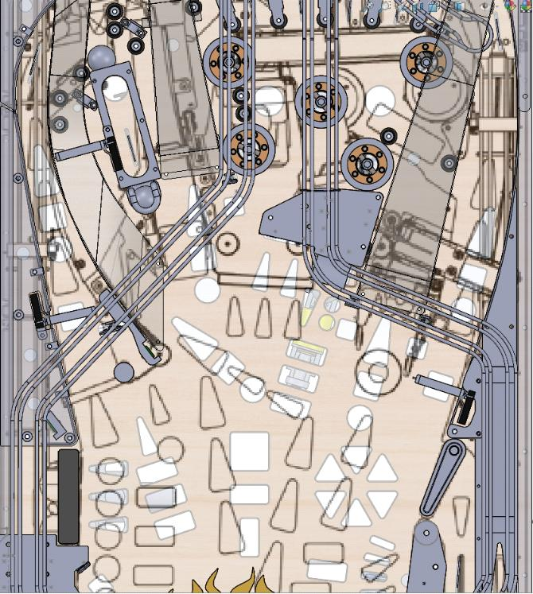
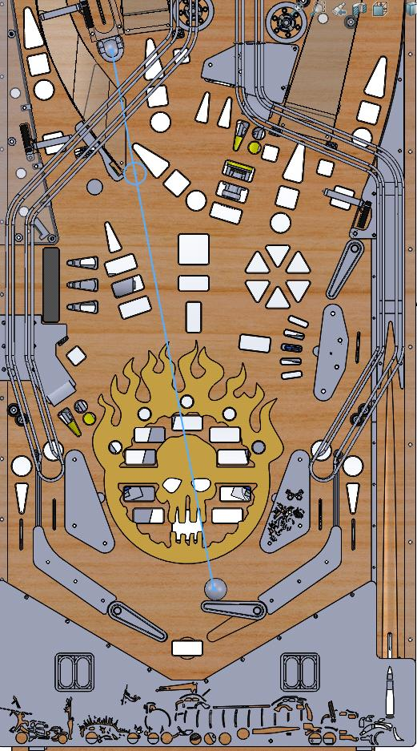
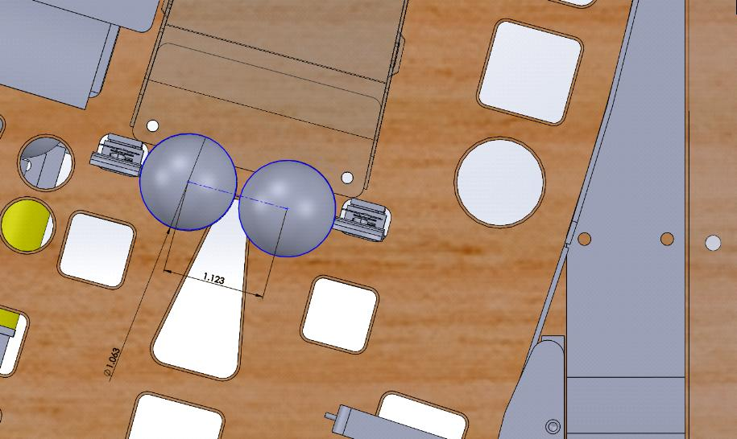

Planning Layout with CAD
========================

Borrowing Shots With CAD
------------------------

If you have planned shot in an area that matches an existing machine, you can
borrow/take their geometry.
This way you know the geometry will be good without any revisions.
PDF's of instructions manuals for games are a good source for the flat overhead
pic you will need.
`IPDB.org <https://www.ipdb.org>`_ is one good source for these.

Most CAD programs have a function to overlay an image file directly onto your
model.
Search youtube for "How to overlay image" + your CAD system.

You will have to move and skew the image until the flippers and size line up
with your drawing.
Once this is done you can take a shot with confidence.

Here's an example of a Spiderman pinball overlay onto a homebrew pinball
machine to get the geometry of the Venom ramp shot:

Using to CAD to Test/Plan Shots
-------------------------------

You can draw a shot in CAD to see if it is makeable.
Here is an example of testing if a newton ball shot can be made from the right
flipper:

Here we test where the balls will go coming of the orbit shots.
(We left a small straight line at the end/beginning of the orbit when
designing, then made the dotted lines parallel):

.. image:: flipper-trajectory-orbits.jpg

Here we use CAD to see how a ball lock will exit when hit with a trapped
newton ball:

.. image:: ball-lock-exit.jpg

Here we use CAD to see if balls wil get trapped after the ball lock:

.. image:: ball-lock-trap-check.jpg

Subtract the ball diameter (1.0625") from ramp and lane shots to see their
actual width.

Here you can see a .500" wide mini target is easier to hit than an over 2" wide
ramp.

.. image:: target-placement.jpg

